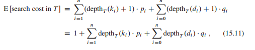
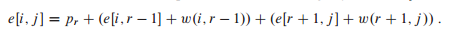
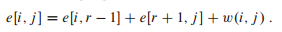

## 最优二叉搜索树

假定我们正在设计一个程序，实现英语文本到法语的翻译。对英语文本中出现的每个单词，我们需要查找对应的法语单词。为了实现这些查找操作，我们可以创建一棵二叉搜索树，将 n 个英语单词作为关键字，对应的法语单词作为关联数据。由于对文本中的每个单词都要进行搜索，我们希望花费在搜索上的总时间尽量少。通过使用红黑树或其它平衡搜索树结构，我们可以假定每次搜索时间为 O(lgn)。但是单词出现的频率是不同的，像 "the" 这种频繁使用的单词有可能位于搜索树中远离根的位置上，而像 "machicolation" 这种很少使用的单词可能位于靠近根的位置上。这样的结构会减慢翻译的速度，因为在二叉搜索树中搜索一个关键字需要访问的结点数等于包含关键字的结点的深度加 1。我们希望文本中频繁出现的单词被置于靠近根的位置。而且，文本中的一些单词可能没有对应的法语单词，这些单词根本不应该出现在二叉搜索树中。在给定单词出现频率的前提下，我们应该如何组织一棵二叉搜索树，使得所有搜索操作访问的结点总数最少呢？

这个问题称为最优二叉搜索树（optimal binary search tree）问题。其形式化定义如下：给定一个 n 个不同关键字的已排序的序列 K = <k<sub>1</sub>, k<sub>2</sub>, ..., k<sub>n</sub>>（因此 k<sub>1</sub> < k<sub>2</sub> < ... < k<sub>n</sub>），我们希望用这些关键字构造一棵二叉搜索树。对每个关键字 k<sub>i</sub>，都有一个概率 p<sub>i</sub> 表示其搜索频率。有些要搜索的值可能不在 K 中，因此我们还有 n + 1 个“伪关键字” d<sub>0</sub>, d<sub>1</sub>, d<sub>2</sub>, ..., d<sub>n</sub> 表示不在 K 中的值。d<sub>0</sub> 表示所有小于 k<sub>1</sub> 的值，d<sub>n</sub> 表示所有大于 k<sub>n</sub> 的值，对 i = 1, 2, ..., n-1，伪关键字 d<sub>i</sub> 表示所有在 k<sub>i</sub> 和 k<sub>i+1</sub> 之间的值。对每个伪关键字 d<sub>i</sub>，也有一个频率 p<sub>i</sub> 表示对应的搜索频率。下图显示了一个 n = 5 个关键字的集合构造的两棵二叉搜索树。每个关键字 k<sub>i</sub> 是一个内部结点，而每个伪关键字 d<sub>i</sub> 是一个叶结点。每次搜索要么成功（找到某个关键字 k<sub>i</sub>）要么失败（找到某个伪关键字 d<sub>i</sub>），因此有如下公式：


（a）期望搜索代价为 2.80 的二叉搜索树。（b）期望搜索代价为 2.75（最优）的二叉搜索树

对一个 n = 5 的关键字集合及如下的搜索频率，构造的两棵二叉搜索树：

|    i       | 0     | 1 | 2 | 3 | 4 | 5 |
|:----------|:------|:------|:------|:------|:------|:------|
| p<sub>i</sub>  |    | 0.15  | 0.10  | 0.05  |0.10  |0.20  |
| q<sub>i</sub>    | 0.05  | 0.10  |0.05  |0.05  |0.05  |0.10 |

由于我们知道每个关键字和伪关键字的搜索频率，因而可以确定在一棵给定的二叉搜索树 T 中进行一次搜索的期望代价。假定一次搜索的代价等于访问的结点数，即此次搜索找到的结点在 T 中的深度再加 1，那么在 T 中进行一次搜索的期望代价为：



其中 depth<sub>T</sub> 表示一个结点在树 T 中的深度，最后一个等式是上上个公式推导而来。在上图（a）中，我们逐个结点计算期望搜索代价：

|   结点     |   深度   | 概率 | 贡献 |
|:----------|:------|:------|:------|
| k<sub>1</sub> | 1 | 0.15 | 0.30 |
| k<sub>2</sub> | 0 | 0.10 | 0.10 |
| k<sub>3</sub> | 2 | 0.05 | 0.15 |
| k<sub>4</sub> | 1 | 0.10 | 0.20 |
| k<sub>5</sub> | 2 | 0.20 | 0.60 |
| d<sub>0</sub> | 2 | 0.05 | 0.15 |
| d<sub>1</sub> | 2 | 0.10 | 0.30 |
| d<sub>2</sub> | 3 | 0.05 | 0.20 |
| d<sub>3</sub> | 3 | 0.05 | 0.20 |
| d<sub>4</sub> | 3 | 0.05 | 0.20 |
| d<sub>5</sub> | 3 | 0.10 | 0.40 |
| 合计 |  |  | 2.80 |

对于一个给定的概率集合，我们希望构造一棵期望搜索代价最小的二叉搜索树，称之为最优二叉搜索树。上图（b）所示的二叉搜索树就是给定概率集合的最优二叉搜索树，其期望代价为 2.75。这个例子显示，最优二叉搜索树不一定是高度最矮的，而且，概率最高的关键字也不一定出现在二叉搜索树的根节点。在此例中，关键字 k<sub>5</sub> 的搜索概率最高，但最优二叉搜索树的根节点为 k<sub>2</sub>（在所有以 k<sub>5</sub> 为根的二叉搜索树中，期望搜索代价最小者为 2.85）。

与矩阵链乘法问题相似，对本问题来说，穷举并检查所有可能的二叉搜索树不是一个高效的算法。对任意一棵 n 个结点的二叉树，我们都可以通过对结点标记关键字 k<sub>1</sub>, k<sub>2</sub>, ..., k<sub>n</sub> 构造出一棵二叉搜索树，然后向其中添加伪关键字作为叶结点，使用动态规划方法求解此问题。

### 步骤 1：最优二叉搜索树的结构

为了刻画最优二叉搜索树的结构，我们从观察子树特征开始。考虑一棵二叉搜索树的任意子树，它必须包含连续关键字 k<sub>i</sub>, ..., k<sub>j</sub>，1 <= i <= j <= n，而且其叶结点必然是伪关键字 d<sub>i-1</sub>, ..., d<sub>j</sub>。

我们现在可以给出二叉搜索树问题的最优子结构：如果一棵最优二叉搜索树 T 有一棵包含关键字 k<sub>i</sub>, ..., k<sub>j</sub> 的子树 T'，那么 T' 必然是包含关键字 k<sub>i</sub>, ..., k<sub>j</sub> 和伪关键字 d<sub>i-1</sub>, ..., d<sub>j</sub> 的子问题的最优解。我们依旧用剪切-粘贴法来证明这一结论。如果存在子树 T''，其期望搜索代价比 T' 低，那么我们将 T‘ 从 T 中删除，将 T'' 粘贴到相应位置，从而得到一棵期望搜索代价低于 T 的二叉搜索树，与 T 最优的假设矛盾。

我们需要利用最优子结构性质来证明，我们可以用子问题的最优解构造原问题的最优解。给定关键字序列 k<sub>i</sub>, ..., k<sub>j</sub>，其中某个关键字，比如说 k<sub>r</sub>（i <= r <= j），是这些关键字的最优子树的根结点，那么 k<sub>r</sub> 的左子树就包含关键字 k<sub>i</sub>, ..., k<sub>r-1</sub>（和伪关键字 d<sub>i-1</sub>, ..., d<sub>r-1</sub>），而右子树包含关键字 k<sub>r+1</sub>, ..., k<sub>j</sub>（和伪关键字 d<sub>r</sub>, ..., d<sub>j</sub>）。只要我们检查所有可能的根结点 k<sub>r</sub> (i <= r <= j)，并对每种情况分别求解包含 k<sub>i</sub>, ..., k<sub>r-1</sub> 及包含 k<sub>r+1</sub>, ..., k<sub>j</sub> 的最优二叉搜索树，即可保证找到原问题的最优解。

这里还有一个值得注意的细节——“空子树”。假定对于包含关键字 k<sub>i</sub>, ..., k<sub>j</sub> 的子问题，我们选定 k<sub>i</sub> 为根结点，根绝前文论证，k<sub>i</sub> 的左子树包含 k<sub>i</sub>, ..., k<sub>i-1</sub>，我们将此序列解释为不包含任何关键字。但请注意，子树仍然包含伪关键字。按照惯例，我们认为包含关键字序列 k<sub>i</sub>, ..., k<sub>i-1</sub> 的子树不包含任何实际关键字，但包含唯一伪关键字 d<sub>i-1</sub>。对称地，如果选择 k<sub>j</sub> 为根结点，那么 k<sub>j</sub> 的右子树包含关键字 k<sub>j+1</sub>, ..., k<sub>j</sub> ——此右子树不包含任何实际关键字，但包含伪关键字 d<sub>j</sub>。

### 步骤 2：一个递归算法

我们已经准备好给出最优解值的递归定义。我们选取子问题域为：求解包含关键字 k<sub>i</sub>, ..., k<sub>j</sub> 的最优二叉搜索树，其中 i >= 1, j<= n 且 j >= i - 1（当 j = i - 1 时，子树不包含实际关键字，只包含伪关键字 d<sub>i-1</sub>）。定义 e[i][j] 为在包含关键字 k<sub>i</sub>, ..., k<sub>j</sub> 的最优二叉搜索树中进行一次搜索的期望代价。最终，我们希望计算出 e[1][n]。

j = i - 1 的情况最简单，由于子树只包含伪关键字 d<sub>i-1</sub>，期望搜索代价为 e[i][i-1] = q<sub>i+1</sub>。

当 j >= i 时，我们需要从 k<sub>i</sub>, ..., k<sub>j</sub> 中选择一个根结点 k<sub>r</sub>，然后构造一棵包含关键字 k<sub>i</sub>, ..., k<sub>r-1</sub> 的最优二叉搜索树作为其左子树，以及一棵包含关键字 k<sub>r+1</sub>, ..., k<sub>j</sub> 的二叉搜索树作为其右子树。当一棵子树成为一个结点的子树时，期望搜索代价有何变化？由于每个结点的深度都增加了 1，根据上面的公式，这棵子树的期望搜索代价的增加值应为所有概率之和。对于包含关键字 k<sub>i</sub>, ..., k<sub>j</sub> 的子树，所有概率之和为


因此，若 k<sub>r</sub> 为包含关键字 k<sub>i</sub>, ..., k<sub>j</sub> 的最优二叉搜索树的根结点，我们有如下公式：



注意


因此 e[i][j] 可重写为



上面的递归公式假定我们知道哪个结点 k 应该作为根结点，如果选取期望搜索代价最低者作为根结点，可得最终递归公式：


e[i][j] 的值给出了最优二叉搜索树的期望搜索代价。为了记录最优二叉搜索树的结构，对于包含关键字 k<sub>i</sub>, ..., k<sub>j</sub> (i <= i <= j <= n) 的最优二叉搜索树，我们定义 root[i][j] 保存根结点 k<sub>r</sub> 的下标 r。

```java
double recursive(double[] p, double[] q, int i, int j) {
    if (j == i - 1) {
        return q[i - 1];
    }
    double min = Double.MAX_VALUE;
    double s = sum(p, q, i, j);
    for (int k = i; k <= j; k++) {
        min = Math.min(min, recursive(p, q, i, k - 1) + recursive(p, q, k + 1, j) + s);
    }
    return min;
}
```

### 步骤 3：计算最优二叉搜索树的期望搜索代价

现在，你可能已经注意到我们求解最优二叉搜索树和矩阵链乘法的一些相似之处，它们的子问题都是由连续的下标子域组成，而上面的直接递归实现，也会与矩阵链乘法问题的直接递归算法一样低效。我们设计替代的高效算法，用一个表 e[i...n+1][0...n] 来保存 e[i][j] 的值。第一维下标上界为 n + 1 而不是 n，原因在于对于只包含伪关键字 d<sub>0</sub> 的子树，我们需要计算并保存 e[n+1][n]，第二维下标下界为 0，是因为对于只包含伪关键字 d<sub>0</sub> 的子树，我们需要计算并保存 e[1][0]。我们只使用表中满足 j >= i - 1 的表项 e[i][j]。我们还使用一个表 root，表项 root[i][j] 记录包含关键字 k<sub>i</sub>, ..., k<sub>j</sub> 的子树的根，我们只使用此表中满足 1 <= i <= j <= n 的表项 root[i][j]。

我们还需要另一个表来提高计算效率。为了避免每次计算 e[i][j] 时都重新计算 w[i][j]，我们将这些值保存在表 w[1...n+1][0...n] 中，这样每次可以节省 Θ(j - 1) 次加法。对基本情况，令 w[i][i-1] = q<sub>i-1</sub> (1 <= i <= n+1)。对 j >= i 的情况，可如下计算：

w[i][j] = w[i][j-1] + p<sub>j</sub> + q<sub>j</sub>

这样，对 Θ(n<sup>2</sup>) 个 w[i][j]，每个的计算时间为 Θ(1)。

```java
double bottomUp(double[] p, double[] q) {
    int n = p.length - 1;
    double[][] e = new double[n + 2][n + 2];
    double[][] w = new double[n + 2][n + 2];
    for (int i = 1; i <= n + 1; i++) {
        e[i][i - 1] = q[i - 1];
        w[i][i - 1] = q[i - 1];
    }
    for (int len = 1; len <= n; len++) {
        for (int i = 1; i <= n - len + 1; i++) {
            int j = i + len - 1;
            double min = Double.MAX_VALUE;
            w[i][j] = w[i][j - 1] + p[j] + q[j];
            for (int k = i; k <= j; k++) {
                min = Math.min(min, e[i][k - 1] + e[k + 1][j] + w[i][j]);
            }
            e[i][j] = min;
        }
    }
    return e[1][n];
}
```

根据前文的描述，以及与矩阵链乘法的相似性，很容易理解此算法。第一个 for 循环初始化 e[i][i-1] 和 w[i][i-1] 的值，第二个外层 for 循环利用上面推导出的递归式来对所有 1 <= i <= j <= n 计算 e[i][j] 和 w[i][j]。在第一个循环步中，len = 1，循环对所有 i = 1, 2, ..., n 计算 e[i][i] 和 w[i][i]，第二个循环步中，len = 2，对所有 i = 1, 2, ..., n-1 计算 e[i][i+1] 和 w[i][i+1]，依此类推。内层 for 循环，逐个尝试下标 r，确定哪个关键字 k<sub>r</sub> 作为根结点可以得到包含关键字 k<sub>i</sub>, ..., k<sub>j</sub> 的最优二叉搜索树。这个 for 循环在找到更好的关键字作为根结点时，会将其下标 r 保存在 root[i][j] 中。

与矩阵链乘法一样，最优二叉搜索树的 bottom 算法时间复杂度也是 Θ(n<sup>3</sup>)。
