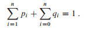

## 最优二叉搜索树

假定我们正在设计一个程序，实现英语到法语的翻译。对英语文本中出现的每个单词，我们需要查找对应的法语单词。为了实现这些查找操作，我们可以创建一棵二叉搜索树，将n个英语单词作为关键字，对应的法语单词作为关联数据。由于对文本中的每个单词都要进行搜索，我们希望花费在搜索上的总时间尽量少。通过使用红黑树或其它平衡搜索树结构，我们可以假定每次搜索时间为O(lgn)。但是，单词出现的频率是不同的，像“the”这种频繁使用的单词有可能位于搜索树远离根的位置上，而像“machicolation”这种很少使用的单词可能位于靠近根的位置上。这样的结构会减慢翻译的速度，因为在二叉搜索树中搜索一个关键字需要访问的结点数等于包含关键字的结点的深度加1。我们希望文本中频繁出现的单词被置于靠近根的位置。而且，文本中的一些单词可能没有对应的法语单词，这些单词根本不应该出现在二叉搜索树中。在给定单词出现频率的前提下，我们应该如何组织一棵二叉搜索树，使得所有搜索操作访问的结点总数最少呢？

这个问题称为**最优二叉搜索树(optimal binary search tree)** 问题。其形式化定义如下：给定一个n个不同关键字的已排序的序列K = <k1, k2, ..., kn>(因此k1 < k2 < k3 < ... < kn)，我们希望用这些关键字构造一棵二叉搜索树。对每个关键字ki，都有一个概率pi表示其搜索频率。有些要搜索的值可能不在K中，因此我们还有n + 1个“伪关键字”d0, d1, d2, ..., dn，表示不在K中的值。d0表示所有小于k1的值，dn表示所有大于kn的值，对i = 1, 2, ..., n - 1，伪关键字di表示所有在ki和ki+1之间的值。对每个伪关键字di，也有一个概率pi表示对应的搜索频率。每个关键字ki是一个内部结点，而每个伪关键字di是一个叶节点，每次搜索要么成功(找到某个关键字ki)要么失败(找到某个伪关键字di)，因此有如下公式：

