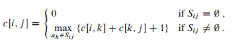

## 贪心算法

求解最优化问题的算法通常需要经过一系列的步骤，在每个步骤都面临多种选择。对于许多最优化问题，使用动态规划算法来求最优解有些杀鸡用牛刀了，可以使用更简单、更高效的算法，贪心算法(greedy algorithm)就是这样的算法，它在每一步都做出当时看起来最佳的选择。也就是说，它总是做出局部最优的选择，寄希望这样的选择能导致全局最优解。

### 活动选择问题

假定有一个n个活动(activity)的集合S = {a[1], a[2], ..., a[n]}，这些活动使用同一个资源(例如一个阶梯教室)，而这个资源在某个时刻只能供一个活动使用。每个活动a[i]都有一个开始时间s[i]和结束时间f[i]，其中0 <= s[i] < f[i] < ∞。如果被选中，任务a[i]发生在半开区间[s[i], f[i])期间。如果两个活动a[i]和a[j]满足[s[i], f[i])和[s[j], f[j])不重叠，则称它们是兼容的。也就是说，若s[i] >= f[i]或s[j] >= f[j]，则a[i]和a[j]是兼容的。在活动选择问题中，我们希望选出一个最大兼容活动集。假定活动已按结束时间的单调递增顺序排序：

f[1] <= f[2] <= f[3] <= ... <= f[n-1] <= f[n]

考虑下面的活动集合S:


对于这个例子，子集{a[3], a[9], a[11]}由相互兼容的活动组成，但它不是一个最大集，因为子集{a[1], a[4], a[8], a[11]}更大。实际上，{a[1], a[3], a[8], a[11]}是一个最大兼容活动子集，另一个最大子集是{a[2], a[4], a[9], a[11]}。

### 活动选择问题的最优子结构

我们很容易验证活动选择问题具有最优子结构性质。令S[i, j]表示在a[i]结束之后开始，且在a[j]开始之前结束的那些活动的集合。假定我们希望求S[i, j]的一个最大的相互兼容的的活动子集，进一步假定A[i, j]就是这样一个子集，包含活动a[k]。由于最优解包含活动a[k]，我们得到两个子问题：寻找S[i, k]中的兼容活动(在a[i]结束之后开始且在a[k]开始之前结束的那些活动)以及寻找S[k, j]中的兼容活动(在a[k]结束之后开始且在a[j]开始之前结束的那些活动)。令A[i, k] = A[i, j] ∩ S[i, k]和A[k, j] = A[i, j] ∩ S[k, j]，这样A[i, k]包含A[i, j]中那些在a[k]开始之前结束的活动，A[k, j]包含A[i, j]中那些在a[k]结束之后开始的活动。因此，我们有A[i, j] = A[i, k] ∪ {a[k]} ∪ A[k, j]，而且S[i, j]中最大兼容任务子集A[i, j] = A[i, k] + A[k, j] + 1个活动。
 
这样刻画活动选择问题的最优子结构，意味着我们可以用动态规划方法求解活动选择问题。如果用c[i][j]表示集合S[i, j]的最优解的大小，则可得递归式：

c[i][j] = c[i][k] + c[k][j] + 1

当然，如果不知道S[i, j]的最优解包含a[k]，就需要考察S[i, j]中所有活动，寻找哪个活动可获得最优解。



于是接下来可以设计一个带备忘机制的递归算法，或者使用自底向上法填写表项，但我们可能忽略了活动选择问题的另一个重要性质，而这一性质可以极大地提高问题的求解速度。

#### 贪心选择

假如我们无需求解所有子问题就可以选择出一个活动加入到最优解，将会怎样？这将使我们省去递归式中固有的考察所有选择的过程。实际上，对于活动选择问题，我们只需考察一个选择：贪心选择。

对于活动选择问题，什么是贪心选择？直观上，我们应该选择这样一个活动，选出它后剩下的资源应能被尽量多的其他任务所用。现在考虑可选的活动，其中必然有一个最先结束，因此，直觉告诉我们，应该选择S中最早结束的活动，因为它剩下的资源可供它之后尽量多的活动使用。(如果S中最早结束的活动有多个，我们可以选择其中任意一个)。换句话说，由于活动已按结束时间单调递增的顺序排序，贪心选择就是活动a[1]。(选择最早结束的活动并不是本问题唯一的贪心选择)

当做出贪心选择后，只剩下一个子问题需要我们求解：寻找在ai结束后开始的活动。为什么不需要考虑在a[i]开始前结束的活动呢？因为s[1] < f[1]且f[1]是最早结束的活动，所以不会有活动的结束时间早于s[1]。因此，所有与a[1]兼容的活动都必须在a[1]结束之后开始。

而且，我们已经证明活动选择问题具有最优子结构性质。令S[k] = {a[i] ∈ S: s[i] >= f[k]}为在a[k]结束后开始的任务集合。当我们做出贪心选择，选择了a[1]后，剩下的S[1]是唯一需要求解的子问题。最优子结构性质告诉我们，如果a[1]在最优解中，那么原问题的最优解由活动a[1]及子问题S[t]中所有活动组成。

因此，我们看到虽然可以用动态规划方法求解活动选择问题，但并不需要这么做(此外，我们并未检查活动选择问题是否具有重叠子问题性质)。相反，我们可以反复选择最早结束的活动，保留与此活动爱金融的活动，重复这一过程，直到不再有剩余活动。而且，因为我们总是选择最早结束的活动，所以选择的活动的结束时间必然是严格递增的。我们只需按结束时间的单调递增顺序处理所有活动，每个活动只考查一次。

求解活动选择问题的算法不必像基于表格的动态固化算法那样自底向上进行计算，相反，可以自顶向下进行计算，选择一个活动放入最优解，然后，对剩余的子问题(包含与已选择的活动兼容的活动)进行求解。贪心算法通常都是这种自顶向下的设计：做出一个选择，然后求解剩下的那个字问题，而不是自底向上地求解出很多子问题，然后再做选择。

#### 递归贪心算法

我们已经看到如何绕过动态规划方法而使用自顶向下的贪心算法来求解活动选择问题，现在我们可以设计一个直接的递归过程来实现贪心算法。

```java
public int recursiveActivitySelector(int[] s, int[] f, int k, int n, int a) {
    int m = k + 1;
    while (m <= n && s[m] < f[k]) {
        m++;
    }
    if (m <= n) {
        a++;
        return recursiveActivitySelector(s, f, m, n, a);
    } else {
        return a;
    }
}
```

假定活动已按结束时间排好序，则递归调用recursiveActivitySelector(s, f, 0, n)的运行时间为Θ(n)。在正给递归调用过程中，每个活动被且只被while循环检查一个。特别地，活动a[i]在k < i的最后一次调用中被检查。

#### 迭代贪心算法

我们可以很容易地将算法转换为迭代形式，recursiveActivitySelector几乎就是“尾递归”：它以一个对自身的递归调用再接一次并集操作结尾。将一个尾递归过程改为迭代形式通常是很直接的，实际上，某些特定语言的编译器可以自动完成这一工作。

greedyActivitySelector是recursiveActivitySelector的一个迭代版本。它也假定输入活动已按结束时间单调递增顺序排好序。

```java
public int greedyActivitySelector(int[] s, int[] f) {
    int n = s.length;
    int i = 0;
    int c = 0;
    for (int j = 1; j < n; j++) {
        if (s[j] >= f[i]) {
            i = j;
            c++;
        }
    }
    return c;
}
```

### 贪心算法原理

贪心算法通过做出一系列选择来求出问题的最优解，在每个决策点上，它做出在当时看来最佳的选择。这种启发式的策略并不保证总能找到最优解，但对有些问题确实有效，如活动选择问题。

设计活动选择问题贪心算法的过程比通常的过程繁琐一些，我们经历了如下步骤：

1. 确定问题的最优子结构
2. 设计一个递归算法(对活动选择问题，我们直接给出了递归式，但跳过了基于此递归式设计递归算法的步骤)。
3. 证明如果我们做出一个贪心选择，则只剩下一个子问题。
4. 证明贪心选择总是安全的。
5. 设计一个递归算法实现贪心策略。
6. 将递归算法转换为迭代算法。

在这个过程中，我们详细地看到了贪心算法是如何以动态规划方法为基础的。例如，在活动选择问题中，我们首先定义了子问题S[i, j]，其中i和j都是可变的。然后我们发现，如果总是做出贪心选择，则可以将子问题先定为S[k]的形式。

与这种繁琐的过程相反，我们可以通过贪心选择来改进最优子结构，使得选择后只留下一个子问题。在活动选择问题中，我们可以一开始就将第二个下表去掉，将子问题定义为Si的形式。然后，我们可以证明，贪心选择(S[k]中最早结束的活动a[m])与剩余兼容活动集合的最优解组合在一起，就会得到S[k]的最优解。更一般地，我们可以按如下步骤设计贪心算法：

1. 将最优化问题转换为这样的形式：对其做出一次选择后，只剩下一个子问题需要求解。
2. 证明做出贪心选择后，原问题总是存在最优解，即贪心选择总是安全的。
3. 证明做出贪心选择后，剩余的子问题满足性质：其最优解与贪心选择组合即可得到原问题的最优解。这样就得到了最优子结构。

我们应该一直使用这种更直接的设计方法，但我们需要知道，在每个贪心算法之下，几乎总有一个更繁琐的动态规划算法。

#### 贪心选择性质

第一个关键要素是贪心选择性质(greedy-choice property)：我们可以通过做出局部最优(贪心)选择来构造全局最优解。换句话说，当进行选择时，我们直接做出在当前问题中看来最优的选择，而不必考虑子问题的解。

这也是贪心算法与动态规划的不同之处。在动态规划方法中，每个步骤都要进行一次选择，但选择通常依赖于子问题的解。因此，我们通常以一种自底向上的方式求解动态规划问题，先求解较小的子问题，然后是较大的子问题(我们也可以自顶向下求解，但需要备忘机制。当然，即使算法是自顶向下进行计算，我们仍然需要先求解子问题再进行选择)。在贪心算法中，我们总是做出当时看来最佳的选择，然后求解剩下的唯一的子问题。贪心算法进行选择时可能依赖之前作出的选择，但不依赖任何将来的选择或是子问题的解。因此，与动态规划先求解子问题才能进行第一次选择不同，贪心算法在进行第一次选择之前不求解任何子问题。一个动态规划算法是自底向上进行计算的，而一个贪心算法通常是自顶向下的，进行一次又一次的选择，将给定问题实例变得更小。

当然，我们必须证明每个步骤做出贪心选择能生成全局最优解。这种证明通常首先考察某个子问题的最优解，然后用贪心选择替换某个其它选择来修改此解。从而得到一个相似但更小的子问题。

如果进行贪心选择时我们不得不考虑众多选择，通常意味着可以改进贪心选择，使其更为高效。例如，在活动选择问题中，假定我们已经能将活动按结束时间单调递增顺序排好序，则对每个活动能够只需处理一次。通过对输入进行预处理或者使用合适的数据结构(通常是优先队列)，我们通常可以使贪心选择更快速，从而得到更高效的算法。

#### 最优子结构

如果一个问题的最优解包含其子问题的最优解，则称此问题具有最优子结构性质，此性质是能否应用动态规划和贪心算法的关键要素。还是以活动选择问题为例，如果一个子问题S[i, j]的最优解包含活动a[k]，那么它必然包含子问题S[i, k]和S[k, j]的最优解。给定这样的最优子结构，我们可以得出结论，如果知道S[i, j]的最优解应该包含哪个活动a[k]，就可以组合a[k]以及S[i, k]和S[k, j]的最优解中所有活动来构造S[i, j]的最优解。基于对最优子结构的这种观察结果，我们就可以设计出递归式来描述最优解值的计算方法。

当应用于贪心算法时，我们通常使用更为直接的最优子结构。如前所述，我们可以假定，通过对原问题应用贪心选择即可得到子问题。我们真正要做的全部工作就是论证：将子问题的最优解与贪心选择组合在一起就能生成原问题的最优解。这种方法隐含地对子问题使用了数学归纳法，证明了在每个步骤中进行贪心选择会生成原问题的最优解。
