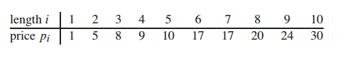

## 钢条切割

钢条切割问题是这样的：给定一段长度为n英寸的钢条和一个价格表pi(i = 1, 2, ..., n)，求钢条切割方案，使得销售收益rn最大。注意，如果长度为n英寸的钢条的价格pn足够大，最优解可能就是完全不需要切割。切割工序本身没有成本支出。

以下是一个价格表的样例：



考虑n=4的情况。下图给出了4英寸钢条所有可能的切割方案，包括根本不切割的方案。我们发现，将一段长度为4英寸的钢条切割为两段各2英寸的钢条，将产生p[2] + p[2] = 5 + 5 = 10的收益，为最优解。


长度为n英寸的钢条共有2 ^ (n - 1)种不同的切割方案，因为在距离钢条左端i(i = 1, 2, ..., n-1)英寸处，我们总是可以选择切割或者不切割。我们用普通的加法符号表示切割方案，因此7 = 2 + 2 + 3表示将长度为7英寸的钢条切割为三段：两段长度为2英寸、一段长度为3英寸。如果一个最优解将钢条切割为k段(1 <= k <= n)，那么最优切割方案

n = i1 + i2 + ... + ik

将钢条切割为长度分别为i1, i2, i3, ..., ik的小段，得到最大收益

r[n] = p[i1] + p[i2] + ... + p[ik]

对于上述价格表样例，我们可以观察所有最优收益值r[i](i = 1, 2, ..., 10)及对应的最优切割方案：

* r[1] = 1, 切割方案 1 = 1 (无切割)
* r[2] = 5, 切割方案 2 = 2 (无切割)
* r[3] = 8, 切割方案 3 = 3 (无切割)
* r[4] = 10, 切割方案 4 = 2 + 2
* r[5] = 13, 切割方案 5 = 2 + 3
* r[6] = 17, 切割方案 6 = 6 (无切割)
* r[7] = 18, 切割方案 7 = 1 + 6 或 7 = 2 + 2 + 3
* r[8] = 22, 切割方案 8 = 2 + 6
* r[9] = 25, 切割方案 9 = 3 + 6
* r[10] = 30, 切割方案 10 = 10 (无切割)

更一般地，对于r[n](n >= 1)，我们可以用更短的钢条的最优切割收益来描述它：

r[n] = max(p[n], r[1] + r[n - 1], r[2] + r[n - 2], ..., r[n - 1] + r[1])

第一个参数对应不切割，直接出售长度为n英寸的钢条的方案，其它n - 1个参数对应另外n - 1种方案：对于每个i = 1, 2, ..., n-1，首先将钢条切割为长度为i和n - i的两段，接着求解这两段的最优切割收益r[i]和r[n - i] (每种方案的最优收益为两段的最优收益之和)。由于无法预知哪种方案会获得最优收益，我们必须考察所有可能的i，选取其中收益最大者。如果直接出售原钢条会获得最大收益，我们当然可以选择不做任何切割。

注意到，为了求解规模为n的原问题，我们先求解形式完全一样，但规模更小的子问题，即完成首次切割后，我们将两段钢条看成两个独立的钢条切割问题实例。我们通过组合两个相关子问题的最优解，并在所有可能的切割方案中选取组合收益最大者，构成原问题的最优解。我们称钢条切割问题满足最优子结构(optimal substructure)性质：问题的最优解由相关子问题的最优解组合而成，而这些子问题可以独立求解。

除了上述求解方法之外，钢条切割问题还存在一种相似的但更为简单的递归求解方法：我们将钢条从左边切割下长度为i的一段，只对右边剩下的长度为n - i的一段继续进行切割(递归求解)，对左边的一段则不再进行切割。即问题分解的方式为：将长度为n的钢条分解为左边开始一段，及剩余部分继续分解的结果。这样，不做任何切割的方案就可以描述为：第一段的长度为n，收益为p[n]，剩余部分长度为0，对应的收益为r[0] = 0。

r[n] = max(p[i] + r[n - i])         1 <= i <= n

在此公式中，原问题的最优解只包含一个相关子问题(右端剩余部分)的解，而不是两个。

### 自顶向下递归实现

下面是一种直接的自顶向下的递归计算。

```java
public int recursiveCutRod(int[] p, int n) {
    if (n == 0) {
        return 0;
    }
    int max = Integer.MIN_VALUE;
    for (int i = 1; i <= n; i++) {
        max = Math.max(max, p[i - 1] + recursiveCutRod(p, n - i));
    }
    return max;
}
```

recursiveCutRod反复用相同的参数值对自身进行调用，即它反复地求解相同的子问题。考察了2 ^ (n - 1)种可能的切割方案，所以运行时间为指数级。

### 使用动态规划方法求解最优钢条切割问题

动态规划方法的思想如下所述。我们已经看到，朴素递归算法之所以效率很低，是因为它反复求解相同的子问题。因此，动态规划方法仔细安排求解顺序，对每个子问题只求解一次，并将结果保存下来。如果随后再次需要此子问题的解，只需查找保存的结果，而不必重新计算。因此，动态规划方法是付出额外的内存空间来节省计算时间，是典型的时空权衡(time-memory trade-off)的例子。而时间上的节省可能是非常巨大的：可能将一个指数时间的解转化为一个多项式时间的解。

动态规划有两种等价的实现方法。

1. 第一种方法称为**带备忘的自顶向下法(top-down with memorization)**。此方法仍按自然的递归形式编写过程，但过程会保存每个子问题的解(通常保存在一个数组或散列表中)。当需要一个子问题的解时，过程首先检查是否已经保存过此解。如果是，则直接返回保存的值，从而节省了计算时间。否则，按通常方式计算这个子问题。我们称这个过程是**带备忘的(memorized)**，因为它记住了之前已经计算的值。

2. 第二种方法称为**自底向上法(bottom-up method)**。这种方法一般需要恰当定义子问题“规模”的概念，使得任何子问题的求解都只依赖于“更小的”子问题的求解。因而我们可以将子问题按规模排序，按由小至大的顺序进行求解。当求解某个子问题时，它所依赖的那些更小的子问题都已求解完毕，结果已保存。每个子问题只需求解一次，当我们求解它(也是第一次遇到它)时，它所有的前提子问题都已求解完成。

两种方法得到的算法具有相同的渐进运行时间，仅有的差异是在某些特殊情况下，自顶向下法并未真正递归地考察所有可能的子问题。由于没有频繁的递归函数调用的开销，自底向上法的时间复杂度函数通常具有更小的系数。

```java
public int memorizedCutRod(int[] p) {
    int n = p.length;
    int[] r = new int[n + 1];
    r[0] = 0;
    for (int i = 1; i <= n; i++) {
        r[i] = Integer.MIN_VALUE;
    }
    return memorizedCutRodAux(p, n, r);
}

private int memorizedCutRodAux(int[] p, int n, int[] r) {
    if (r[n] >= 0) {
        return r[n];
    }
    int max = Integer.MIN_VALUE;
    for (int i = 1; i <= n; i++) {
        max = Math.max(max, p[i - 1] + memorizedCutRodAux(p, n - i, r));
    }
    r[n] = max;
    return max;
}

public int bottomUpCutRod(int[] p) {
    int n = p.length;
    int[] r = new int[n + 1];
    r[0] = 0;
    for (int len = 1; len <= n; len++) {
        int max = Integer.MIN_VALUE;
        for (int i = 1; i <= len; i++) {
            max = Math.max(max, p[i - 1] + r[len - i]);
        }
        r[len] = max;
    }
    return r[n];
}
```

### 重构解

上面给出的钢条切割问题的动态规划算法返回最优解的收益值，但并未返回解本身(一个长度列表，给出切割后每段钢条的长度)。我们可以扩展动态规划算法，使之对每个子问题不仅保存最优收益值，还保存对应的切割方案。利用这些信息，我们就能输出最优解。

下面给出bottomUpCutRod的扩展版本，它对长度为len的钢条不仅计算最大收益值r[len]，还保存最优解对应的第一段钢条的切割长度s[len]。

```java
public static Object[] extendedBottomUpCutRod(int[] p, int n) {
    int[] r = new int[n + 1];
    int[] s = new int[n + 1];
    r[0] = 0;
    for (int len = 1; len <= n; len++) {
        int max = Integer.MIN_VALUE;
        for (int i = 1; i <= len; i++) {
            if (max < p[i - 1] + r[len - i]) {
                max = p[i - 1] + r[len - i];
                s[len] = i;
            }
        }
        r[len] = max;
    }
    return new Object[]{r[n], s};
}
```

可以利用extendedBottomUpCutRod计算出来的s[1...n]，输出长度为n的钢条的完整的最优切割方案。

```java
public void constructSolution(int[] s, int n) {
    while (n > 0) {
        System.out.print(s[n] + " ");
        n -= s[n];
    }
}
```
