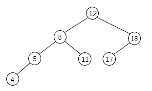
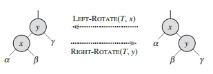

## AVL 树

AVL 树是一种高度平衡的（height balanced）二叉搜索树：对每一个结点，它的左子树与右子树的高度差至多为 1。

下图是一棵合法的 AVL 树，因为对每个结点来说，其左子树和右子树的高度差都不超过 1。



下图不是一棵合法的 AVL 树，因为对结点 12 和 8 来说，它们的左右子树高度差都超过了 1。


基于这一性质，下面的代码可以判断一棵树是否为 AVL 树：

```java
boolean isAVL() {
    return dfsHeight(root) != -1;
}

int dfsHeight(Node node) {
    if (node == null) {
        return 0;
    }
    int leftHeight = dfsHeight(node.left);
    int rightHeight = dfsHeight(node.right);
    if (leftHeight == -1 || rightHeight == -1 || Math.abs(leftHeight - rightHeight) > 1) {
        return -1;
    }
    return Math.max(leftHeight, rightHeight) + 1;
}
```

大多数的搜索树操作，例如 search, insert, delete 等，花费的时间是 O(h)，其中 h 是树的高度。对于一棵倾斜的树来说，其高度较高，h 达到了 O(n)。如果我们保证在每次插入和删除等操作之后，树高 h 能保持在 O(lgn)，那么我们就能保证这些搜索树操作时间复杂度为  O(lgn)，其中 n 是树中结点的数量。

要实现一棵 AVL 树，需要在每个结点内维护一个额外的属性 height，代表该结点的高度。

```java
class AVLTree {
    Node root;
    
    class Node {
        int key;
        int height;
        Node left;
        Node right;
    
        Node(int key) {
            this.key = key;
            height = 1;
        }
    }
}
```

### 插入操作

要在一棵 AVL 树中插入一个结点，首先以二叉搜索树的顺序把该结点放在适当的位置上，此时，这棵树可能就不再是高度平衡的，具体来说，某些结点的左子树和右子树的高度差可能会到 2。为了让树重新保持平衡，我们引入一个 balance 操作，输入一棵以 x 为根的子树，其左子树和右子树都是高度平衡的，而且它们的高度差至多是 2，即丨x.right.height - x.left.height丨<= 2，将这棵以 x 为根的子树转变为高度平衡的。

平衡操作是基于旋转的，类似于红黑树的旋转，只不过在旋转之后需要更新结点的高度。



```java
Node rightRotate(Node p) {
    Node l = p.left;
    p.left = l.right;
    l.right = p;
    updateHeight(p);
    updateHeight(l);
    return l;
}

Node leftRotate(Node p) {
    Node r = p.right;
    p.right = r.left;
    r.left = p;
    updateHeight(p);
    updateHeight(r);
    return r;
}

int getHeight(Node node) {
    if (node == null) {
        return 0;
    } else {
        return node.height;
    }
}

void updateHeight(Node node) {
    node.height = Math.max(getHeight(node.left), getHeight(node.right)) + 1;
}

int balanceFactor(Node node) {
    if (node == null) {
        return 0;
    } else {
        return getHeight(node.left) - getHeight(node.right);
    }
}
```

插入一个结点后导致树不平衡的原因，是某个子树的高度增加了 1。从新插入的结点 w 开始往根结点回溯，假设 z 是第一个不平衡的结点，y 是从回溯路径上 z 的孩子，x 是回溯路径上 y 的孩子。根据 y 和 x 的方向不同，插入后的平衡操作需要考虑 4 种情况：

**1. y 是 z 的左孩子， x 是 y 的左孩子（Left Left Case）**

```
         z                                      y 
        / \                                   /   \
       y   T4      Right Rotate (z)          x      z
      / \          - - - - - - - - ->      /  \    /  \ 
     x   T3                               T1  T2  T3  T4
    / \
  T1   T2
```

**2. y 是 z 的左孩子，x 是 y 的右孩子（Left Right Case）**

```
     z                               z                           x
    / \                            /   \                        /  \ 
   y   T4  Left Rotate (y)        x    T4  Right Rotate(z)    y      z
  / \      - - - - - - - - ->    /  \      - - - - - - - ->  / \    / \
T1   x                          y    T3                    T1  T2 T3  T4
    / \                        / \
  T2   T3                    T1   T2
```

**3. y 是 z 的右孩子，x 是 y 的右孩子（Right Right Case）**

```
  z                                y
 /  \                            /   \ 
T1   y     Left Rotate(z)       z      x
    /  \   - - - - - - - ->    / \    / \
   T2   x                     T1  T2 T3  T4
       / \
     T3  T4
```

**4. y 是 z 的右孩子，x 是 y 的左孩子（Right Left Case）**

```
   z                            z                            x
  / \                          / \                          /  \ 
T1   y   Right Rotate (y)    T1   x      Left Rotate(z)   z      y
    / \  - - - - - - - - ->     /  \   - - - - - - - ->  / \    / \
   x   T4                      T2   y                  T1  T2  T3  T4
  / \                              /  \
T2   T3                           T3   T4
```

```java
Node balanceInsert(Node node) {
    // If this node becomes unbalanced, then there are 4 cases

    // Left Left Case
    if (balanceFactor(node) == 2 && balanceFactor(node.left) == 1) {
        return rightRotate(node);
    }

    // Right Right Case
    if (balanceFactor(node) == -2 && balanceFactor(node.right) == -1) {
        return leftRotate(node);
    }

    // Left Right Case
    if (balanceFactor(node) == 2 && balanceFactor(node.left) == -1) {
        node.left = leftRotate(node.left);
        return rightRotate(node);
    }

    // Right Left Case
    if (balanceFactor(node) == -2 && balanceFactor(node.right) == 1) {
        node.right = rightRotate(node.right);
        return leftRotate(node);
    }

    // Return the (unchanged) node pointer
    return node;
}
```

有一个 balanceInsert 过程，我们就可以先将一个结点插入，然后沿着树根方向回溯，更新结点的高度，遇到第一个不平衡的结点，将其调整为平衡的，再往上就不会再出现不平衡的结点了，只需要更新高度即可。

```java
void insert(int key) {
    root = insert(root, key);
}

Node insert(Node node, int key) {
    if (node == null) {
        return new Node(key);
    }
    if (key < node.key) {
        node.left = insert(node.left, key);
    } else if (key > node.key) {
        node.right = insert(node.right, key);
    } else {
        return node;
    }

    updateHeight(node);

    return balanceInsert(node);
}
```

### 删除操作

为了保证删除结点后仍然保持 AVL 树性质，我们首先按二叉搜索树的方式删除该结点，然后做一些重新平衡操作，以恢复 AVL 树性质。

删除一个结点 w 后，为了恢复 AVL 树性质，我们沿着 w 向树根回溯，直到遇到第一个不平衡的结点 z，令 y 为 z 的高度较大的子结点，x 为 y 的高度较大的子结点，注意到这里的 x 和 y 的定义与插入时有所不同。为了重新平衡这个结点，需要在以 z 为根结点的子树上进行适当的旋转，根据 x、y 和 z 结点的位置不同，有 4 种可能的情况。这 4 种情况和插入时大致一样，但有两处不同，当 y 是 z 的左孩子， x 是 y 的左孩子，或 y 是 z 的右孩子，x 是 y 的右孩子 时，y 的左右孩子结点高度之差可能为 0。和插入不同，在删除过程中，我们使第一个不平衡的结点 z 重新平衡后，还需沿着树根往上回溯，可能还会遇到不平衡的结点，因此需要继续平衡操作，直到到达根结点。

```java
void delete(int key) {
    root = delete(root, key);
}

Node delete(Node node, int key) {
    if (node == null) {
        return null;
    }

    if (key < node.key) {
        node.left = delete(node.left, key);
    } else if (key > node.key) {
        node.right = delete(node.right, key);
    } else {
        // If the key is same as root'key, then this is the node to be deleted
        if (node.left == null) {
            node = node.right;
        } else if (node.right == null) {
            node = node.left;
        } else {
            Node suc = minimum(node.right);
            node.key = suc.key;
            node.right = delete(node.right, suc.key);
        }
    }

    updateHeight(node);

    return balanceDelete(node);
}

Node minimum(Node node) {
    while (node.left != null) {
        node = node.left;
    }
    return node;
}

Node balanceDelete(Node node) {
    // If this node becomes unbalanced, then there are 4 cases

    // Left Left Case
    if (balanceFactor(node) == 2 && balanceFactor(node.left) >= 0) {
        return rightRotate(node);
    }

    // Right Right Case
    if (balanceFactor(node) == -2 && balanceFactor(node.right) <= 0) {
        return leftRotate(node);
    }

    // Left Right Case
    if (balanceFactor(node) == 2 && balanceFactor(node.left) == -1) {
        node.left = leftRotate(node.left);
        return rightRotate(node);
    }

    // Right Left Case
    if (balanceFactor(node) == -2 && balanceFactor(node.right) == 1) {
        node.right = rightRotate(node.right);
        return leftRotate(node);
    }

    // Return the (unchanged) node pointer
    return node;
}
```
