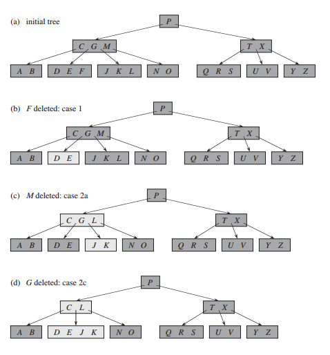

## B树

B 树是为磁盘或其他直接存取的辅助存储设备而设计的一种平衡搜索树。B 树类似于红黑树，但它们在降低磁盘 I/O 操作数方面要更好一些，许多数据库系统使用 B 树或 B 树的变种来存储信息。

B 树与红黑树的不同之处在于 B 树的结点可以有很多孩子，从数个到数千个。也就是说，一个 B 树的“分支因子”可以相当大，尽管它们通常依赖于所使用的磁盘单元的特性。B 树类似于红黑树，就是每棵含有 n 个结点的 B 树的高度为 O(lgn)。然而，一棵 B 树的严格高度可能比一棵红黑树的高度要小许多，这是因为它的分支因子，也就是表示高度的对数的底数可以非常大。因此，我们也可以使用 B 树在 O(lgn) 时间内完成一些动态集合的操作。

B 树以一种自然的方式推广了二叉搜索树。如果 B 树的一个内部结点 x 包含 x.n 个关键字，那么结点 x 就有 x.n + 1 个孩子。结点 x 中的关键字就是分隔点，它把结点 x 中所处理的关键字的属性分隔为 x.n + 1 个子域，每个子域都由 x 的一个孩子处理。当在一棵 B 树中查找一个关键字时，基于对存储在 x 中的 x.n 个关键字的比较，做出一个 x.n + 1 路的选择。叶结点的结构与内部结点不同，后面将讨论这些差别。

下图给出了一棵关键字为英语中辅音字母的 B 树。一个内部结点 x 包含 x.n 个关键字以及 x.n + 1 个孩子，所有叶结点处于树中相同的深度，浅阴影的结点是在查找字母 R 时检查过的结点。


### B 树的定义

为了简单起见，我们假定，就像二叉搜索树和红黑树一样，任何和关键字相联系的“卫星数据”（satellite information）将与关键字一样存放在同一个结点中，当一个关键字从一个结点移动到另一个结点时，无论是与关键字相联系的卫星数据，还是指向卫星数据的指针，都会随着关键字一起移动。一个常见的 B 树变种，称为 B+ 树，它把所有的卫星数据都存储在叶结点中，内部结点只存放关键字和孩子指针，因此最大化了内部结点的分支因子。

一棵 B 树是具有以下性质的有根树：

1. 每个结点 x 有下面属性：  
(1) n，存储在 x 中的关键字个数。  
(2) n 个关键字本身 keys[0], keys[1], ..., keys[n-1]，以非降序存放，使得 keys[0] <= keys[1] <= ... <= keys[n-1]。  
(3) leaf，一个布尔值，如果 x 是叶结点，则为 true，如果 x 为内部结点，则为 false。 

2. 每个内部结点 x 还包含 n + 1 个指向其孩子的指针 children[0], children[1], ..., children[n]，叶结点没有孩子。

3. 关键字 keys[i] 对存储在各子树中的关键字范围加以分割：如果 k[i] 为任意一个存储在以 children[i] 为根的子树中的关键字，那么 k[0] <= keys[0] <= k[1] <= ... <= keys[n-1] <= k[n]。

4. 每个叶结点具有相同的深度，即树的高度 h。

5. 每个结点所包含的关键字个数有上界和下界。用一个被称为 B 树的最小度数（minimum degree）的固定整数 t >= 2 来表示这些界：  
(1) 除了根结点以外的每个结点必须至少有 t - 1 个关键字。因此，除了根结点以外的每个内部结点至少有 t 个孩子。如果树非空，根结点至少有一个关键字。  
(2) 每个结点至多可包含 2t - 1 个关键字。因此，一个内部结点至多可有 2t 个孩子。当一个结点恰好有 2t - 1 个关键字时，称该结点是满的（full）。t 允许的最小值为 2，并且当 t = 2 时的 B 树是最简单的，每个内部结点有 2 个、3 个或 4 个孩子，即一棵 2-3-4 树。然而，在实际中，t 的值越大，B 树的高度就越小。

```java
public class BTree {
    Node root;
    int t;

    class Node {
        int n;
        boolean leaf;
        int[] keys;
        Node[] children;

        Node() {
            keys = new int[2 * t - 1];
            children = new Node[2 * t];
        }
    }

    BTree(int degree) {
        t = degree;
        root = new Node();
        root.n = 0;
        root.leaf = true;
    }
}
```

#### B树的高度

B 树上大部分的操作所需的磁盘存取次数与 B 树的高度是成正比的，现在来分析 B 树最坏情况下的高度。

> 定理：如果 n >= 1，那么对任意一棵包含 n 个关键字、高度为 h、最小度数 t >= 2 的 B 树，有


证明：B 树的根至少包含一个关键字，而且所有其它的结点至少包含 t - 1 个关键字。因此，高度为 h 的 B 树在深度 1 至少包含 2 个结点，在深度 2 至少包含 2t 个结点，在深度 3 至少包含 2t^2 个结点，等等，至少深度 h 至少有 2t^(n-1) 个结点。下图给出了 h = 3 时的一棵树。因此，关键字的个数 n 满足不等式：


由简单的代数变换，可以得到 t^h <= (n + 1) / 2，两边取以 t 为底的对数就证明了定理。


与红黑树对比，这里我们看到了 B 树的能力。尽管二者的高度都以 O(lgn) 的速度增长（注意 t 是个常数），但对 B 树来说，对数的底可以大很多倍。因此，对大多数树的操作来说，要检查的结点数在 B 树中要比在红黑树中少大约 lgt 的因子。由于在一棵树中检查任意一个结点都需要一次磁盘访问，所以 B 树避免了大量的磁盘访问。

### B 树上的基本操作

#### 搜索 B 树

搜索一棵 B 树和搜索一棵二叉搜索树很相似，只是在每个结点所做的不是二叉或者“两路”分支选择，而是根据结点的孩子数做多路分支选择。更严格地说，对每个内部结点 x，做的是一个 x.n + 1 路的分支选择。

B 树的 search 是定义在二叉搜索树上的 search 的一个直接推广。它的输入是某子树的根结点 x，以及要在该子树中搜索的关键字 key，因此，顶层调用的形式为 search(root, key)。如果 key 在 B 树中，那么 search 返回的是由结点 y 和使得 y.keys[i] = key 的下标 i 组成的有序对 (y, i)，否则返回 null。 

```java
Object[] search(Node node, int key) {
    int i = 0;
    while (i < node.n && key > node.keys[i]) {
        i++;
    }
    if (i < node.n && key == node.keys[i]) {
        return new Object[]{node, i};
    } else {
        if (node.leaf) {
            return null;
        } else {
            return search(node.children[i], key);
        }
    }
}
```

就像二叉搜索树的搜索过程一样，在递归过程中所遇到的结点构成了一条从树根向下的简单路径。因此，由 search 过程访问的磁盘页面数为 O(h) = O(log(t, n))，其中 h 为 B 树的高度，n 为 B 树中所含的关键字个数。由于 x.n < 2t，所以 while 循环在每个结点中花费的时间为 O(t)，总的时间为 O(th) = O(t * log(t, n))。

#### 向 B 树中插入一个关键字

B 树中插入一个关键字要比二叉搜索树中插入一个关键字复杂得多。像二叉搜索树一样，要查找插入新关键字的叶结点的位置。然而，在 B 树中，不能简单地创建一个新的叶结点，然后将其插入，因为这样得到的树将不再是合法的 B 树。相反，我们是将新的关键字插入一个已经存在的叶结点上。由于不能将关键字插入一个满的叶结点，故引入一个操作，将一个满的结点 y（有 2t - 1 个关键字）按其中间关键字 (median key) y.keys[t - 1] 分裂 (split) 为两个各含 t - 1 个关键字的结点。中间关键字被提升到 y 的父结点，以标识两棵新树的划分点。但是如果 y 的父结点也是满的，就必须在插入新的关键字之前将其分裂，最终满结点的分裂会沿着树向上传播。

与一棵二叉搜索树一样，可以在从树根到叶子这个单程向下过程中将一个新的关键字插入 B 树中。为了做到这一点，我们并不是等到找出插入过程中实际要分裂的满结点才做分裂，相反，当沿着树往下查找新的关键字所属位置时，就分裂沿途遇到的每个满结点（包括叶结点本身）。因此，每当要分列一个满结点 y 时，就能确保它的父结点不是满的。

#### 分裂B树中的结点

splitChild 的输入是一个非满的内部结点 x 和一个使 x.children[i] 为 x 的满子结点的下标 i。该过程把这个子结点分裂成两个，并调整 x，使之包含多出来的孩子。要分列一个满的根，首先要让根成为一个新的空根结点的孩子，这样才能使用 splitChild，树的高度因此增加 1。分裂是树长高的唯一途径。

下图显示了这个过程。满结点 y = x.children[i] 按照其中间关键字 S 进行分裂，S 被提升到 y 的父结点 x。y 中的那些大于中间关键字的关键字都置于一个新的结点 z 中，它成为 x 的一个新的孩子。


分裂一个 t = 4 的结点。结点 y = x.children[i] 分为两个结点 y 和 z，y 的中间关键字 y.keys[t - 1]，即图中的 S，被提升到 y 的父结点中。

```java
void splitChild(Node x, int i) {
    Node y = x.children[i];
    Node z = new Node();
    z.leaf = y.leaf;
    z.n = t - 1;
    y.n = t - 1;
    for (int j = 0; j < t - 1; j++) {
        z.keys[j] = y.keys[t + j];
    }
    if (!y.leaf) {
        for (int j = 0; j < t; j++) {
            z.children[j] = y.children[t + j];
        }
    }
    for (int j = x.n; j >= i + 1; j--) {
        x.children[j + 1] = x.children[j];
    }
    x.children[i + 1] = z;
    for (int j = x.n - 1; j >= i; j--) {
        x.keys[j + 1] = x.keys[j];
    }
    x.keys[i] = y.keys[t - 1];
    x.n++;
}
```

splitChild 以直接的“剪贴”方式工作。这里 x 是被分裂的结点，y 是 x 的第 i 个孩子。开始时，结点 y 有 2t 个孩子（2t - 1 个关键字），在分裂后减少至 t 个孩子（t - 1 个关键字）。结点 z 取走 y 的 t 个最大的孩子（t - 1 个关键字），并且 z 成为 x 的新孩子，它在 x 的孩子列表中仅位于 y 之后，y 的中间关键字上升到 x 中，成为分隔 y 和 z 的关键字。

#### 沿树单程下行方式向 B 树插入关键字

在一棵高度为 h 的 B 树中，插入一个关键字所需的时间为 O(th) = O(t * log(t, n))。insert 利用 splitChild 来保证递归始终不会降至一个满结点上。

```java
void insert(int key) {
    Node r = root;
    if (r.n == 2 * t - 1) {
        Node node = new Node();
        root = node;
        node.leaf = false;
        node.n = 0;
        node.children[0] = r;
        splitChild(node, 0);
        insertNonFull(node, key);
    } else {
        insertNonFull(r, key);
    }
}
```

当根结点为满时，原来的根结点被分裂，一个新的结点 s（有两个孩子）成为根。对根进行分裂是增加B树高度的唯一途径，与二叉搜索树不同，B 树高度的增加发生在顶部而不是底部。insert 通过调用 insertNonFull 完成将关键字 key 插入以非满的根结点为根的树中。insertNonFull 在需要时沿树向下递归，在必要时通过调用 splitChild 来保证任何时刻它所递归处理的结点都是非满的。


分裂 t = 4 的根。根结点 r 一分为二，并创建了一个新的根结点 s。新的根结点包含了 r 的中间关键字，且以 r 的两半作为孩子。当根被分裂时，B 树的高度增加 1。

辅助的递归过程 insertNonFull 将关键字插入结点 x，要求假定在调用该过程时 x 是非满的。操作 insert 和递归操作 insertNonFull 保证了这个假设成立。

```java
void insertNonFull(Node node, int key) {
    int i = node.n - 1;
    if (node.leaf) {
        while (i >= 0 && i < node.n && key < node.keys[i]) {
            node.keys[i + 1] = node.keys[i];
            i--;
        }
        node.keys[i + 1] = key;
        node.n++;
    } else {
        while (i >= 0 && i < node.n && key < node.keys[i]) {
            i--;
        }
        i++;
        if (node.children[i].n == 2 * t - 1) {
            splitChild(node, i);
            if (key > node.keys[i]) {
                i++;
            }
        }
        insertNonFull(node.children[i], key);
    }
}
```

下图演示了向 B 树中插入若干个关键字：


这棵 B 树的最小度数 t 为 3，所以一个结点至多可包含 5 个关键字。在插入过程中被修改的结点由浅阴影标记。（a）这个例子初始时的树。（b）向初始树中插入 B 后的结果，这是一个对叶结点的简单插入。（c）将 Q 插入前一棵树中的结果。结点 RSTUV 被分裂为两个分别包含 RS 和 UV 的结点，关键字 T 被提升到根中，Q 被插入两半的最左边（RS结点）。（d）将 L 插入前一棵树中的结果。由于根结点是满的，所以它立即被分裂，同时 B 树的高度增加 1，然后 L 被插入包含 JK 的叶结点中。（e）将 F 插入前一棵树中的结果。在将 F 插入两半的最右边（DE结点）之前，结点 ABCDE 会进行分裂。

#### 从 B 树中删除关键字

B 树上的删除操作与插入操作类似，只是略微复杂一点，因为可以从任意一个结点中删除一个关键字，而不仅仅是叶结点，而且当从一个内部结点删除一个关键字时，还要重新安排这个结点的孩子。与插入操作一样，必须防止因删除操作而导致树的结构违反 B 树性质。就像必须保证一个结点不会因为插入而变得太大一样，必须保证一个结点不会在删除期间变得太小（根结点除外，因为它允许有比最少关键字数 t - 1 还少的关键字个数）。一个简单插入算法，如果插入关键字的路径上结点满，可能需要向上回溯；与此类似，一个简单删除算法，当要删除关键字的路径上结点（非根）有最少的关键字个数时，也可能需要向上回溯。

delete 从以 x 为根的子树中删除关键字 k。我们设计的这个过程必须保证无论何时，结点 x 递归调用自身时，x 中关键字个数至少为最小度数 t。注意到，这个条件要求比通常 B 树中的最少关键字多一个，使得有时在递归下降至子结点之前，需要把一个关键字移到子结点中。这个加强的条件允许在一趟下降过程中，就可以将一个关键字从树中删除，无需任何向上回溯（有一个例外，后面会解释）。对下面的 B 树上删除操作的规定应当这样理解，如果根结点 x 成为一个不含任何关键字的内部结点（这种情况可能出现在下图中的情况 2c 和情况 3b 中），那么 x 就要被删除，x 的唯一孩子 x.children[0] 成为树的新根，从而树的高度降低 1，同时也维持树根必须包含至少一个关键字的性质（除非树是空的）。

现在我们来简要地介绍删除操作是如何工作的，下图描绘了从 B 树中删除关键字的各种情况。

1. 如果关键字 k 在结点 x 中，并且 x 是叶结点，则从 x 中删除 k。

2. 如果关键字 k 在结点 x 中，并且 x 是内部结点，则做以下操作：  
(1) 如果结点 x 中前于 k 的子结点 y 至少包含 t 个关键字，则找出 k 在以 y 为根的子树中的前驱 k'。递归地删除 k'，并在 x 中用 k' 代替 k（找到 k' 并删除它可在沿树下降的单过程中完成）。  
(2) 对称地，如果 y 有少于 t 个关键字，则检查结点 x 中后于 k 的子结点 z。如果 z 至少有 t 个关键字，则找出 k 在以 z 为根的子树中的后继 k'，递归地删除 k'，并在 x 中用 k' 代替 k（找到 k' 并删除它可在沿树下降的单过程中完成）。  
(3) 否则，如果 y 和 z 都只含有 t - 1 个关键字，则将 k 和 z 的全部合并进 y，这样 x 就是去了 k 和指向 z 的指针，并且 y 现在包含 2t - 1 个关键字。然后释放 z 并递归地从 y 中删除 k。

3. 如果关键字 k 当前不在内部结点 x 中，则确定必包含 k 的子树的根 x.children[i]（如果 k 确实在树中）。如果 x.children[i] 只有 t - 1 个关键字，必须执行步骤 3a 或 3b 来保证降至一个至少包含 t 个关键字的结点。然后，通过对 x 的某个合适的子结点进行递归而结束。  
(1) 如果 x.children[i] 只含有 t - 1 个关键字，但是它的一个相邻的兄弟至少包含 t 个关键字，则将 x 中的某一个关键字降至 x.children[i] 中，将 x.children[i] 的相邻左兄弟或右兄弟的一个关键字升至 x，将该兄弟中相应的孩子指针移到 x.children[i] 中，这样就使得 x.children[i] 增加了一个额外的关键字。  
(2) 如果 x.children[i] 以及 x.children[i] 的所有相邻兄弟都只包含 t - 1 个关键字，则将 x.children[i] 与一个兄弟合并，即将 x 的一个关键字移至新合并的结点，使之成为该结点的中间关键字。



由于一棵 B 树的大部分关键字都在叶结点中，我们可以预期在实际中，删除操作最经常用于从叶结点删除关键字。这样 delete 过程只要沿树下降一趟即可，不需要向上回溯。然而，当要删除某个内部结点的关键字时，该过程也要沿树下降一趟，但可能还要返回删除了关键字的那个结点，以用其前驱或后继来取代被删除的关键字（情况 2a 和情况 2b）。
