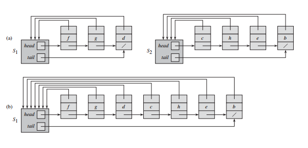
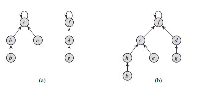
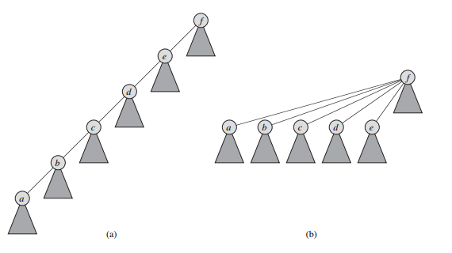

## 不相交集合

一些应用涉及将 n 个不同的元素分成一组不相交的集合，这些应用经常要进行两种特别的操作：寻找包含给定元素的唯一集合和合并两个集合。

### 不相交集合的操作

一个不相交结合数据结构（disjoint-set data structure）维护了一个不相交动态集的集合 S = {S<sub>1</sub>, S<sub>2</sub>, ..., S<sub>k</sub>}。我们用一个代表（representative）来标识每个集合，它是这个集合的某个成员。在一些应用中，我们不关心哪个成员被用来作为代表，仅仅关心的是两次查询动态集合的代表中，如果这些查询没有修改动态集合，则这两次查询应该得到相同的答案。其它一些应用可能会需要一个预先说明的规则来选择代表，比如选择这个集合中最小的成员（当然假设集合中的元素能被比较次序）。

用对象来表示集合中的元素，设 x 表示一个对象，我们希望支持以下三个操作：

* makeSet 建立一个新的集合，它的唯一成员（因而是代表）是 x。因为各个集合是不相交的，故 x 不会出现在别的某个集合中。

* union 将包含 x 和 y 的两个动态集合（表示为 S<sub>x</sub> 和 S<sub>y</sub>）合并成一个新的集合，即这两个集合的并集（假定在操作之前这两个集合是不相交的）。虽然 union 的很多实现中特别地选择 S<sub>x</sub> 或 S<sub>y</sub> 的代表作为新的代表，然而结果集的代表可以是 S<sub>x</sub> ∪ S<sub>y</sub> 中的任何成员。由于我们要求各个集合不相交，故要消除原有的集合 S<sub>x</sub> 和 S<sub>y</sub>，即把它们从 S 中删除。实际上，我们经常把其中一个集合的元素并入另一个集合中，来代替删除操作。

* findSet 返回一个指针，这个指针指向包含 x 的集合的代表。

### 不相交集合的链表表示

下图给出了一个实现不相交集合数据结构的简单方法：每个集合用一个链表来表示。每个集合包含 head 属性和 tail 属性，head 属性指向链表的第一个对象，tail 属性指向链表的最后一个对象。链表中的每个对象都包含一个集合成员、一个指向链表中下一个对象的指针和一个指回到集合对象的指针。在每个链表中，对象可以以任意的次序出现。代表是链表的第一个对象。

用这种链表表示，makeSet 操作和 findSet 操作是非常方便的，只需 O(1) 的时间。要执行 makeSet(x) 操作，我们需要创建一个只有 x 对象的新的链表。对于 findSet(x)，仅沿着 x 对象的返回指针返回到集合，然后返回 head 指向的对象。例如，在下图（a）中，findSet(g) 的调用将返回 f。



（a）两个集合的链表表示。令集合 S<sub>1</sub> 包含成员 f、g 和 d，代表为 f。集合 S<sub>2</sub> 包含成员 c、h、e 和 b，代表为 c。链表中的每个对象包含一个集合成员、一个指向链表中下一个对象的指针和一个返回到集合的指针。每个集合有 head 和 tail 指针分别指向第一个对象和最后一个对象。（b）union(g, e) 的结果，使得包含 e 的链表加到包含 g 的链表中，结果集合的代表为 f，e 链表的集合对象被删除。

在使用链表集合表示的实现中，union 操作的最简单实现明显比 makeSet 或 findSet 花费的时间多。如图（b）所示，我们通过把 y 所在的链表拼接到 x 所在的链表实现了 union(x, y)，x 所在的链表的代表成为结果集的代表。利用 x 所在链表的 tail 指针，可以迅速地找到拼接 y 所在的链表的位置。因为 y 所在的链表的所有成员加入了 x 所在的链表，此时可以删除 y 所在的链表的集合对象。遗憾的是，对于 y 所在链表的每个对象，我们必须更新指向集合对象的指针，这将花费的时间与 y 所在链表长度呈线性关系。例如在上图中，union(g, e) 促使 c、h、e 和 b 对象的指针被更新。

#### 一种加权合并的启发式策略

在最坏情况下，上面给出的 union 过程的每次调用平均需要 Θ(n) 的时间，这是因为需要把一个较长的表拼接到一个较短的表上，此时必须对较长表的每个成员更新其指向集合对象的指针。现在换一种做法，假设每个表中还包含了表的长度（这是很容易维护的）以及拼接次序可以任意的话，我们总是把较短的表拼接到较长的表中。使用这种简单的加权合并启发式策略（weighted-union heuristic），如果两个集合都有 Ω(n) 个成员，则单个的 union 操作仍然需要 Ω(n) 的时间。然而下面的定理表明，一个具有 m 个 makeSet、union 和 findSet 操作的序列（其中有 n 个是 makeSet 操作）需要耗费 O(m + n lgn) 的时间。

> 定理：使用不相交集合的链表表示和加权合并启发式策略，一个具有 m 个 makeSet、union 和 findSet 操作的序列（其中有 n 个是 makeSet 操作）需要的时间为 O(m + n lgn)。

证明：由于每个 union 操作合并两个不相交集合，因此总共至多执行 n - 1 个 union 操作。现在来确定由这些 union 操作所花费时间的上界。我们先确定每个对象指向它的集合对象的指针被更新次数的上界。考虑某个对象 x，我们知道每次 x 的指针被更新，x 早先一定在一个规模较小的集合中，因此第一次 x 的指针被更新后，结果集一定至少有 2 个成员。类似地，下次 x 的指针被更新后，结果集一定至少有 4 个成员。一直继续下去，注意到对于任意的 k <= n，在 x 的指针被更新 ceil(lgk) 次后，结果集一定至少有 k 个成员。因为最大集合至多包含 n 个成员，故每个对象的指针在所有的 union 操作中最多被更新 ceil(lgn) 次。因此在所有的 union 操作中被更新的对象的指针总数为 O(n lgn)。当然，我们也必须考虑 tail 指针和表长度的更新，而它们在每个 union 操作中只花费 Θ(1) 时间，至多执行 n - 1 个 union 操作，花费 O(n) 时间。所以总共花在 union 操作的时间为 O(n lgn)。

整个 m 个操作的序列所需的时间很容易求出。每个 makeSet 和 findSet 操作需要 O(1) 时间，它们的总数为 O(m)，所以整个序列的总时间是 O(m + n lgn)。

```java
public class DisjointSet {
    class Node {
        int key;
        Node next;
        Set set;

        Node(int key) {
            this.key = key;
        }
    }

    class Set {
        Node head;
        Node tail;
        int weight;
        
        Set() {
            this.weight = 0;
        }
    }

    Node makeSet(int key) {
        Node node = new Node(key);
        Set set = new Set();
        set.head = node;
        set.tail = node;
        node.set = set;
        set.weight++;
        return node;
    }

    void union(Node x, Node y) {
        Set set1 = x.set;
        Set set2 = y.set;
        if (set1.weight < set2.weight) {
            link(set1, set2);
        } else {
            link(set2, set1);
        }
    }

    void link(Set src, Set dest) {
        dest.tail.next = src.head;
        Node node = src.head;
        while (node != null) {
            node.set = dest;
            dest.weight++;
            node = node.next;
        }
        dest.tail = src.tail;
    }

    Node findSet(Node node) {
        return node.set.head;
    }
}
```

### 不相交集合森林

在一个不相交集合更快的实现中，我们使用有根树来表示集合，树中每个结点包含一个成员，每棵树代表一个集合。在一个不相交集合森林（disjoint-set forest）中，如下图所示，每个成员仅指向它的父结点。每棵树的根包含集合的代表，并且是其自己的父结点。正如我们将要看到的那样，虽然使用这种表示的直接算法并不比使用链表表示的算法快，但通过引入两种启发式策略（“按秩合并”和“路径压缩”），我们能得到一个渐进最优的不相交集合数据结构。



一个不相交集合森林。（a）两棵树表示图中的两个集合。左边的树表示集合 {b, h, c, e}，其中 c 作为集合的代表。右边的树表示集合 {d, f, g}，f 作为集合的代表。（b）union(e, g) 的结果。

我们执行以下三种不相交集合操作：makeSet 操作简单地创建一棵只有一个结点的树，findSet 操作通过沿着指向父结点的指针找到树的根，这一通向根结点的简单路径上所访问的结点构成了查找路径（find path）。union 操作如图（b）所示，使得一棵树的根指向另外一棵树的根。

#### 改进运行时间的启发式策略

到目前为止，我们还没有对使用链表的实现作出改进。一个包含 n - 1 个 union 操作的序列可以构造出一棵恰好含有 n 个结点的线性链的树。然而，通过使用两种启发式策略，我们能获得一个几乎与总的操作数 m 呈线性关系的运行时间。

第一种启发式策略是按秩合并（union by rank），它类似于链表表示中使用的加权合并启发式策略。显而易见的做法是，使具有较少结点的树的根指向具有较多结点的树的根。这里并不显式地记录每个结点为根的子树的大小，而是采用一种易于分析的方法。对于每个结点，维护一个秩，它表示该结点高度的一个上界。在使用按秩合并策略的 union 操作中，我们可以让具有较小秩的根指向具有较大秩的根。

第二种启发式策略是路径压缩（path compression），也相当简单和高效。如下图所示，在 findSet 操作中，使用这种策略可以使查找路径中的每个结点直接指向根。路径压缩并不改变任何结点的秩。



findSet 过程中的路径压缩。箭头和根结点的自环被略去了。（a）在执行 findSet(a) 之前代表一个集合的树。三角形代表一棵子树，其根为图中示出的结点。每个结点有一个指向父结点的指针。（b）在执行 findSet(a) 之后的同一个集合，现在在查找路径上每个结点都直接指向了根。

为了使用按秩合并的启发式策略实现一个不相交集合森林，我们必须记录下秩的变化情况。对每个结点 x，维护一个整数值 x.rank，它代表 x 的高度（从 x 到某一后代叶结点的最长简单路径上边的数目）的一个上界。当 makeSet 创建一个单元素集合时，这个树上的单结点有一个为 0 的初始秩。每一个 findSet 操作不改变任何秩。union 操作有两种情况，取决于两棵树的根是否有相同的秩。如果根没有相同的秩，就让较大秩的根成为较小秩的根的父结点，但秩本身保持不变。另一种情况是两个根有相同的秩时，任意选择两个根中的一个作为父结点，并使它的秩加 1。

```java
public class DisjointSetForest {
    class Node {
        int key;
        Node parent;
        int rank;

        Node(int key) {
            this.key = key;
            rank = 0;
        }
    }

    Node makeSet(int key) {
        Node node = new Node(key);
        node.parent = node;
        return node;
    }

    void union(Node x, Node y) {
        link(findSet(x), findSet(y));
    }

    void link(Node x, Node y) {
        if (x.rank > y.rank) {
            y.parent = x;
        } else {
            x.parent = y;
            if (x.rank == y.rank) {
                y.rank++;
            }
        }
    }

    Node findSet(Node node) {
        if (node != node.parent) {
            node.parent = findSet(node.parent);
        }
        return node.parent;
    }
}
```

findSet 是一种两趟方法（two-pass method）：当它递归时，第一趟沿着查找路径向上直到找到根，当递归回溯时，第二趟沿着搜索树向下更新每个结点，使其直接指向根。

#### 启发式策略对运行时间的影响

如果单独使用按秩合并或路径压缩，它们中的每一个都能改善不相交集合森林上操作的运行时间，而一起使用这两种启发式策略时，这种改善更大。当同时使用按秩合并和路径压缩时，最坏情况的运行时间为 O(m α(n))，这里 α(n) 是一个增长非常慢的函数，在任何一个可以想得到的不相交集合数据结构的应用中，都有 α(n) <= 4。因此，我们可以认为在所有实际应用中，其运行时间与 m 呈线性关系。然而，严格地说，它是超线性的。
