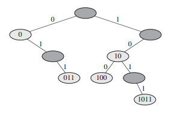

## 基数树

给定两个串 a = a0a1a2...ap 和 b = b0b1b2...bq，这里每个 ai 和 bj 是以字符集的某种次序出现的，如果下面两种规则之一成立，就称串 a 按字典序小于（lexicographically less than）串 b：

1. 存在一个整数 j，其中 0 <= j <= min(p, q)，使得对所有的 i = 0, 1, ..., j-1，ai = bi 成立，且 aj < bj。

2. p < q，且对所有的 i = 0, 1, ..., p，ai = bi。

例如，如果 a 和 b 是位串，那么 10 100 < 10 110（由规则 1，取 j = 3），10 100 < 101 000（由规则 2）。这种次序类似于英语字典中使用的排序。

基数树（radix tree）数据结构如下图所示，这个树存储了位串 1011、10、011、100 和 0。当对一个关键字 a = a0a1...ap 进行查找时，在深度为 i 的一个结点处，如果 ai = 0，则走左侧，如果 ai = 1，则走右侧。

一棵基数树存储了位串 1011、10、011、100 和 0。每个结点的关键字可以通过从树根到该结点的一条简单路径来确定，这样就没有必要在这些结点中存储关键字，图中出现的关键字仅仅作为描述之用。如果一些结点的关键字不在树中，它们就被标为深阴影，这些结点的存在仅为了建立起一条通往其它结点的路径。

设 S 是一个不同位串组成的集合，各个串长度值和为 n，可以使用一棵基数树在 Θ(n) 时间内按字典序对 S 进行排序，对于上图所示的例子，排序输出的应该是序列 0、011、10、100、1011。

