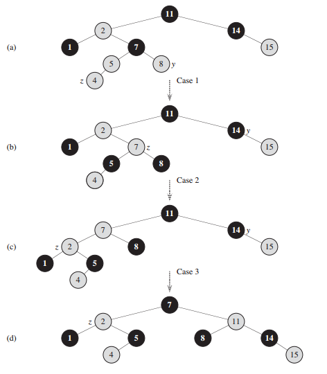
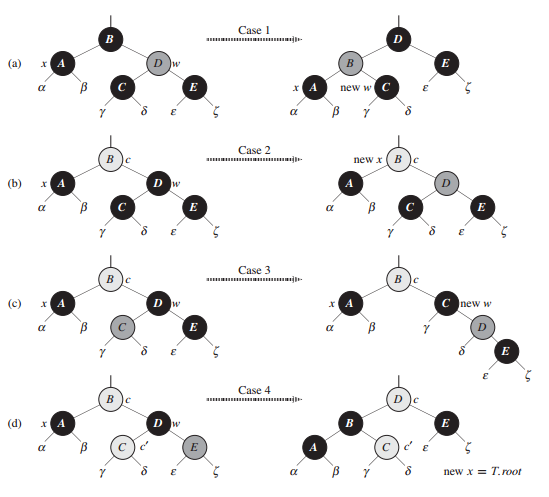

## 红黑树

对于一棵高度为 h 的普通二叉搜索树来说，它的 search、predecessor、successor、minimum、maximum、insert 和 delete 操作的时间复杂度均为 O(h)。因此，如果搜索树的高度较低时，这些集合操作会执行得比较快。然而，如果树的高度较高时，这些集合操作可能并不比在链表上执行得快。红黑树 (red black tree) 是许多平衡搜索树中的一种，可以保证在最坏情况下基本动态集合操作的时间复杂度为 O(lgn)。

### 红黑树的性质

红黑树是一棵二叉搜索树，它在每个结点上增加了一个存储位来表示结点的颜色，可以是 RED 或 BLACK。通过对任何一条从根到叶子的简单路径上各个结点的颜色进行约束，红黑树确保没有一条路径会比其它路径长出 2 倍，因而是近似于平衡的。

树中的每个结点包含 5 个属性：color、key、left、right 和 parent。如果一个结点没有子结点或父结点，则该结点相应指针属性的值为 nil。我们可以把这些 nil 视为指向二叉搜索树的叶结点（外部结点）的指针，而把带关键字的结点视为树的内部结点。

```java
public class RedBlackTree {
    Node root;
    Node nil;
    static final boolean RED = true;
    static final boolean BLACK = false;
    
    class Node {
        int key;
        Node parent;
        Node left;
        Node right;
        boolean color;
        
        Node() {
        }

        Node(int key) {
            this.key = key;
        }
    }
    
    RedBlackTree() {
        nil = new Node();
        nil.color = BLACK;
        root = nil;
    }
}
```

一棵红黑树是满足下面红黑性质的二叉搜索树：

1. 每个结点或是红色的，或是黑色的。

2. 根结点是黑色的。

3. 每个叶结点（nil）是黑色的。

4. 如果一个结点是红色的，则它的两个子结点都是黑色的。

5. 对每个结点，从该结点到其所有后代叶结点的简单路径上，均包含相同数目的黑色结点。

下图显示了一个红黑树的例子：


为了便于处理红黑树代码中的边界条件，使用一个哨兵来代表 nil。对于一棵红黑树，哨兵 nil 是一个与树中普通结点有相同属性的对象，它的 color 属性为 BLACK，而其它属性 parent、left、right 和 key 可以为任意值。

使用哨兵后，就可以将结点 x 的 nil 孩子视为一个普通结点，其父结点为 x。尽管可以为树内的每一个 nil 新增一个不同的哨兵结点，使得每个 nil 的父结点都有这样的良定义，但这种做法会浪费空间。取而代之的是，使用一个哨兵 nil 来代表所有的 nil：根结点的父结点和所有的叶结点。哨兵的属性 parent、left、right 和 key 的取值并不重要。


从某个结点 x 出发（不包含该结点）到达一个叶结点的任意一条简单路径上的黑色结点个数称为该结点的黑高 (black height)。根据性质 5，黑高的概念是明确定义的，因为从该结点出发的所有下降到其叶结点的简单路径的黑结点个数都相同，于是定义红黑树的黑高为其根结点的黑高。利用黑高可以证明以下引理：

> 一棵有n个内部结点的红黑树的高度至多为 2 * lg(n + 1)。

### 旋转

搜索树操作 insert 和 delete 在包含 n 个关键字的红黑树上，运行花费时间为 O(lgn)。由于这两个操作对树做了修改，结果可能违反红黑性质。为了维护这些性质，必须要改变树中某些结点的颜色以及指针结构。

指针结构的修改是通过旋转 (rotate) 来完成的，这是一种能保持二叉搜索树性质的搜索树局部操作。下图给出了两种旋转：左旋和右旋。当在某个结点 x 上做左旋时，假设它的右孩子是 y 而不是 nil，x 可以为右孩子不是 nil 的树内任意结点。左旋以 x 到 y 的链为支轴进行，它使 y 成为该子树新的根结点，x 成为 y 的左孩子，y 的左孩子成为 x 的右孩子。


leftRotate 通过改变常数个指针，可以将右边的结构转变成左边的结构。左边的结构可以使用相反的操作 rightRotate 来转变成右边的结构。字母 α、β 和 γ 代表任意的子树。旋转操作保持了二叉搜索树的性质：α 的关键字在 x.key 之前，x.key 在 β 的关键字之前，β 的关键字在 y.key 之前，y.key 在 γ 的关键字之前。在 leftRotate 中 x.right != nil，在 rightRotate 中 y.left != nil。 

```java
void leftRotate(Node p) {
    Node r = p.right;
    p.right = r.left;
    p.right.parent = p;
    r.parent = p.parent;
    if (p.parent == nil) {
        root = r;
    } else if (p == p.parent.left) {
        p.parent.left = r;
    } else {
        p.parent.right = r;
    }
    r.left = p;
    r.left.parent = r;
}

void rightRotate(Node p) {
    Node l = p.left;
    p.left = l.right;
    p.left.parent = p;
    l.parent = p.parent;
    if (p.parent == nil) {
        root = l;
    } else if (p == p.parent.right) {
        p.parent.right = l;
    } else {
        p.parent.left = l;
    }
    l.right = p;
    l.right.parent = l;
}
```

下图给出了一个 leftRotate 操作修改二叉搜索树的例子，rightRotate 操作的代码是对称的。leftRotate 和 rightRotate 都在 O(1) 时间内完成，在旋转操作中只有指针改变，其它所有属性都保持不变。


### 插入

我们可以在 O(lgn) 的时间内完成向一棵含 n 个结点的红黑树中插入一个新结点。为了做到这一点，利用二叉搜索树略作修改的 insert 版本来将结点 z 插入树内，就好像一棵普通的二叉搜索树一样，然后将 z 着为红色。为了保证红黑性质能继续保持，我们调用一个辅助程序 insertFixUp 来对结点重新着色并旋转。

```java
void insert(int key) {
    Node node = new Node(key);
    Node p = nil;
    Node temp = root;
    while (temp != nil) {
        p = temp;
        if (key < temp.key) {
            temp = temp.left;
        } else {
            temp = temp.right;
        }
    }
    node.parent = p;
    if (p == nil) {
        root = node;
    } else if (key < p.key) {
        p.left = node;
    } else {
        p.right = node;
    }
    node.left = nil;
    node.right = nil;
    node.color = RED;
    insertFixUp(node);
}

void insertFixUp(Node node) {
    while (node.parent.color == RED) {
        if (node.parent == node.parent.parent.left) {
            Node uncle = node.parent.parent.right;
            if (uncle.color == RED) {
                node.parent.color = BLACK;
                uncle.color = BLACK;
                node.parent.parent.color = RED;
                node = node.parent.parent;
            } else {
                if (node == node.parent.right) {
                    node = node.parent;
                    leftRotate(node);
                }
                node.parent.color = BLACK;
                node.parent.parent.color = RED;
                rightRotate(node.parent.parent);
            }
        } else {
            Node uncle = node.parent.parent.left;
            if (uncle.color == RED) {
                node.parent.color = BLACK;
                uncle.color = BLACK;
                node.parent.parent.color = RED;
                node = node.parent.parent;
            } else {
                if (node == node.parent.left) {
                    node = node.parent;
                    rightRotate(node);
                }
                node.parent.color = BLACK;
                node.parent.parent.color = RED;
                leftRotate(node.parent.parent);
            }
        }
    }
    root.color = BLACK;
}
```

为了理解 insertFixUp 如何工作，把代码分为三个主要的步骤。首先，要确定当结点 z 被插入并着为红色后，红黑性质中有哪些不能继续保持。其次，应分析 while 循环的总目标。最后，要分析 while 循环体中的三种情况，看它们是如何完成目标的。下图给出一个范例，显示在一棵红黑树上 insertFixUp 如何操作。



（a）插入后的结点 z。由于 z 和它的父结点 z.parent 都是红色的，所以违反了性质 4。由于 z 的叔结点 y 是红色的，可以应用程序中的情况 1。结点被重新着色，并且指针 z 沿树上升，得到树（b）。再一次 z 及其父结点又都为红色，但 z 的叔结点 y 是黑色的。因为 z 是 z.parent 的右孩子，可以应用情况 2。在执行 1 次左旋之后，得到树（c）。现在，z 是其父结点的左孩子，可以应用情况 3。重新着色并执行一次右旋后得到（d）中的树，它是一棵合法的红黑树。

在调用 insertFixUp 操作之前，哪些红黑性质可能会被破坏呢？性质 1 和性质 3 继续成立，因为新插入的红结点两个子结点都是哨兵 nil。性质 5，即从一个指定结点开始的每条简单路径上的黑结点的个数都是相等的，也会成立，因为结点 z 代替了（黑色）哨兵，并且结点 z 本身是有哨兵孩子的红结点。这样来看，仅可能被破坏的就是性质 2 和性质 4，即根结点需要为黑色以及红结点不能有红孩子。这两个性质可能被破坏是因为 z 被着为红色。如果 z 是根结点，则破坏了性质 2，如果 z 的父结点是红结点，则破坏了性质 4。

while 循环在每次迭代的开头保持下列三个部分的不变式：

1. 结点 z 是红结点。

2. 如果 z.parent 是根结点，则 z.parent 是黑结点。

3. 如果有任何红黑性质被破坏，则至多只有一条被破坏，或是性质 2，或是性质 4。如果性质 2 被破坏，其原因为 z 是根结点且是红色。如果性质 4 被破坏，其原因为 z 和 z.parent 都是红色。

需要考虑 while 循环中的 6 种情况，而其中三种与另外三种是对称的。这取决于 z 的父结点 z.parent 是 z 的祖父结点 z.parent.parent 的左孩子还是右孩子。根据循环不变式，如果 z.parent 是根结点，那么 z.parent 是黑色的，可知 z.parent 不可能是根结点，z 更不可能是根结点，否则不会进入 while 循环，结点 z.parent.parent 存在。因为只有在 z.parent 是红色时才进入一次循环迭代，所以 z.parent 不可能是根结点，因此 z.parent.parent 存在。

情况 1 和情况 2、情况 3 的区别在于 z 父亲的兄弟结点（或称为叔结点）的颜色不同。

**情况 1：z 的叔结点 y 是红色的。**

这种情况在 z.parent 和 y 都是红色时发生。因为 z.parent.parent 是黑色的，所以将 z.parent 和 y 都着为黑色，以此解决 z 和 z.parent 都是红色的问题，将 z.parent.parent 着为红色以保持性质 5，然后把 z.parent.parent 作为新结点 z 来重复 while 循环。指针 z 在树中上移两层。


insertFixUp 的情况 1。性质 4 被违反，因为 z 和它的父结点 z.parent 都是红色的，无论 z 是一个右孩子（图(a)）还是一个左孩子（图(b)），都同样处理。每一棵子树 α、β、γ、δ 和 ε 都有一个黑色根结点，而且具有相同的黑高。情况 1 的代码改变了某些结点的颜色，但保持了性质 5：从一个结点向下到一个叶结点的所有简单路径都有相同数目的黑结点。while 循环将结点 z 的祖父 z.parent.parent 作为新的 z 以继续迭代。现在性质 4 的破坏只可能发生在新的红色结点 z 和它的父结点之间，条件是如果父结点也为红色的。

**情况 2：z 的叔结点 y 是黑色的且 z 是一个右孩子。**

**情况 3：z 的叔结点 y 是黑色的且 z 是一个左孩子。**

在情况 2 和情况 3 中，z 的叔结点 y 是黑色的，通过 z 是 z.parent 的右孩子还是左孩子来区别这两种情况。在情况 2 中，结点 z 是它的父结点的右孩子，可以立即使用一个左旋来将此情形转变为情况 3，此时结点 z 为左孩子。因为 z 和 z.parent 都是红色的，所以该旋转对结点的黑高和性质 5 都无影响。无论是直接进入情况 2，还是通过情况 3 进入情况 2，z 的叔结点 y 总是黑色的，因为否则就要执行情况 1。此外，z.parent.parent 一定存在。在情况 3 中，改变某些结点的颜色并做一次右旋，以保持性质 5，这样，由于一行中不再有两个红色结点，所有的处理到此完毕。因为此时 z.parent 是黑色的，所以无需再执行 while 循环。


insertFixUp 的情况 2 和 情况 3。如同情况 1，由于 z 和它的父结点 z.parent 都是红色的，性质 4 在情况 2 或情况 3 中会被破坏。每一棵子树 α、β、γ、δ 和 ε 都有一个黑色根结点（α、β 和 γ 是由性质 4 而来，δ 也有黑色根结点，因为否则将导致情况 1），而且具有相同的黑高。通过左旋将情况 2 转变为情况 3，以保持性质 5：从一个结点向下到一个叶结点的所有简单路径都有相同数目的黑结点。情况 3 引起某些结点颜色的改变，以及一个同样为了保持性质 5 的右旋，然后 while 循环终止，因为性质 4 已经得到了满足：红色结点的孩子是黑色的。

insert 的运行时间怎样呢？由于一棵有 n 个结点的红黑树的高度 h 为 O(lgn)，因此，首先将 z 按普通二叉搜索树的方式插入到树中需要花费 O(h) = O(lgn) 时间。在 insertFixUp 中，仅当情况 1 发生，然后指针 z 沿着树上升 2 层，while 循环才会重复执行，所以 while 循环可能被执行的总次数为 O(lgn)。因此，insert 总共花费 O(lgn) 时间。此外，该程序所做的旋转从不超过 2 次，因为只要执行了情况 2 或情况 3，while 循环就结束了。

### 删除

与 n 个结点的红黑树上的其它操作一样，删除一个结点要花费 O(lgn) 的时间。与插入操作相比，删除操作要稍微复杂些。

从一棵红黑树中删除结点是基于普通二叉搜索树的 delete 过程。首先，需要特别设计一个子程序 transplant，并将其应用到红黑树上。

```java
void transplant(Node src, Node dest) {
    if (dest.parent == nil) {
        root = src;
    } else if (dest == dest.parent.left) {
        dest.parent.left = src;
    } else {
        dest.parent.right = src;
    }
    src.parent = dest.parent;
}
```

红黑树的 transplant 和普通二叉搜索树的有所不同：首先，用 nil 代替直接的 null，其次，对 src.parent 的赋值是无条件执行，即使 src 指向 nil，也要对 src.parent 赋值。实际上，当 src = nil 时，也能给 src.parent 赋值。

红黑树的 delete 和普通二叉搜索树的 delete 类似，只是多了几行代码。多出的几行代码记录结点 y 的踪迹，y 有可能导致红黑性质的破坏。当想要删除结点 z，且此时 z 的子结点少于 2 个时，z 从树中删除，并让 y 成为 z。当 z 有两个子结点时，y 应该是 z 的后继，并且 y 将移至树中的 z 位置。在结点被移除或者在树中移动之前，必须记住 y 的颜色，并且记录结点 x 的踪迹，将 x 移至树中 y 原来的位置，因为结点 x 也可能会引起红黑性质的破坏。删除结点 z 后，需要调用一个辅助过程 deleteFixUp，该过程通过改变颜色和执行旋转来恢复红黑性质。

```java
void delete(int key) {
    Node node = search(key);
    if (node == nil) {
        return;
    }
    boolean deletedColor;
    Node replacer;
    if (node.left == nil) {
        deletedColor = node.color;
        replacer = node.right;
        transplant(node.right, node);
    } else if (node.right == nil) {
        deletedColor = node.color;
        replacer = node.left;
        transplant(node.left, node);
    } else {
        Node suc = minimum(node.right);
        deletedColor = suc.color;
        replacer = suc.right;
        if (suc.parent != node) {
            transplant(suc.right, suc);
            suc.right = node.right;
            suc.right.parent = suc;
        }
        transplant(suc, node);
        suc.left = node.left;
        suc.left.parent = suc;
        suc.color = node.color;
    }
    if (deletedColor == BLACK) {
        deleteFixUp(replacer);
    }
}
```

现在我们来看 deleteFixUp 是如何恢复红黑性质的。

```java
void deleteFixUp(Node node) {
    while (node != nil && node.color == BLACK) {
        if (node == node.parent.left) {
            Node sibling = node.parent.right;
            if (sibling.color == RED) {
                sibling.color = BLACK;
                node.parent.color = RED;
                leftRotate(node.parent);
                sibling = node.parent.right;
            }
            if (sibling.left.color == BLACK && sibling.right.color == BLACK) {
                sibling.color = RED;
                node = node.parent;
            } else {
                if (sibling.right.color == BLACK) {
                    sibling.left.color = BLACK;
                    sibling.color = RED;
                    rightRotate(sibling);
                    sibling = node.parent.right;
                }
                sibling.right.color = BLACK;
                sibling.color = node.parent.color;
                node.parent.color = BLACK;
                leftRotate(node.parent);
                node = root;
            }
        } else {
            Node sibling = node.parent.left;
            if (sibling.color == RED) {
                sibling.color = BLACK;
                node.parent.color = RED;
                rightRotate(node.parent);
                sibling = node.parent.left;
            }
            if (sibling.left.color == BLACK && sibling.right.color == BLACK) {
                sibling.color = RED;
                node = node.parent;
            } else {
                if (sibling.left.color == BLACK) {
                    sibling.right.color = BLACK;
                    sibling.color = RED;
                    leftRotate(sibling);
                    sibling = node.parent.left;
                }
                sibling.left.color = BLACK;
                sibling.color = node.parent.color;
                node.parent.color = BLACK;
                rightRotate(node.parent);
                node = root;
            }
        }
    }
    node.color = BLACK;
}
```

deleteFixUp 恢复性质 1、性质 2 和性质 4。while 循环的目标是将额外的黑色沿树上移，直到：

1. x 指向红黑结点，此时在最后一行将 x 着为单个黑色。

2. x 指向根结点，此时可以简单地移除额外的黑色。

3. 执行适当的旋转和重新着色，退出循环。

在 while 循环中，x 总是指向一个具有双重黑色的非根结点。保持 w 指向 x 的兄弟，由于结点 x 是双重黑色的，故 w 不可能是 nil，因为否则，从 x.parent 至单黑色叶子 w 的简单路径上的黑结点个数就会小于从 x.parent 到 x 的简单路径上的黑结点个数。

下图给出了代码中的 4 种情况。



deleteFixUp 中 while 循环的各种情况。加黑的结点 color 属性为 BLACK，深阴影的结点 color 属性为 RED，浅阴影的结点 color 属性用 c 和 c' 表示，它既可以为 RED 也可以为 BLACK。字母α，β，γ，...，ξ 代表任意的子树。在每种情况中，通过改变某些结点的颜色及/或进行一次旋转，可以将左边的结构转化为右边的结构。x 指向的任何结点都具有额外的一重黑色而成为双重黑色或红黑色。只有情况 2 引起循环重复。（a）通过交换结点 B 和 D 的颜色以及执行一次左旋，可将情况 1 转化为情况 2、3 或 4。（b）在情况 2 中，在将结点 D 着为红色，并将 x 设为指向结点 B 后，由指针 x 所表示的额外黑色沿树上升。如果通过情况 1 进入情况 2，则 while 循环结束，因为新的结点 x 是红黑色的，因此其 color 属性 c 是 RED。（c）通过交换结点 C 和 D 的颜色并执行一次右旋，可以将情况 3 转换成情况 4。（d）在情况 4 中，通过改变某些结点的颜色并执行一次左旋（不违反红黑性质），可以将由 x 表示的额外黑色去掉，然后循环终止。

**情况1：x 的兄弟结点 w 是红色的。**

因为 w 的子节点一定是黑色的，所以可以改变 w 和 x.parent 的颜色，然后对 x.parent 做一次左旋而不违反红黑树的任何性质。现在，x 的新兄弟结点是旋转之前 w 的某个子结点，其颜色为黑色。这样，就将情况 1 转化为情况 2、3 或 4 处理。

> 当结点 w 为黑色时，属于情况 2、3 和 4，这些情况是由 w 的子结点的颜色来区分的。

**情况 2：x 的兄弟结点 w 是黑色的，而且 w 的两个子结点都是黑色的。**

因为 w 也是黑色的，所以从 x 和 w 上去掉一重黑色，使得 x 只有一重黑色而 w 为红色。为了补偿从 x 和 w 中去掉的一重黑色，在原来是红色或黑色的 x.parent 上新增一重额外的黑色。通过将 x.parent 作为新结点 x 来重复 while 循环。注意到，如果通过情况 1 进入到情况 2，则新结点 x 是红黑色的，因为原来的 x.parent 是红色的。因此，新结点 x 的 color 属性值 c 为 RED，并且在测试循环条件后循环终止。然后，将新结点 x 着为单一黑色。

**情况 3：x 的兄弟结点 w 是黑色的，w 的右孩子是黑色的（因此 w 的左孩子是红色的）。**

交换 w 和其左孩子 w.left 的颜色，然后对 w 进行右旋而不违反红黑树的任何性质。现在 x 的新兄弟结点 w 是一个有红色右孩子的黑色结点，这样我们就将情况 3 转换成了情况 4。 

**情况 4：x 的兄弟结点 w 是黑色的，且 w 的右孩子是红色的（左孩子可能是红色的也可能是黑色的）。**

通过进行某些颜色修改并对 x.parent 做一次左旋，可以去掉 x 的额外黑色，从而使得它变为单重黑色，而且不破坏红黑树的任何性质。将 x 设置为根后，当 while 循环测试其循环条件时，循环终止。

delete 的运行时间是怎样的呢？因为含有 n 个结点的红黑树的高度为 O(lgn)，不调用 deleteFixUp 时该过程总时间代价为 O(lgn)。在 deleteFixUp 中，情况 1、3 和 4 在各执行常数次数的颜色改变和至多 3 次旋转后便终止。情况 2 是 while 循环可以重复执行的唯一情况，然后指针 x 沿树上升至多 O(lgn) 次，且不执行任何旋转。所以，deleteFixUp 要花费 O(lgn) 时间，做至多 3 次旋转。因此，delete 运行的总时间为 O(lgn)。
