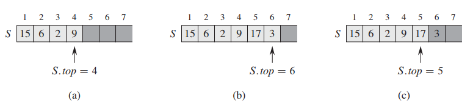
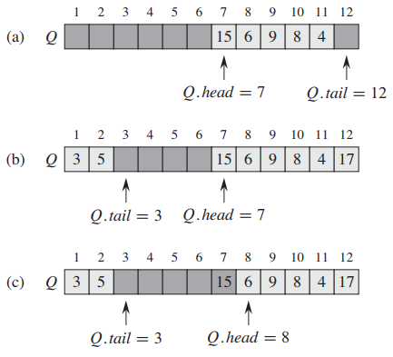

## 栈和队列

栈和队列都是动态集合，在栈中，被删除的是最近插入的元素：栈实现的是一种后进先出 (last-in, first-out, LIFO) 策略。类似地，在队列 (queue) 中，被删除的总是在集合中存在时间最长的那个元素：队列实现的是一种先进先出 (first-in, first-out, FIFO) 策略。

### 栈

栈上的插入操作称为压入 (push)，而无元素参数的删除操作称为弹出 (pop)。这两个名字使人联想到现实中的栈，比如餐馆里装有弹簧的摞盘子的栈，盘子从栈中弹出的次序刚好同它们被压入的次序相反，这是因为只有最上面的盘子才能被取下来。

可以用一个数组 arr[0...n-1] 来实现一个最多可容纳 n 个元素的栈。该数组有一个属性 top，指向最新插入的元素。栈中包含的元素为 arr[0...top]，其中 arr[0] 是栈底元素，arr[top] 是栈顶元素。当 top = -1 时，栈中不包含任何元素，即栈是空的。当 top = n - 1 时，栈是满的。



栈的数组实现。只有出现在浅灰色格子里的才是栈元素。（a）栈有 4 个元素，栈顶元素为 9。（b）调用 push(17) 和 push(3) 后的栈。（c）调用 pop 并返回最后压入的元素 3 的栈。虽然元素 3 仍在数组里，但它已不在栈内了，此时在栈顶的是元素 17。

```java
public class Stack {
    int[] arr;
    int top;
    
    Stack(int capacity) {
        arr = new int[capacity];
        top = -1;
    }
    
    boolean isEmpty() {
        return top == -1;
    }

    boolean isFull() {
        return top == arr.length - 1;
    }
    
    void push(int key) {
        if (isFull()) {
            throw new RuntimeException("stack overflow");
        }
        arr[++top] = key;
    }
    
    int pop() {
        if (isEmpty()) {
            throw new RuntimeException("stack underflow");
        }
        return arr[top--];
    }
}
```

### 队列

队列上的插入操作称为入队 (enqueue)，删除操作称为出队 (dequeue)。正如栈的 pop 操作一样，dequeue 操作也没有元素参数。队列的先进先出特性类似于收银台前排队等待结账的一排顾客。队列有队头 (head) 和队尾 (tail)，当有一个元素入队时，它被放在队尾的位置，就像一个新到来的顾客排在队伍的末端一样，而出队的元素则总是在队头的那个，就像排在队伍前面等待最久的那个顾客一样。



利用数组 arr[0...11] 实现一个队列。只有出现在浅灰色格子里的才是队列的元素。（a）列队包含 5 个元素，位于 arr[6...10]。（b）依次调用 enqueue(17)、enqueue(3) 和 enqueue(5) 后队列的构成。（c）在调用 dequeue 并返回原队头的关键字值 15 后，队列的构成，此时新的队头元素为 6。

可以用数组 arr[0...n-1] 来实现一个最多容纳 n - 1 个元素的队列。该队列有一个属性 head 指向队头元素，而属性 tail 指向下一个新元素将要插入的位置。队列中的元素存放在位置 head, head + 1, head + 2, ..., tail - 1，并在最后的位置环绕，感觉好像位置 0 紧邻在位置 n - 1 后面行成一个环。当 head = tail 时，队列为空，初始时有 head = tail = 0，当 head = tail + 1 或者 head = 0 且 tail = n - 1 时，队列是满的。

```java
public class Queue {
    int[] arr;
    int head;
    int tail;
    
    Queue(int capacity) {
        arr = new int[capacity + 1];
        head = 0;
        tail = 0;
    }
    
    boolean isEmpty() {
        return head == tail;
    }
    
    boolean isFull() {
        return (head == tail + 1) || (head == 0 && tail == arr.length - 1);
    }
    
    void enqueue(int key) {
        if (isFull()) {
            throw new RuntimeException("queue overflow");
        }
        arr[tail] = key;
        if (tail == arr.length - 1) {
            tail = 0;
        } else {
            tail++;
        }
    }
    
    int dequeue() {
        if (isEmpty()) {
            throw new RuntimeException("queue underflow");
        }
        int res = arr[head];
        if (head == arr.length - 1) {
            head = 0;
        } else {
            head++;
        }
        return res;
    }
}
```

队列的 enqueue 和 dequeue 操作的执行时间都为 O(1)。

#### 双端队列

栈插入和删除元素只能在同一端进行，队列的插入和删除操作分别在两端进行，与它们不同的是，有一种双端队列（double ended queue, deque），其插入和删除操作都可以在两端进行。可以用一个数组实现双端队列，其在两端插入和删除元素的时间都是 O(1)。

```java
public class Deque {
    int[] arr;
    int head;
    int tail;

    Deque(int capacity) {
        arr = new int[capacity];
        head = -1;
        tail = 0;
    }
    
    boolean isEmpty() {
        return head == -1;
    }

    boolean isFull() {
        return (head == tail + 1) || (head == 0 && tail == arr.length - 1);
    }

    void headEnqueue(int key) {
        if (isFull()) {
            throw new RuntimeException("overflow");
        }
        if (head == -1) {
            head = 0;
            tail = 0;
        } else if (head == 0) {
            head = arr.length - 1;
        } else {
            head--;
        }
        arr[head] = key;
    }

    void tailEnqueue(int key) {
        if (isFull()) {
            throw new RuntimeException("overflow");
        }
        if (head == -1) {
            head = 0;
            tail = 0;
        } else if (tail == arr.length - 1) {
            tail = 0;
        } else {
            tail++;
        }
        arr[tail] = key;
    }

    int headDequeue() {
        if (isEmpty()) {
            throw new RuntimeException("underflow");
        }
        int res = arr[head];
        if (head == tail) {
            head = -1;
            tail = -1;
        } else if (head == arr.length - 1) {
            head = 0;
        } else {
            head++;
        }
        return res;
    }

    int tailDequeue() {
        if (isEmpty()) {
            throw new RuntimeException("underflow");
        }
        int res = arr[tail];
        if (head == tail) {
            head = -1;
            tail = -1;
        } else if (tail == 0) {
            tail = arr.length - 1;
        } else {
            tail--;
        }
        return res;
    }
}
```

#### 用两个栈实现一个队列

用两个栈实现队列，就相当于把两个栈底靠在一起（背靠背），一个栈用来出队列（记为 out），一个栈用来进队列（记为 in）。enqueue 只需将元素 push 进 in，运行时间为 O(1)。dequeue 操作是从 out 中 pop 一个元素，当 out 不为空时，运行时间为 O(1)，而当 out 为空时，需要把 in 中的元素依次 pop 出来并 push 进 out 中，最后从 out 中 pop，此时运行时间为 O(n)。

```java
public class Queue {
    Stack in;
    Stack out;

    Queue(int capacity) {
        in = new Stack(capacity);
        out = new Stack(capacity);
    }
    
    boolean isEmpty() {
        return in.isEmpty() && out.isEmpty();
    }

    boolean isFull() {
        return in.isFull() && !out.isEmpty();
    }

    void enqueue(int key) {
        if (isFull()) {
            throw new RuntimeException("overflow");
        }
        in.push(key);
    }

    int dequeue() {
        if (isEmpty()) {
            throw new RuntimeException("underflow");
        } else {
            if (out.isEmpty()) {
                while (!in.isEmpty()) {
                    out.push(in.pop());
                }
            }
            return out.pop();
        }
    }
}
```

#### 用两个队列实现一个栈

用两个队列实现栈，队列轮流充当入栈和出栈的角色，在执行 pop 操作的时候两个队列会交换角色。push 操作只需将元素 enqueue 进队列中，运行时间为 O(1)。pop 操作需要把一个队列中的所有元素依次 dequeue 出来并 enqueue 进另一个队列中，当队列中只剩一个元素的时候，将这个唯一的元素 dequeue 出来返回，并停止 enqueue。pop 操作运行时间为 O(n)。

```java
public class Stack {
    Queue queue1;
    Queue queue2;

    Stack(int capacity) {
        queue1 = new Queue(capacity);
        queue2 = new Queue(capacity);
    }

    Queue active() {
        return queue1.isEmpty() ? queue2 : queue1;
    }

    Queue inactive() {
        return queue1.isEmpty() ? queue1 : queue2;
    }
    
    boolean isEmpty() {
        return active().isEmpty();
    }

    boolean isFull() {
        return active().isFull();
    }

    void push(int key) {
        if (isFull()) {
            throw new RuntimeException("overflow");
        }
        active().enqueue(key);
    }

    int pop() {
        if (isEmpty()) {
            throw new RuntimeException("underflow");
        }
        Queue out = active();
        Queue in = inactive();
        while (true) {
            int temp = out.dequeue();
            if (out.isEmpty()) {
                return temp;
            } else {
                in.enqueue(temp);
            }
        }
    }
}
```

#### 用一个单链表实现一个栈

push 操作只需直接调用链表的 insert，将元素插入到链表的头部。pop 操作只需删除链表的头部元素并将其返回。push 和 pop 的运行时间都是 O(1)。

```java
public class Stack {
    SinglyLinkedList list;
    
    Stack() {
        list = new SinglyLinkedList();
    }

    boolean isEmpty() {
        return list.head == null;
    }

    void push(int key) {
        list.insert(key);
    }

    int pop() {
        if (isEmpty()) {
            throw new RuntimeException("underflow");
        }
        int res = list.head.key;
        list.delete(list.head);
        return res;
    }
}
```

#### 用一个单链表实现一个队列

修改单链表的结构，使它含有 head 和 tail 两个属性。enqueue 操作只需将新结点插入到链表的尾部，运行时间为 O(1)。dequeue 操作只需删除链表的头部并将其返回，运行时间为 O(1)。

```java
public class Queue {
    Node head;
    Node tail;

    class Node {
        int key;
        Node next;

        Node(int key) {
            this.key = key;
        }
    }

    boolean isEmpty() {
        return head == null;
    }

    void enqueue(int key) {
        Node node = new Node(key);
        if (isEmpty()) {
            head = node;
            tail = node;
        } else {
            tail.next = node;
            tail = node;
        }
    }

    int dequeue() {
        if (isEmpty()) {
            throw new RuntimeException("underflow");
        }
        int res = head.key;
        head = head.next;
        return res;
    }
}
```
