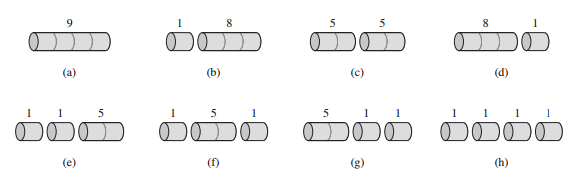

## 动态规划

动态规划（dynamic programming）与分治法类似，都是通过组合子问题的解来求解原问题（在这里，programming 指的是一种表格法，并非编写计算机程序）。分治法将问题划分为互不相交的子问题，递归地求解子问题，再将它们组合起来，求出原问题的解。与之相反，动态规划应用于子问题重叠的情况，即不同的子问题具有公共的子子问题（子问题的求解是递归进行的，将其划分为更小的子子问题）。在这种情况下，分治算法会做许多不必要的工作，它会反复地求解那些公共子子问题。而动态规划算法对每个子子问题只求解一次，将其解保存在一个表格中，从而无需每次求解一个子子问题时都重新计算，避免了这种不必要的计算工作。

动态规划方法常用来求解最优化问题（optimization problem）。这类问题可以有很多可行解，每个解都有一个值，我们希望寻找具有最优值（最大值或最小值）的解。我们称这样的解为问题的一个最优解（an optimal solution），而不是最优解（the optimal solution），因为可能有多个解都达到最优值。

通常按照如下 4 个步骤来设计一个动态规划算法：

1. 刻画一个最优解的结构特征。

2. 递归地定义最优解的值。

3. 计算最优解的值，通常采用自底向上的方法。

4. 利用计算出的信息构造一个最优解。

步骤 1 ~ 3 是动态规划算法求解问题的基础。如果我们仅仅需要一个最优解的值，而非解本身，可以忽略步骤 4。如果确实要做步骤 4，有时就需要在执行步骤 3 的过程中维护一些额外信息，以便用来构造一个最优解。

下面以钢条切割问题为例，展示如何通过动态规划方法来求解一些最优化问题。

### 钢条切割问题

钢条切割问题是这样的：给定一段长度为 n 英寸的钢条和一个价格表 p<sub>i</sub> (i = 1, 2, ..., n)，求钢条切割方案，使得销售收益 r<sub>n</sub> 最大。如果长度为 n 英寸的钢条的价格 p<sub>n</sub> 足够大，最优解可能就是完全不需要切割。切割工序本身没有成本支出。

以下是一个价格表的样例：


考虑 n = 4 的情况。下图给出了 4 英寸钢条所有可能的切割方案，包括根本不切割的方案。我们发现，将一段长度为 4 英寸的钢条切割为两段各 2 英寸的钢条，将产生 p<sub>2</sub> + p<sub>2</sub> = 5 + 5 = 10 的收益，为最优解。



4 英寸钢条的 8 种切割方案。根据上面的价格表，在每段钢条之上标记了它的价格。最优方案为方案（c）：将钢条切割为两段长度均为 2 英寸的钢条，总价值为 10。

长度为 n 英寸的钢条共有 2<sup>n-1</sup> 种不同的切割方案，因为在距离钢条左端 i (i = 1, 2, ..., n-1) 英寸处，我们总是可以选择切割或者不切割。我们用普通的加法符号表示切割方案，因此 7 = 2 + 2 + 3 表示将长度为 7 英寸的钢条切割为三段：两段长度为 2 英寸、一段长度为 3 英寸。如果一个最优解将钢条切割为 k 段 (1 <= k <= n)，那么最优切割方案 n = i<sub>1</sub> + i<sub>2</sub> + ... + i<sub>k</sub> 将钢条切割为长度分别为 i<sub>1</sub>, i<sub>2</sub>, i<sub>3</sub>, ..., i<sub>k</sub> 的小段，得到最大收益 r<sub>n</sub> = p<sub>i<sub>1</sub></sub> + p<sub>i<sub>2</sub></sub> + ... + p<sub>i<sub>k</sub></sub>。

对于上述价格表样例，我们可以观察所有最优收益值 r<sub>i</sub> (i = 1, 2, ..., 10) 及对应的最优切割方案：

* r<sub>1</sub> = 1, 切割方案 1 = 1（无切割）
* r<sub>2</sub> = 5, 切割方案 2 = 2（无切割）
* r<sub>3</sub> = 8, 切割方案 3 = 3（无切割）
* r<sub>4</sub> = 10, 切割方案 4 = 2 + 2
* r<sub>5</sub> = 13, 切割方案 5 = 2 + 3
* r<sub>6</sub> = 17, 切割方案 6 = 6（无切割）
* r<sub>7</sub> = 18, 切割方案 7 = 1 + 6 或 7 = 2 + 2 + 3
* r<sub>8</sub> = 22, 切割方案 8 = 2 + 6
* r<sub>9</sub> = 25, 切割方案 9 = 3 + 6
* r<sub>10</sub> = 30, 切割方案 10 = 10（无切割）

更一般地，对于 r<sub>n</sub> (n >= 1)，我们可以用更短的钢条的最优切割收益来描述它：

> r<sub>n</sub> = max(p<sub>n</sub>, r<sub>1</sub> + r<sub>n-1</sub>, r<sub>2</sub> + r<sub>n-2</sub>, ..., r<sub>n-1</sub> + r<sub>1</sub>)

第一个参数 p<sub>n</sub> 对应不切割，直接出售长度为 n 英寸的钢条的方案，其它 n - 1 个参数对应另外 n - 1 种方案：对于每个 i = 1, 2, ..., n-1，首先将钢条切割为长度为 i 和 n - i 的两段，接着求解这两段的最优切割收益 r<sub>i</sub> 和 r<sub>n-i</sub>（每种方案的最优收益为两段的最优收益之和）。由于无法预知哪种方案会获得最优收益，我们必须考察所有可能的 i，选取其中收益最大者。如果直接出售原钢条会获得最大收益，我们当然可以选择不做任何切割。

注意到，为了求解规模为 n 的原问题，我们先求解形式完全一样，但规模更小的子问题，即当完成首次切割后，我们将两段钢条看成两个独立的钢条切割问题实例。我们通过组合两个相关子问题的最优解，并在所有可能的两段切割方案中选取组合收益最大者，构成原问题的最优解。我们称钢条切割问题满足最优子结构（optimal substructure）性质：问题的最优解由相关子问题的最优解组合而成，而这些子问题可以独立求解。

除了上述求解方法之外，钢条切割问题还存在一种相似的但更为简单的递归求解方法：我们将钢条从左边切割下长度为 i 的一段，只对右边剩下的长度为 n - i 的一段继续进行切割（递归求解），对左边的一段则不再进行切割。即问题分解的方式为：将长度为 n 的钢条分解为左边开始一段，及剩余部分继续分解的结果。这样，不做任何切割的方案就可以描述为：第一段的长度为 n，收益为 p<sub>n</sub>，剩余部分长度为 0，对应的收益为 r<sub>0</sub> = 0。于是我们得到上面公式的简化版本：

> r<sub>n</sub> = max(p<sub>i</sub> + r<sub>n-i</sub>)         1 <= i <= n

在此公式中，原问题的最优解只包含一个相关子问题（右端剩余部分）的解，而不是两个。

### 自顶向下递归实现

下面的过程实现了上面公式的计算，它采用的是一种直接的自顶向下的递归方法。

```java
int recursive(int[] p, int n) {
    if (n == 0) {
        return 0;
    }
    int max = Integer.MIN_VALUE;
    for (int i = 1; i <= n; i++) {
        max = Math.max(max, p[i - 1] + recursive(p, n - i));
    }
    return max;
}
```

上面 recursive 算法的效率相当的差，原因在于，它反复地用相同的参数值对自身进行递归调用，即它反复求解相同的子问题。下图显示了 n = 4 时的调用过程，当这个递归过程展开时，它所做的工作量（用 n 的函数的形式描述）会爆炸性地增长。


这棵递归调用树显示了 n = 4 时，recursive 的递归调用过程。每个结点的标号为对应子问题的规模 n，因此，从父结点 s 到子节点 t 的边表示从钢条左端切下长度为 s - t 的一段，然后继续递归求解剩余的规模为 t 的子问题。从根结点到叶结点的一条路径对应长度为 n 的钢条的的 2<sup>n-1</sup> 种切割方案之一。一般来说，这棵递归调用树共有 2<sup>n</sup> 个结点，其中有 2<sup>n-1</sup> 个叶结点。

### 使用动态规划方法求解最优钢条切割问题

我们已经看到，朴素递归算法之所以效率很低，是因为它反复求解相同的子问题。因此，动态规划方法仔细安排求解顺序，对每个子问题只求解一次，并将结果保存下来。如果随后再次需要此子问题的解，只需查找保存的结果，而不必重新计算。因此，动态规划方法是付出额外的内存空间来节省计算时间，是典型的时空权衡（time-memory trade-off）的例子。而时间上的节省可能是非常巨大的：可能将一个指数时间的解转化为一个多项式时间的解。

动态规划有两种等价的实现方法。

1. 第一种方法称为带备忘的自顶向下法（top-down with memorization）。此方法仍按自然的递归形式编写过程，但过程会保存每个子问题的解（通常保存在一个数组或散列表中）。当需要一个子问题的解时，过程首先检查是否已经保存过此解。如果是，则直接返回保存的值，从而节省了计算时间，否则，按通常方式计算这个子问题。我们称这个过程是带备忘的（memorized），因为它记住了之前已经计算的值。

2. 第二种方法称为自底向上法（bottom-up method）。这种方法一般需要恰当定义子问题“规模”的概念，使得任何子问题的求解都只依赖于“更小的”子问题的求解。因而我们可以将子问题按规模排序，按由小到大的顺序进行求解。当求解某个子问题时，它所依赖的那些更小的子问题都已求解完毕，结果已经保存。每个子问题只需求解一次，当我们求解它（也是第一次遇到它）时，它所有的前提子问题都已求解完成。

两种方法得到的算法具有相同的渐进运行时间，仅有的差异是在某些特殊情况下，自顶向下法并未真正递归地考察所有可能的子问题。由于没有频繁的递归函数调用的开销，自底向上法的时间复杂度函数通常具有更小的系数。

下面给出的是自顶向下的钢条切割算法，在直接递归算法上加入了备忘机制：

```java
int memorized(int[] p) {
    int n = p.length;
    int[] r = new int[n + 1];
    r[0] = 0;
    for (int i = 1; i <= n; i++) {
        r[i] = Integer.MIN_VALUE;
    }
    return memorizedAux(p, n, r);
}

int memorizedAux(int[] p, int n, int[] r) {
    if (r[n] >= 0) {
        return r[n];
    }
    int max = Integer.MIN_VALUE;
    for (int i = 1; i <= n; i++) {
        max = Math.max(max, p[i - 1] + memorizedAux(p, n - i, r));
    }
    r[n] = max;
    return max;
}
```

主过程 memorized 将辅助数组 r[0...n] 的元素均初始化为 -∞，这是一种常见的表示未知值的方法（已知的收益总是非负值），然后它会调用辅助过程 memorizedAux。memorizedAux 是最初的 recursive 引入备忘机制的版本，它首先检查所需值是否已知，如果是，则直接返回保存过的值，否则，用通常方法计算所需值，并将其保存起来。

自底向上版本更为简单：

```java
int bottomUp(int[] p) {
    int n = p.length;
    int[] r = new int[n + 1];
    r[0] = 0;
    for (int j = 1; j <= n; j++) {
        int max = Integer.MIN_VALUE;
        for (int i = 1; i <= j; i++) {
            max = Math.max(max, p[i - 1] + r[j - i]);
        }
        r[j] = max;
    }
    return r[n];
}
```

自底向上版本采用子问题的自然顺序：若 i < j，则规模为 i 的子问题比规模为 j 的子问题更小，因此，依次求解规模为 j = 1, 2, ..., n 的子问题。

自底向上算法和自顶向下算法具有相同的渐近运行时间。bottomUp 的主体是嵌套的双重循环，内层 for 循环的迭代次数构成一个等差数列，不难分析过程的运行时间为 Θ(n<sup>2</sup>)。自顶向下的 memorized 的运行时间也是 Θ(n<sup>2</sup>)，其分析略难一些：当求解一个之前已计算出结果的子问题时，递归调用会立即返回，即 memorized 对每个子问题只求解一次，而它求解了规模为 0, 1, ..., n 的子问题。求解规模为 n 的子问题，for 循环会迭代 n 次，因此 memorized 进行的所有递归调用执行此 for 循环的迭代次数也是一个等差数列，其和也是 Θ(n<sup>2</sup>)，与 bottomUp 内层 for 循环的迭代总次数一样。

### 构造解

上面给出的钢条切割问题的动态规划算法返回最优解的收益值，但并未返回解本身（一个长度列表，给出切割后每段钢条的长度）。我们可以扩展动态规划算法，使之对每个子问题不仅保存最优收益值，还保存对应的切割方案。利用这些信息，我们就能输出最优解。

下面给出 bottomUp 的扩展版本，它对长度为 j 的钢条不仅计算最大收益值 r[j]，还保存最优解对应的第一段钢条的切割长度 s[j]。

```java
Object[] extendedBottomUp(int[] p) {
    int n = p.length;
    int[] r = new int[n + 1];
    int[] s = new int[n + 1];
    r[0] = 0;
    for (int j = 1; j <= n; j++) {
        int max = Integer.MIN_VALUE;
        for (int i = 1; i <= j; i++) {
            if (max < p[i - 1] + r[j - i]) {
                max = p[i - 1] + r[j - i];
                s[j] = i;
            }
        }
        r[j] = max;
    }
    return new Object[]{r[n], s};
}
```

可以利用 extendedBottomUp 计算出来的 s[1...n]，输出长度为 n 的钢条的完整的最优切割方案。

```java
void constructSolution(int[] s, int n) {
    while (n > 0) {
        System.out.print(s[n] + " ");
        n -= s[n];
    }
}
```
