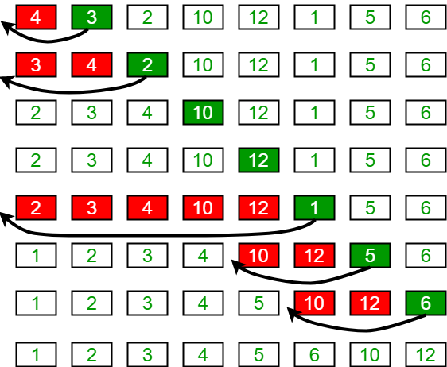

## 插入排序

对于少量的元素，插入排序是一个高效的算法。插入排序的工作方式就像许多人排序一手的扑克牌，开始时，我们的左手只有一张牌，它当然是排好序的。然后，我们每次
从桌子上拿走一张牌并将它插入到左手中正确的位置。为了找到一张牌的正确位置，我们从右到左将它与已在手中的每张牌进行比较。如下图所示，拿在左手中的牌总是排
好序的。

例如，对数组[4, 3, 2, 10, 12, 1, 5, 6]的排序过程如下：

