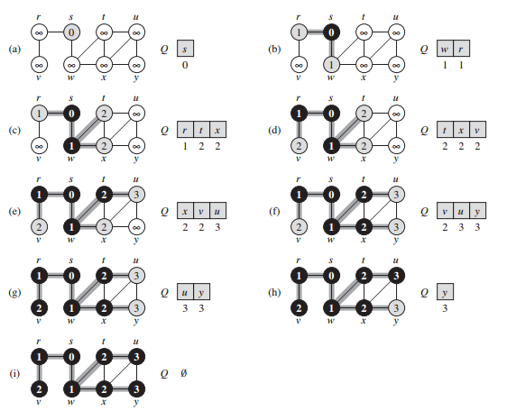

## 广度优先搜索

广度优先搜索是最简单的图搜索算法之一，也是许多重要的图算法的原型。Prim 的最小生成树算法和 Dijkstra 的单源最短路径算法都使用了类似广度优先搜索的思想。

给定图 G = (V, E) 和一个可识别的源结点 s，广度优先搜索对图 G 中的边进行系统性的探索来发现可以从源结点 s 到达的所有结点。该算法能够计算从源结点 s 到每个可达的结点的距离（最少的边数），同时生成一棵“广度优先搜索树”，该树以源结点 s 为根结点，包含所有可以从 s 到达的结点。对于每个源结点 s 可以到达的结点 v，在广度优先搜索树里从结点 s 到结点 v 的简单路径所对应的就是图 G 中从结点 s 到结点 v 的最短路径，即包含最少边数的路径。该算法既可以用于有向图，也可以用于无向图。

广度优先搜索之所以如此得名是因为该算法始终是将已发现结点和未发现结点之间的边界，沿其广度方向向外扩展，也就是说，算法需要在发现距离源结点 s 为 k 的所有结点之后，才会发现距离源结点 s 为 k + 1 的其它结点。

为了跟踪算法的进展，广度优先搜索在概念上将每个结点涂上白色、灰色或者黑色。所有结点在一开始的时候均涂上白色，在算法推进的过程中，这些结点可能会变成灰色或者黑色。在搜索过程中，第一次遇到一个结点就称该结点被“发现”，此时该结点的颜色将发生改变。因此，凡是灰色和黑色的结点都是已被发现的结点。但广度优先搜索对灰色和黑色结点加以区分，以确保搜索按照广度优先模式进行推进。如果边 (u, v) ∈ E 且结点 u 是黑色，则结点 v 既可能是灰色也可能是黑色，也就是说，所有与黑色结点邻接的结点都已经被发现。对于灰色结点来说，其邻接结点中可能存在未被发现的白色结点，灰色结点所代表的就是已知和未知两个集合之间的边界。

在执行广度优先搜索的过程中将构造出一棵广度优先树。一开始，该树仅含有根结点，就是源结点 s。在扫描已发现结点 u 的邻接链表时，每当发现一个白色结点 v，就将结点 v 和边 (u, v) 同时加入该棵树中。在广度优先树中，称结点 u 是结点 v 的前驱或者父结点。由于每个结点最多被发现一次，它最多只有一个父结点。广度优先树中的祖先和后代关系皆以相对于根结点 s 的位置来进行定义：如果结点 u 是从根结点 s 到结点 v 的简单路径上的一个结点，则结点 u 是结点 v 的祖先，结点 v 是结点 u 的后代。

下图描述的是 bfs 在一个样本图上的推进过程。



bfs 在无向图上的运行过程。添加了阴影的边是被 bfs 发现的边，每个结点 u 里面记录的是 u.d 的值。图中还给出了算法在 while 循环每次开始时队列中的内容。结点距离标记在队列相应结点的下方。

下面给出的广度优先搜索算法中，假定输入图 G = (V, E) 是以邻接链表所表示的。该算法为图中每个结点赋予了一些额外的属性：我们将每个结点 u 是否被发现存放在属性 u.visited 里，将 u 的前驱结点存放在属性 u.pre 里，如果 u 没有前驱结点（例如，如果 u = s 或者结点 u 尚未被发现），则 u.pre = null。属性 u.d 记录的是广度优先搜索算法所计算出的从源结点 s 到结点 u 之间的距离。该算法使用一个先进先出的队列来管理灰色结点集。

```java
class Vertex {
    // Other fields and methods ...

    boolean visited;
    Vertex pre;
    int d;
}

void bfs(Graph graph, int rootId) {
    int V = graph.V;
    for (int i = 0; i < V; i++) {
        Vertex u = graph.vertices[i];
        u.visited = false;
        u.d = Integer.MAX_VALUE;
        u.pre = null;
    }
    Vertex root = graph.vertices[rootId];
    root.visited = true;
    root.d = 0;
    Queue<Vertex> queue = new LinkedList<>();
    queue.add(root);
    while (!queue.isEmpty()) {
        Vertex u = queue.remove();
        for (Edge e : graph.adj[u.id]) {
            Vertex v = graph.vertices[e.other(u.id)];
            if (!v.visited) {
                v.visited = true;
                v.d = u.d + 1;
                v.pre = u;
                queue.add(v);
            }
        }
        u.visited = true;
    }
}
```

广度优先搜索的结果依赖于对每个结点的邻接结点的访问顺序，广度优先树可能会不一样，但算法所计算出来的距离 d 都是一样的。

### 分析

我们来分析该算法的运行时间。在初始化操作结束后，广度优先搜索不会再给任何结点涂上白色，因此，```if (!v.visited)``` 的测试可以确保每个结点的入队次数最多为一次，因而出队最多一次。入队和出队的时间均为 O(1)，因此，对队列进行操作的总时间为 O(V)。因为算法只在一个结点出队的时候才对该结点的邻接链表进行扫描，所以每个邻接链表最多只扫描一次。由于所有邻接链表的长度之和是 Θ(E)，用于扫描邻接链表的总时间为 O(E)。初始化操作的成本是 O(V)，因此，广度优先搜索的总运行时间为 O(V + E)，即广度优先搜索的运行时间是图 G 的邻接链表大小的一个线性函数。

### 最短路径

广度优先搜索能够找出从给定源结点 s ∈ V 到所有可以到达的结点之间的距离，我们定义从源结点 s 到结点 v 的最短路径距离 δ(s, v) 为从结点 s 到结点 v 之间所有路径里面最少的边数，如果从结点 s 到结点 v 之间没有路径，则 δ(s, v) = ∞。

### 广度优先树

过程 bfs 在对图进行搜索的过程中将创建一棵广度优先树，该棵树对应的是 pre 属性。更形式化地说，对于图 G = (V, E) 和源结点 s，我们定义图 G 的前驱子图为 G<sub>pre</sub> = (V<sub>pre</sub>, E<sub>pre</sub>)，其中 V<sub>pre</sub> = {v ∈ V : v.pre != null} ∪ {s}，E<sub>pre</sub> = {(v.pre, v) : v ∈ V<sub>pre</sub> - {s}}。

如果 V<sub>pre</sub> 由源结点 s 可以到达的结点组成，并且对于所有的 v ∈ V<sub>pre</sub>，子图 G<sub>pre</sub> 包含一条从源结点 s 到结点 v 的唯一简单路径，且该路径也是图 G 里面从源结点 s 到结点 v 之间的一条最短路径，则前驱子图 G<sub>pre</sub> 是一棵广度优先树。广度优先树实际上就是一棵树，因为它是连通的，并且 ∣E<sub>pre</sub>∣ = ∣V<sub>pre</sub>∣ - 1。我们称 E<sub>pre</sub> 中的边为树边。

下面的代码将打印出从源结点 s 到结点 v 的一条最短路径上的所有结点，这里假定 bfs 已经计算出一棵广度优先树。

```java
void printPath(Vertex src, Vertex dest) {
    if (src == dest) {
        System.out.print(src + " ");
    } else {
        if (dest.pre == null) {
            System.out.println("No path from " + src + " to " + dest + " exists");
        } else {
            printPath(src, dest.pre);
            System.out.print(dest + " ");
        }
    }
}
```

因为每次递归调用时的路径都比前一次调用中的路径少一个结点，所以该过程的运行时间是关于所输出路径上顶点数的一个线性函数。
