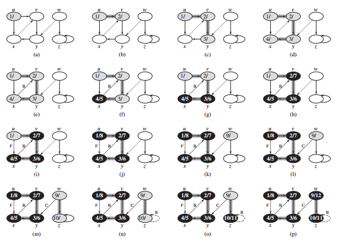
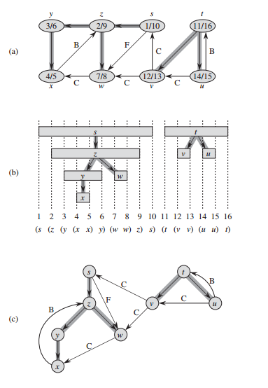
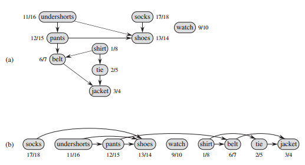
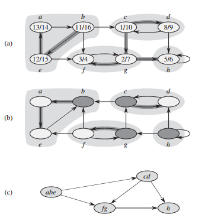

## 深度优先搜索

深度优先搜索所使用的策略就像其名字所隐含的：只要可能，就在图中尽量深入。深度优先总是对最近才发现的结点 v 的出发边进行探索，直到该结点的所有出发边都被发现为止，一旦结点 v 的所有出发边都被发现，探索则回溯到 v 的前驱结点（v 是经过该结点才被发现的），来搜索该前驱结点的出发边。该过程一直持续到从源结点可以到达的所有结点都被发现为止。如果还存在尚未发现的结点，则深度优先搜索将从这些未被发现的结点中任选一个作为新的源结点，并重复同样的搜索过程。该算法重复整个过程，直到图中的所有结点都被发现为止。

像广度优先搜索一样，在对已被发现的结点 u 的邻接链表进行扫描时，每当发现一个结点 v，深度优先搜索算法将对这个事件进行记录，将 v 的前驱属性 v.pre 设置为 u。不过，与广度优先搜索不同的是，广度优先搜索的前驱子图形成一棵树，而深度优先搜索的前驱子图可能由多棵树组成，因为搜索可能从多个源结点重复进行。因此，我们给深度优先搜索的前驱子图所下的定义与广度优先搜索前驱子图所下的定义略有不同：设图 G<sub>pre</sub> = (V, E<sub>pre</sub>)，其中 E<sub>pre</sub> = {(v.pre, v) : v ∈ V 且 v.pre != null}。深度优先搜索的前驱子图形成一个由多棵深度优先树构成的深度优先森林，森林 E<sub>pre</sub> 中的边仍然称为树边。

像广度优先搜索算法一样，深度优先搜索算法在搜索过程中也是对结点进行涂色来指明结点的状态。每个结点的初始颜色都是白色，在结点被发现后变为灰色，在其邻接链表被扫描完成后变为黑色。该方法可以保证每个结点仅在一棵深度优先树中出现，因此，所有的深度优先树都是不相交的 (disjoint)。

除了创建一个深度优先搜索森林外，深度优先搜索算法还在每个结点盖上一个时间戳，每个结点 v 有两个时间戳：第一个时间戳 v.d 记录结点 v 第一次被发现的时间（涂上灰色的时候），第二个时间戳 u.f 记录的是搜索完成对 v 的邻接链表扫描的时间（涂上黑色的时候）。这些时间戳提供了图的重要信息，通常能够帮助推断深度优先搜索算法的行为。

下面的深度优先搜索的代码将其发现结点 u 的时刻记录在属性 u.d 中，将其完成对结点 u 处理的时刻记录在属性 u.f 中。因为 ∣V∣ 个结点中的每个结点只能有一个发现事件和一个完成事件，所以这些时间戳都是处于 1 和 2∣V∣ 之间的整数。很显然，对每个结点 u，我们有：u.d < u.f。结点 u 在时刻 u.d 之前为白色，在时刻 u.d 和 u.f 之间为灰色，在时刻 u.f 之后为黑色。

```java
class Vertex {
    // Other fields and methods ...

    boolean visited;
    Vertex pre;
    int d;
    int f;
}
```

下面的代码给出的是基本的深度优先搜索算法，输入图 G 既可以是无向图，也可以是有向图，变量 time 是一个全局变量，用来计算时间戳。

```java
int time = 0;

void dfs(Graph graph) {
    int V = graph.V;
    for (int i = 0; i < V; i++) {
        Vertex u = graph.vertices[i];
        u.visited = false;
        u.pre = null;
    }
    for (int i = 0; i < V; i++) {
        Vertex u = graph.vertices[i];
        if (!u.visited) {
            visit(graph, u);
        }
    }
}

void visit(Graph graph, Vertex u) {
    time++;
    u.d= time;
    u.visited = true;
    for (Edge e : graph.adj[u.id]) {
        Vertex v = graph.vertices[e.other(u.id)];
        if (!v.visited) {
            v.pre = u;
            visit(graph, v);
        }
    }
    time++;
    u.f = time;
}
```

注意，深度优先搜索的结果可能依赖于算法 dfs 中第二个 for 循环对结点进行检查的次序和算法 visit 的 for 循环对一个结点的邻接结点进行访问的次序。不过，这些不同的访问次序在实际中并不会导致问题，因为我们通常可以对任意的深度优先搜索结果加以有效利用，并获得等价的结果。



深度优先搜索算法 dfs 在有向图上的运行过程。随着算法对边的探索的推进，这些边或者变成有阴影的边（如果它们是树边），或者变为虚线边（其它情况）。非树边则根据其后向（back）边、横向（cross）边或前向（forward）边而分别标记为 B、C 或 F。结点中的时间戳表明该结点的发现时间和完成时间。

dfs 的运行时间是多少呢？如果排除 visit 的时间，dfs 的两个 for 循环所需的时间为 Θ(V)。对每个结点 v ∈ V 来说，visit 被调用的次数刚好为一次，这是因为在对一个结点 u 调用 visit 时，该结点 u 必须是白色，而 visit 所做的第一件事情就是将结点 u 涂上灰色。在执行 visit 的过程中，for 循环的执行次数为 ∣adj[v]∣。由于 ∑<sub>v∈V</sub>∣adj[v]∣ = Θ(E)，执行 visit 的 for 循环的总成本是 Θ(E)。因此，深度优先搜索算法的运行时间为 Θ(V + E)。

### 深度优先搜索的性质

深度优先搜索提供的是关于图结构的价值很高的信息。也许深度优先搜索最基本的性质是，其生成的前驱子图 G<sub>pre</sub> 形成一个由多棵树所构成的森林，这是因为深度优先树的结构与 visit 的递归调用结构完全对应。也就是说，u = v.pre 当且仅当 visit(G, v) 在算法对结点 u 的邻接链表进行搜索时被调用。此外，结点 v 是深度优先森林里结点 u 的后代当且仅当结点 v 在结点 u 为灰色的时间段里被发现。

深度优先搜索的另一个重要性质是，结点的发现时间和完成时间具有所谓的括号化结构（parenthesis structure）。如果以左括号 "(u" 来表示结点 u 的发现，以右括号 "u)" 来表示结点 u 的完成，则发现和完成的历史记载形成一个规整的表达式，这里“规整”的意思是所有的括号都适当地嵌套在一起。例如，对下图 (a) 进行深度优先搜索对应的括号化结构如下图 (b) 所示。



深度优先搜索的性质。(a) 有向图上的深度优先搜索结果。每个结点都有自己的时间戳，边的类型也在图中予以标注。(b) 每个结点的发现时间和完成时间所构成的区间对应图中所示的括号化结构。每个矩形区域横跨由相应结点的发现和完成时间所给出的时间区间。图中给出的边都是树边（非树边被略去了）。如果两个时间区间存在重叠，则其中一个区间必定完全囊括在另一个区间内部，而对应较小区间的结点是对应较大区间结点的后代。(c) 对图 (a) 所进行的重画，该图给出了深度优先树中所有的树边、往下的从祖先指向后代的前向边和往上的从后代指向祖先的后向边。

下面的定理提供了另一种对括号化结构进行描述的方法。

括号化定理：在对有向或无向图 G = (V, E) 进行的任意深度优先搜索中，对于任意两个结点 u 和 v 来说，下面三种情况只有一种成立：

* 区间 [u.d, u.f] 和区间 [v.d, v.f] 完全分离，在深度优先森林中，结点 u 不是结点 v 的后代，结点 v 也不是结点 u 的后代。

* 区间 [u.d, u.f] 完全包含在区间 [v.d, v.f] 内，在深度优先树中，结点 u 是结点 v 的后代。

* 区间 [v.d, v.f] 完全包含在区间 [u.d, u.f] 内，在深度优先树中，结点 v 是结点 u 的后代。

推论（后代区间的嵌套）：在有向或无向图 G 的深度优先森林中，结点 v 是结点 u 的后代当且仅当 u.d < v.d < v.f < u.f 成立。

### 拓扑排序

对于一个有向无环图 G = (V, E) 来说，其拓扑排序是 G 中所有结点的一种线性次序，该次序满足如下条件：如果图 G 包含边 (u, v)，则结点 u 在拓扑排序中处于结点 v 的前面（如果图 G 包含环路，则不可能排出一个线性次序）。可以将图的拓扑排序看作是将图的所有结点在一条水平线上排开，图的所有有向边都从左指向右。因此，拓扑排序与通常意义上的“排序”是不同的。

许多实际应用都需要使用有向无环图来指明事件的优先次序，下图描述的是早上起床穿衣所发生的事件的次序图。必须先穿某些衣服，才能再穿其它衣服（比如先穿袜子后才能再穿鞋），有些服饰则可以以任意顺序穿上（比如袜子和裤子之间可以以任意次序进行穿戴）。在下图 (a) 所示的有向无环图中，有向边 (u, v) 表明服装 u 必须在服装 v 之前穿上，对该有向无环图进行拓扑排序所获得的就是一种合理的穿衣次序。下图 (b) 将拓扑排序后的有向无环图在一条水平线上展示出来，在该水平线上，所有的有向边都从左指向右。



(a) 对早上的穿衣进行的拓扑排序。每条有向边 (u, v) 表明服装 u 必须在服装 v 之前穿上。深度优先搜索的发现时间和完成时间注明在每个结点旁边。(b) 以拓扑排序展示的同一个图，所有的结点按照其完成时间的逆序被排成从左至右的一条水平线，所有的有向边都从左指向右。

下面的算法可以对一个有向无环图进行拓扑排序：

```java
LinkedList<Vertex> vertices = new LinkedList<>();

LinkedList<Vertex> topologicalSort(Digraph digraph) {
    dfs(digraph);
    return vertices;
}

void dfs(Digraph digraph) {
    int V = digraph.V;
    for (int i = 0; i < V; i++) {
        Vertex u = digraph.vertices[i];
        u.visited = false;
    }
    for (int i = 0; i < V; i++) {
        Vertex u = digraph.vertices[i];
        if (!u.visited) {
            visit(digraph, u);
        }
    }
}

void visit(Digraph digraph, Vertex u) {
    u.visited = true;
    for (Edge e : digraph.adj[u.id]) {
        Vertex v = digraph.vertices[e.other(u.id)];
        if (!v.visited) {
            visit(digraph, v);
        }
    }
    vertices.add(0, u);
}
```

上图 (b) 描述的是经过拓扑排序后的结点次序，这个次序与结点的完成时间恰好相反。

我们可以在 Θ(V + E) 的时间内完成拓扑排序，因为深度优先搜索算法的运行时间为 Θ(V + E)，将结点插入到链表最前端所需的时间为 O(1)，而一共只有 ∣V∣ 个结点需要插入。

### 强连通分量

我们现在来考虑深度优先搜索的一个经典应用：将有向图分解为强连通分量。许多针对有向图的算法都是以这种分解操作开始，在将图分解为强连通分量后，这些算法将分别运行在每个连通分量上，然后根据连通分量之间的连接结构将各个结果组合起来，从而获得最终所需的结果。

有向图 G = (V, E) 的强连通分量是一个最大结点集合 C ⊆ V，对于该集合中的任意一对结点 u 和 v 来说，路径 u ~~> v 和路径 v ~~> u 同时存在，也就是说，结点 u 和结点 v 可以互相到达。下图描述的是强连通分量的一个例子。



(a) 有向图 G，每个加了阴影的区域是 G 的一个强连通分量，每个结点上注明了其在深度优先搜索中的发现时间和完成时间，所有的树边都加了额外的阴影。(b) 图 G 的转置图 G<sup>T</sup>，图中注明了算法 stronglyConnectedComponents 第 3 行所计算出来的深度优先森林。所有树边都加上了额外的阴影。每个强连通分量对应一棵深度优先树。加了深阴影的结点 b、c、g 和 h 全部是深度优先树的根节点。这些深度优先树是在转置图 G<sup>T</sup> 上运行深度优先搜索算法所获得的。(c) 无环分量图 G<sup>SCC</sup>，由对图 G 的强连通分量进行收缩而成，这种收缩将每个强连通分量收缩为一个结点，即由一个结点来替换整个连通分量。

我们用于寻找强连通分量的算法需要用到图 G = (V, E) 的转置，将其定义为 G<sup>T</sup> = (V, E<sup>T</sup>)，这里 E<sup>T</sup> = {(u, v) : (v, u) ∈ E}。也就是说， E<sup>T</sup> 由对图 G 中的边进行反向而获得。给定图 G 的邻接链表，创建 G<sup>T</sup> 的时间为 O(V + E)。有趣的是，图 G 和图 G<sup>T</sup> 的强连通分量完全相同：u 和 v 在图 G 中可以相互到达当且仅当它们在图 G<sup>T</sup> 中可以相互到达。上图 (b) 描述的就是图 (a) 的转置，我们在其强连通分量上加了阴影。

```java
class Digraph {
    // Other fields and methods ...

    Digraph transpose() {
        Digraph tDigraph = new Digraph(V);
        for (int i = 0; i < V; i++) {
            for (Edge e : adj[i]) {
                tDigraph.addEdge(e.other(i), i);
            }
        }
        return tDigraph;
    }
}
```

下面的线性时间（即 Θ(V + E) 时间）算法使用两次深度优先搜索来计算有向图 G = (V, E) 的强连通分量。这两次深度优先搜索一次运行在图 G 上，一次运行在转置图 G<sup>T</sup> 上。

```java
class KosarajuStronglyConnectedComponents {
    LinkedList<Vertex>[] components;
    int count = 0;
    Stack<Vertex> stack = new Stack<>();

    void stronglyConnectedComponents(Digraph digraph) {
        int V = digraph.V;

        for (int i = 0; i < V; i++) {
            digraph.vertices[i].visited = false;
        }
        for (int i = 0; i < V; i++) {
            Vertex u = digraph.vertices[i];
            if (!u.visited) {
                dfs(digraph, u, false);
            }
        }

        Digraph tDigraph = digraph.transpose();
        for (int i = 0; i < V; i++) {
            tDigraph.vertices[i].visited = false;
        }
        while (!stack.isEmpty()) {
            Vertex u = tDigraph.vertices[stack.pop().id];
            if (!u.visited) {
                dfs(tDigraph, u, true);
                count++;
            }
        }

        components = new LinkedList[count];
        for (int i = 0; i < count; i++) {
            components[i] = new LinkedList<>();
        }
        for (int i = 0; i < V; i++) {
            Vertex u = tDigraph.vertices[i];
            components[u.componentId].add(u);
        }
    }

    void dfs(Digraph digraph, Vertex u, boolean isT) {
        u.visited = true;
        for (Edge e : digraph.adj[u.id]) {
            Vertex v = digraph.vertices[e.other(u.id)];
            if (!v.visited) {
                dfs(digraph,v, isT);
            }
        }
        if (isT) {
            u.componentId = count;
        } else {
            stack.push(u);
        }
    }

    boolean connected(int uId, int vId) {
        Vertex u = resultDigraph.vertices[uId];
        Vertex v = resultDigraph.vertices[vId];
        return u.componentId == v.componentId;
    }
}
```

上述算法背后的思想来自于分量图 G<sup>SCC</sup> = (V<sup>SCC</sup>, E<sup>SCC</sup>) 的一个关键性质，这个关键性质的定义如下：假定图 G 有强连通分量 C<sub>1</sub>, C<sub>2</sub>, ..., C<sub>k</sub>，结点集 V<sup>SCC</sup> 为 {v<sub>1</sub>, v<sub>2</sub>, ..., v<sub>k</sub>}，对于图 G 的每个强连通分量 C<sub>i</sub> 来说，该集合包含该分量的结点 v<sub>i</sub>。如果对某个 x ∈ C<sub>i</sub> 和 y ∈ C<sub>j</sub>，图 G 包含一条有向边 (x, y)，则边 (v<sub>i</sub>, v<sub>j</sub>) ∈ E<sup>SCC</sup>。从另一个角度来看，通过收缩所有相邻结点都在同一个强连通分量中的边，剩下的图就是 G<sup>SCC</sup>。图 (c) 描述的就是图 (a) 的分量图。

分量图的关键性质是：分量图是一个有向无环图。该事实可由下面的引理所推出。

引理：设 C 和 C' 为有向图 G = (V, E) 的两个不同的强连通分量，设结点 u, v ∈ C，结点 u', v' ∈ C'，假定图 G 包含一条从结点 u 到结点 u' 的路径 u ~~> u'，那么图 G 不可能包含一条从结点 v' 到结点 v 的路径 v' ~~> v。

证明：如果图 G 包含一条从结点 v' 到结点 v 的路径 v' ~~> v，则 G 也将包含路径 u ~~> u' ~~> v' 和 v' ~~> v ~~> u，因此 u 和 v' 可以互相到达，从而与 C 和 C' 是不同的强连通分量的假设矛盾。

在进行第二次深度优先搜索时，以第一次深度优先搜索所计算出的结点完成时间的递减顺序来对结点进行考察，我们实际上是在以拓扑排序的次序来访问分量图中的结点（每个结点对应图 G 中的一个强连通分量）。
