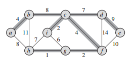
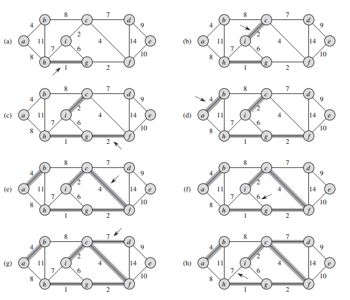
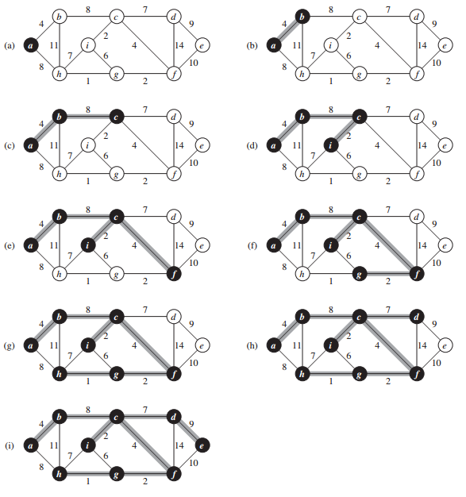

## 最小生成树

在电子电路设计中，我们常常需要将多个组件的针脚连接在一起，要连接 n 个针脚，我们可以使用 n - 1 根连线，每根连线连接两个针脚。很显然，我们希望所使用的连线长度最短。

我们可以将上述的布线问题用一个连通无向图 G = (V, E) 来表示，这里的 V 是针脚的集合，E 是针脚之间的可能连接，并且对每条边 (u, v) ∈ E，我们为其赋予权重 w(u, v) 作为连接针脚 u 和针脚 v 的代价（也就是连线的长度）。我们希望找到一个无环子集 T ⊆ E，既能够将所有的结点（针脚）连接起来，又具有最小的权重，即 w(T) = ∑<sub>(u,v)∈T</sub>w(u, v) 的值最小。由于 T 是无环的，并且连通所有的结点，因此，T 必然是一棵树，我们称这样的树为（图 G 的）生成树，因为它是由图 G 所生成的。我们称求取该生成树的问题为最小生成树问题。下图描述的是一个连通图及其最小生成树的例子。



连通图的最小生成树。每条边上标记的数值为该条边的权重。在图中，属于最小生成树的边都加上了阴影。图中所示的生成树的总权重为 37。不过，该最小生成树并不是唯一的：删除边 (b, c)，然后加入边 (a, h)，将形成另一棵权重也是 37 的最小生成树。

下面，我们将详细讨论解决最下生成树问题的两种算法：Kruskal 算法和 Prim 算法。如果使用普通的二叉堆，那么可以很容易地将这两个算法的时间复杂度限制在 O(E lgV) 的数量级内，但如果使用斐波那契堆，Prim 算法的运行时间将改善为 O(E + E lgV)，此运行时间在 ∣V∣ 远远小于 ∣E∣ 的情况下较二叉堆有很大改进。

我们讨论的两种最小生成树算法都是贪心算法，贪心算法的每一步必须在多个可能的选择中选择一种，贪心算法推荐选择在当前看来最好的选择。这种策略一般并不能保证找到一个全局最优的解决方案，但是，对于最小生成树问题来说，我们可以证明，某些贪心策略确实能够找到一棵权重最小的生成树。

因为树是图的一种，为了精确起见，我们在定义树时不仅要用到边，还必须用到结点。

### 最小生成树的形成

假定有一个连通无向图 G = (E, E) 和权重函数 w: E -> R，我们希望找出图 G 的一棵最小生成树，下面所讨论的两种算法都使用贪心策略来解决这个问题，但它们使用贪心策略的方式却有所不同。

这个贪心策略可以由下面的通用方法来表述，该通用方法在每个时刻生长最小生成树的一条边，并在整个策略的实施过程中，管理一个遵循下述循环不变式的边集合 A：

在每遍循环之前，A 是某棵最小生成树的一个子集。

在每一步，我们要做的事情是选择一条边 (u, v)，将其加入到集合 A 中，使得 A 不违反循环不变式，即 A ∪ {(u, v)} 也是某棵最小生成树的子集。由于我们可以安全地将这种边加入到集合 A 而不会破坏 A 的循环不变式，因此称这样的边为集合 A 的安全边。

### Kruskal 算法

Kruskal 算法找到安全边的办法是，在所有连接森林中两棵不同树的边里面，找到权重最小的边 (u, v)。设 C<sub>1</sub> 和 C<sub>2</sub> 为边 (u, v) 所连接的两棵树。由于边 (u, v) 一定是连接 C<sub>1</sub> 和其它某棵树的一条轻量级边，那么边 (u, v) 是 C<sub>1</sub> 的一条安全边。很显然，Kruskal 算法属于贪心算法，因为它每次都选择一条权重最小的边加入到森林。

我们使用一个不相交结合数据结构来维护几个互不相交的元素集合，每个集合代表当前森林中的一棵树，findSet(u) 用来返回包含元素 u 的集合的代表元素，我们可以通过测试 findSet(u) 是否等于 findSet(v) 来判断结点 u 和结点 v 是否属于同一棵树。Kruskal 算法使用 union 过程来对两棵树进行合并。

```java

```

下图描述的是 Kruskal 算法的工作过程。算法的第 1 ~ 3 行将集合 A 初始化为一个空集合，并创建 ∣V∣ 棵树，每棵树仅包含一个结点。算法第 5 ~ 8 行的 for 循环按照权重从低到高的次序对每条边逐一进行检查。对每条边 (u, v) 来说，该循环将检查端点 u 和端点 v 是否属于同一棵树，如果是，该边不能加入到森林（否则将形成环路），如果不是，则两个端点分别属于不同的树，算法第 7 行将把这条边加入到集合 A 中。最后将两棵树中的结点进行合并。




在图上执行 Kruskal 算法的过程。加了阴影的边属于不断增长的森林 A。该算法按照边的权重大小依次进行考虑。箭头指向的边是算法每一步所考察的边。如果该条边将两棵不同的树连接起来，它就被加入到森林里，从而完成对两棵树的合并。

对于图 G = (V, E)，Kruskal 算法的运行时间依赖于不相交集合数据结构的实现方式。假定使用不相交集合森林实现，并增加按秩合并和路径压缩的功能，因为这是目前已知的渐进时间最快的实现方式。在这种实现模式下，算法第 1 行对集合 A 的初始化时间为 O(1)，第 4 行对边进行排序的时间为 O(E lgE)，算法第 5 ~ 8 行的 for 循环执行 O(E) 个 findSet 和 union 操作。与 ∣V∣ 个 makeSet 操作一起，这些操作的总运行时间为 O((V + E)α(V))，这里 α 是一个增长非常缓慢的函数。由于假定图 G 是连通的，因此有 ∣E∣ >= ∣V∣ + 1，所以不相交集合操作的时间代价为 O(Eα(V))。而且，由于 α(∣V∣) = o(lgV) = O(lgE)，Kruskal 算法的总运行时间为 O(E lgE)。如果再注意到 ∣E∣ < ∣V∣<sup>2</sup>，则有 lg∣E∣ = O(lgV)，因此，我们可以将 Kruskal 算法的时间重新表示为 O(E lgV)。

### Prim 算法

与 Kruskal 算法类似，Prim 算法也是通用最小生成树算法的一个特例。Prim 算法的工作原理与 Dijkstra 的最短路径算法相似。Prim 算法所具有的一个性质是集合 A 中的边总是构成一棵树。如下图所示，这棵树从一个任意的根结点 r 开始，一直长大到覆盖 V 中的所有结点为止。算法每一步在连接集合 A 和 A 之外的结点的所有边中，选择一条轻量级边加入到 A 中，这条规则所加入的边都是对 A 安全的边。因此，当算法终止时，A 中的边形成一棵最小生成树。本策略也属于贪心策略，因为每一步所加入的边都必须是使树的总权重增加量最小的边。



执行 Prim 算法的过程。初始的根结点为 a。加阴影的边和黑色的结点都属于树 A。在算法的每一步，树中的结点就决定了图的一个切割，横跨该切割的一跳轻量级边被加入到树中。例如，在图中的第 2 步，该算法可以选择将边 (b, c) 加入到树中，也可以选择将边 (a, h) 加入到树中，因为这两条边都是横跨该切割的轻量级边。

为了有效地实现 Prim 算法，需要一种快速的方法来选择一条新的边，以便加入到由集合 A 中的边所构成的树里。在下面的代码中，连通图 G 和最小生成树的根结点 r 将作为算法的输入。在算法的执行过程中，所有不在树 A 中的结点都存放在一个基于 key 属性的最小优先队列 Q 中。对每个结点 v，属性 v.key 保存的是连接 v 和树中结点的所有边中最小边的权重。我们约定，如果不存在这样的边，则 v.key = ∞。属性 v.pre 给出的是结点 v 在树中的父结点。Prim 算法将 genericMST 中的集合 A 维持在 A = {(v, v.pre) : v ∈ V - {r} - Q} 的状态下。

```java

```

Prim 算法的运行时间取决于最小队列 Q 的实现方式。如果将 Q 实现为一个二叉最小优先队列，我们可以使用 buildMinHeap 来执行算法的第 1 ~ 5 行，时间成本为 O(V)。while 循环中的语句一共要执行 ∣V∣ 次，由于每个 extractMin 操作需要的时间成本为 O(lgV)，extractMin 操作的总时间为 O(V lgV)。由于所有邻接链表的长度之和为 2∣E∣，算法第 8 ~ 11 行的 for 循环的总执行次数为 O(E)。在 for 循环里面，我们可以在常数时间内完成对一个结点是否属于队列 Q 的判断，方法就是对每个结点维护一个标志位来指明该结点是否属于 Q，并在将结点从 Q 删除的时候对该标志位进行更新。算法第 11 行的赋值操作设计一个隐含的 decreaseKey 操作，该操作在二叉最小堆上执行的时间成本为 O(lgV)。因此，Prim 算法的总时间代价为 O(V lgV + E lgV) = O(E lgV)。从渐进意义上来说，它与 Kruskal 算法的运行时间相同。

如果使用斐波那契堆来实现最小优先队列 Q，Prim 算法的渐进运行时间可以得到进一步改善。如果斐波那契堆中有 ∣V∣ 个元素，则 extractMin 操作的时间摊还代价为 O(lgV)，而 decreaseKey 操作（用于实现算法第 11 行的操作）的摊还代价为 O(1)。因此，如果使用斐波那契堆来实现最小优先队列 Q，则 Prim 算法的运行时间将改进到 O(E + V lgV)。
