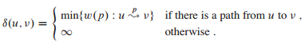

## 单源最短路径

在最短路径问题中，我们给定一个带权重的有向图 G = (V, E) 和权重函数 w: E -> R，该权重函数将每条边映射到实数值的权重上。图中一条路径 p = <v0, v1, ..., vk> 的权重 w(p) 是构成该路径的所有边的权重之和：

w(p) = ∑i=1kw(vi-1, vi)

定义从结点 u 到结点 v 的最短路径权重 δ(u, v) 如下：

从结点 u 到结点 v 的最短路径则定义为任何一条权重为 w(p) = δ(u, v) 的从 u 到 v 的路径 p。当然，边上的权重也可以代表非距离的度量单位，如时间、成本、罚款、损失，或者任何其它可以随路径长度的增加而线性积累的数量以及我们想要最小化的数量。

广度优先搜索算法就是一个求取最短路径的算法，但该算法只能用于无权重的图，即每条边的权重都是单位权重的图。

### 最短路径的几个变体

我们集中精力讨论单源最短路径问题：给定一个图 G = (V, E)，我们希望找到从给定源结点 s ∈ V 到每个结点 v ∈ V 的最短路径。单源最短路径问题可以用来解决许多其它问题，其中就包括下面的几个最短路径的变体问题。

单目的地最短路径问题：找到从每个结点 v 到给定目的地结点 t 的最短路径。如果将图的每条边的方向翻转过来，我们就可以将这个问题转换为单源最短路径问题。

单结点对最短路径问题：找到从给定结点 u 到给定结点 v 的最短路径。如果解决了针对单个结点 u 的单源最短路径问题，那么也就解决了这个问题。而且，在该问题的所有已知算法中，最坏情况下的渐进运行时间都和最好的单源最短路径算法的运行时间一样。

所有结点对最短路径问题：对于每对结点 u 和 v，找到从结点 u 到结点 v 的最短路径。虽然可以针对每个结点运行一遍单源最短路径算法，但通常可以更快地解决这个问题。

#### 最短路径的最优子结构

最短路径算法通常依赖最短路径的一个重要性质：两个结点之间的一条最短路径包含着其它的最短路径，最优子结构是可以使用动态规划和贪心算法的一个重要指标。Dijkstra 算法就是一个贪心算法，而 Floyd-Warshall 算法则是一个动态规划算法，该算法能够找出所有结点对之间的最短路径。下面的引理精确地叙述了最短路径的最优子结构性质。

引理（最短路径的子路径也是最短路径）：给定带权重的有向图 G =(V, E) 和权重函数 w: E -> R。设 p = <v0, v1, ..., vk> 为结点 v0 到结点 vk 的一条最短路径，并且对于任意的 i 和 j，0 <= i <= j <= k，设 pij = <vi, vi+1, ..., j> 为路径 p 中从结点 vi 到结点 vj 的子路径，那么 pij 是从结点 vi 到结点 vj 的一条最短路径。

证明：如果将路径 p 分解为 v0 --p0i--> vi --pij--> vj --pjk--> vk，则有 w(p) = w(p0i) + w(pij) + w(pjk)。现在，假设存在一条从 vi 到 vj 的路径 pij'，且 w(pij') < w(pij)，则 v0 --p0i--> vi --pij'--> vj --pjk--> vk 是一条从结点 v0 到结点 vk 的权重为 w(p0i) + w(pij') + w(pjk) 的路径，而该权重小于 w(p)。这与 p 是从 v0 到 vk 的一条最短路径这一假设矛盾。

#### 负权重的边

某些单源最短路径问题可能包括权重为负值的边。但

