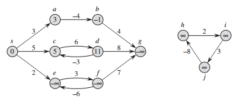
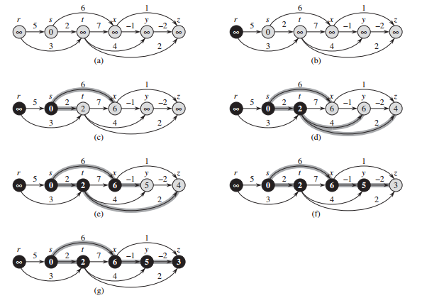

## 单源最短路径

在最短路径问题中，我们给定一个带权重的有向图 G = (V, E) 和权重函数 w: E -> R，该权重函数将每条边映射到实数值的权重上。图中一条路径 p = <v<sub>0</sub>, v<sub>1</sub>, ..., v<sub>k</sub>> 的权重 w(p) 是构成该路径的所有边的权重之和：

w(p) = ∑<sub>i=1</sub><sup>k</sup>w(v<sub>i-1</sub>, v<sub>i</sub>)

定义从结点 u 到结点 v 的最短路径权重 δ(u, v) 如下：


从结点 u 到结点 v 的最短路径则定义为任何一条权重为 w(p) = δ(u, v) 的从 u 到 v 的路径 p。当然，边上的权重也可以代表非距离的度量单位，如时间、成本、罚款、损失，或者任何其它可以随路径长度的增加而线性积累的数量以及我们想要最小化的数量。

广度优先搜索算法就是一个求取最短路径的算法，但该算法只能用于无权重的图，即每条边的权重都是单位权重的图。

#### 最短路径的几个变体

我们集中精力讨论单源最短路径问题：给定一个图 G = (V, E)，我们希望找到从给定源结点 s ∈ V 到每个结点 v ∈ V 的最短路径。单源最短路径问题可以用来解决许多其它问题，其中就包括下面的几个最短路径的变体问题。

单目的地最短路径问题：找到从每个结点 v 到给定目的地结点 t 的最短路径。如果将图的每条边的方向翻转过来，我们就可以将这个问题转换为单源最短路径问题。

单结点对最短路径问题：找到从给定结点 u 到给定结点 v 的最短路径。如果解决了针对单个结点 u 的单源最短路径问题，那么也就解决了这个问题。而且，在该问题的所有已知算法中，最坏情况下的渐进运行时间都和最好的单源最短路径算法的运行时间一样。

所有结点对最短路径问题：对于每对结点 u 和 v，找到从结点 u 到结点 v 的最短路径。虽然可以针对每个结点运行一遍单源最短路径算法，但通常可以更快地解决这个问题。

#### 最短路径的最优子结构

最短路径算法通常依赖最短路径的一个重要性质：两个结点之间的一条最短路径包含着其它的最短路径，最优子结构是可以使用动态规划和贪心算法的一个重要指标。Dijkstra 算法就是一个贪心算法，而 Floyd-Warshall 算法则是一个动态规划算法，该算法能够找出所有结点对之间的最短路径。下面的引理精确地叙述了最短路径的最优子结构性质。

引理（最短路径的子路径也是最短路径）：给定带权重的有向图 G =(V, E) 和权重函数 w: E -> R。设 p = <v<sub>0</sub>, v<sub>1</sub>, ..., v<sub>k</sub>> 为结点 v<sub>0</sub> 到结点 v<sub>k</sub> 的一条最短路径，并且对于任意的 i 和 j，0 <= i <= j <= k，设 p<sub>ij</sub> = <v<sub>i</sub>, v<sub>i+1</sub>, ..., <sub>j</sub>> 为路径 p 中从结点 v<sub>i</sub> 到结点 v<sub>j</sub> 的子路径，那么 p<sub>ij</sub> 是从结点 v<sub>i</sub> 到结点 v<sub>j</sub> 的一条最短路径。

证明：如果将路径 p 分解为 v<sub>0</sub> --p<sub>0i</sub>--> v<sub>i</sub> --p<sub>ij</sub>--> v<sub>j</sub> --p<sub>jk</sub>--> v<sub>k</sub>，则有 w(p) = w(p<sub>0i</sub>) + w(p<sub>ij</sub>) + w(p<sub>jk</sub>)。现在，假设存在一条从 v<sub>i</sub> 到 v<sub>j</sub> 的路径 p<sub>ij</sub>'，且 w(p<sub>ij</sub>') < w(p<sub>ij</sub>)，则 v<sub>0</sub> --p<sub>0i</sub>--> v<sub>i</sub> --p<sub>ij</sub>'--> v<sub>j</sub> --p<sub>jk</sub>--> v<sub>k</sub> 是一条从结点 v<sub>0</sub> 到结点 v<sub>k</sub> 的权重为 w(p<sub>0i</sub>) + w(p<sub>ij</sub>') + w(p<sub>jk</sub>) 的路径，而该权重小于 w(p)。这与 p 是从 v<sub>0</sub> 到 v<sub>k</sub> 的一条最短路径这一假设矛盾。

#### 负权重的边

某些单源最短路径问题可能包括权重为负值的边。但如果图 G = (V, E) 不包含从源结点 s 可以到达的权重为负值的环路，则对于所有的结点 v ∈ V，最短路径权重 δ(s, v) 都有精确定义，即使其取值是负数。如果图 G 包含从 s 可以到达的权重为负值的环路，则最短路径权重无定义。从 s 到该环路上的任意结点的路径都不可能是最短路径，因为我们只要沿着任何“最短”路径再遍历一次权重为负值的环路，则总是可以找到一条权重更小的路径。如果从结点 s 到结点 v 的某条路径上存在权重为负值的环路，我们定义 δ(s, v) = -∞。

下图描述的是负权重和权重为负值的环路对最短路径权重的影响。因为从结点 s 到结点 a 只有一条路径（路径 <s, a>），所以有 δ(s, a) = w(s, a) = 3。类似地，从结点 s 到结点 b 也只有一条路径，因此 δ(s, b) = w(s, a) + w(a, b) = 3 + (-4) = -1。从结点 s 到结点 c 则有无数条路径：<s, c>, <s, c, d, c>, <s, c, d, c, d, c> 等。因为环路 <c, d, c> 的权重为 6 + (-3) = 3 > 0，从结点 s 到结点 c 的最短路径是 <s, c>，其权重为 δ(s, c) = w(s, c) = 5.类似地，从结点 s 到结点 d 的最短路径为 <s, c, d>，其权重为 δ(s, d) = w(s, c) + w(c, d) = 11.类似地，从结点 s 到结点 e 也有无数条路径：<s, e>, <s, e, f, e>, <s, e, f, e, f, e> 等等。因为环路 <e, f, e> 的权重为 3 + (-6) = -1 < 0，从结点 s 到结点 e 没有最短路径。通过遍历负权重环路 <e, f, e> 任意次数，可以找打权重为任意负值的从结点 s 到结点 e 的路径，因此 δ(s, e) = -∞。类似地，δ(s, f) = -∞。因为结点 g 可以从结点 f 到达，我们可以找到一条权重为任意负值的从结点 s 到结点 g 的路径，因此 δ(s, g) = -∞。结点 h、i 和 j 也形成一个权重为负值的环路，但它们不能从结点 s 到达，因此，δ(s, h) = δ(s, i) = δ(s, j) = ∞。



有向图中的负权重边。从源结点 s 到每个结点之间的最短路径的权重标记在每个结点中。因为结点 e 和结点 f 形成一个权重为负值且可以从结点 s 到达的环路，它们的最短路径权重为 -∞。因为结点 g 可以从一个最短路径权重为 -∞ 的结点到达，它的最短路径权重也是 -∞。结点 h、i 和 j 不能从源结点 s 到达，因此，它们的最短路径权重为 ∞，即使它们也在一条权重为负值的环路上。

某些最短路径算法（如 Dijkstra 算法）假设输入图的所有的边权重为非负值。例如，道路交通图的例子中所有权重都为正值。另外一些算法（如 Bellman-Ford）算法，允许输入图中包含负权重的边，但只要没有可以从源结点到达的权重为负值的环路，就可以生成正确的答案。在通常情况下，如果存在一条权重为负值的环路，Bellman-Ford 算法可以侦测并报告其存在。

#### 环路

一条最短路径可以包含环路吗？最短路径不能包含权重为负值的环路，而事实上，最短路径也不能包含权重为正值的环路，因为只要将环路从路径上删除就可以得到一条源结点和终结点与原来路径相同的一条权重更小的路径。这样就只剩下权重为 0 的环路。我们可以从任何路径上删除权重为 0 的环路而得到另一条权重相同的路径。因此，如果从源结点 s 到终结点 v 存在一条包含权重为 0 的环路的最短路径，则也同时存在另一条不包含该环路的从结点 s 到结点 v 的最短路径。只要一条最短路径上还有权重为 0 的环路，我们就可以重复删除这些环路，知道得到一条不包括环路的最短路径。因此，不失一般性，我们可以假定在找到的最短路径中没有环路，即它们都是简单路径。由于图 G  = (V, E) 中的任意无环路径最多包含 ∣V∣ 个不同的结点，它也最多包含 ∣V∣ - 1 条边，因此，我们可以将注意力集中到至多只包含 ∣V∣ - 1 条边的最短路径上。

#### 最短路径的表示

最毒路径不一定是唯一的，最短路径树也不一定是唯一的，例如，下图描述的是一个带权重的有向图和两棵根结点相同的最短路径树。


(a) 带权重的有向图，具有从源结点 s 出发的最短路径权重。(b) 加了阴影的边形成一棵根结点为 s 的最短路径树。(c) 根结点相同的另一棵最短路径树。

#### 松弛操作

对每个结点 v 来说，我们维持一个属性 v.d 用来记录从源结点 s 到结点 v 的最短路径权重的上界。我们称 v.d 为 s 到 v 的最短路径估计。我们用下面运行时间为 Θ(V) 的算法来对最短路径估计和前驱结点进行初始化：

```java

```

在初始化操作结束后，对于所有的结点 v ∈ V，我们有 v.pre = null, s.d = 0，对于所有的结点 v ∈ V - {s}，我们有 v.d = ∞。

对一条边 (u, v) 的松弛过程为：首先测试一下是否可以对从 s 到 v 的最短路径进行改善，测试的方法是，将从结点 s 到结点 u 之间的最短路径距离加上结点 u 与 v 之间的边权重，并与当前的 s 到 v 的最短路径估计进行比较，如果前者更小，则对 v.d 和 v.pre 进行更新。松弛步骤可能降低最短路径的估计值 v.d 并更新 v 的前驱属性 v.pre。下面的代码执行的就是对边 (u, v) 在 O(1) 时间内进行的松弛操作。

```java

```

下图描述的是对一条边进行松弛的两个例子。在其中一个例子中，最短路径估计因松弛操作而减少了，在另一个例子中，最短路径估计则没有发生变化。


对权重 w(u, v) = 2 的边 (u, v) 进行的松弛操作。对每个结点的最短路径估计写在结点里面。(a) 因为在松弛操作前有 v.d > u.d + w(u, v)，因而 v.d 的值减少。(b) 在对边进行松弛操作前有 v.d <= u.d + w(u, v)，因此，松弛操作维持 v.d 的取值不变。

本文后面的每个算法都将调用算法 initializeSingleSource，然后重复对边进行松弛，而且，松弛是唯一导致最短路径估计和前驱结点发生变化的操作。后面讨论的算法之间的不同之处是对每条边进行松弛的次数和松弛边的次序有所不同。Dijkstra 算法和用于有向无环图的最短路径算法对每条边仅松弛一次，Bellman-Ford 算法则是对每条边松弛 ∣V∣ - 1 次。

#### 最短路径和松弛操作的性质

以下是最短路径和松弛操作的一些性质，它们成立的前提是必须调用 initializeSingleSource(G, s) 来对图进行初始化，并且所有对最短路径估计和前驱子图所进行的改变都是通过一系列的松弛步骤来实现的。

三角不等式性质：对任何边 (u, v) ∈ E，我们有 δ(s, v) <= δ(s, u) + w(u, v)。

上界性质：对于所有的结点 v ∈ V，我们总是有 v.d >= δ(s, v)。一旦 v.d 的取值达到 δ(s, v)，其值将不再发生变化。

非路径性质：如果从结点 s 到结点 v 之间不存在路径，则总是有 v.d = δ(s, v) = ∞。

收敛性质：对于某些结点 u, v ∈ V，如果 s --...--> u -> v 是图 G 中的一条最短路径，并且在对边 (u, v) 进行松弛前的任意时间有 u.d = δ(s, u)，则在之后的所有时间有 v.d = δ(s, v)。

路径松弛性质：如果 p = <v<sub>0</sub>, v<sub>1</sub>, ..., v<sub>k</sub>> 是从源结点 s = v<sub>0</sub> 到结点 v<sub>k</sub> 的一条最短路径，并且我们对 p 中的边所进行松弛的次序为 (v<sub>0</sub>, v<sub>1</sub>), (v<sub>1</sub>, v<sub>2</sub>), ..., (v<sub>k-1</sub>, v<sub>k</sub>)，则 v<sub>k</sub>.d = δ(s, v<sub>k</sub>)。该性质的成立于任何其它的松弛操作无关，即使这些松弛操作是与对 p 上的边所进行的松弛操作穿插进行的。

前驱子图性质：对于所有的结点 v ∈ V，一旦 v.d = δ(s, v)，则前驱子图是一棵根结点为 s 的最短路径树。

### Bellman-Ford 算法

Bellman-Ford 算法解决的是一般情况下的单源最短路径问题，在这里，边的权重可以为负值。给定带权重的有向图 G = (V, E) 和权重函数 w: E -> R，Bellman-Ford 算法返回一个布尔值，以表明是否存在一个从源结点可以到达的权重为负值的环路。如果存在这样一个环路，算法将告诉我们不存在解决方案。如果没有这种环路存在，算法将给出最短路径和它们的权重。

Bellman-Ford 算法通过对边进行松弛操作来渐进地降低从源结点 s 到每个结点 v 的最短路径的估计值 v.d，直到该估计值与实际的最短路径权重 δ(s, v) 相同时为止。该算法返回 true 值当且仅当输入图不包含可以从源结点到达的权重为负值的环路。

```java

```

下图描述的是在有 5 个结点的图上运行 Bellman-Ford 算法的过程。在算法第 1 行对所有结点的 d 值和 pre 值进行初始化后，算法对图的每条边进行 ∣V∣ - 1 次处理，每一次处理对应的是算法第 2 ~ 4 行 for 循环的一次循环，该循环对图的每条边进行一次松弛操作。图 (b) ~ (e) 描述的是对边进行 4 次松弛操作时，每一次松弛后的算法状态。在进行了 ∣V∣ - 1 次松弛操作后，算法第 5 ~ 8 行负责检查图中是否存在权重为负值的环路并返回与之相适应的布尔值。


Bellman-Ford 算法的执行过程。源结点为 s，结点中的数值为该结点的 d 值，加了阴影的边表示前驱值：如果边 (u, v) 加了阴影，则 v.pre = u。在本图的例子中，每一次的松弛操作对边的处理次序都是：(t, x), (t, y), (t, z), (y, x), (y, z), (z, x), (z, s), (s, t), (s, y)。(a) 在第 1 次松弛操作前的场景。(b) ~ (e) 在对边进行每次松弛操作后的场景。图 (e) 中的 d 值和 pre 值为最终取值。在本例中，Bellman-Ford 算法返回的值为 true。

由于算法第 1 行的初始化操作所需时间为 Θ(V)，第 2 ~ 4 行循环的运行时间为 Θ(E)，且一共要进行 ∣V∣ - 1 次循环，第 5 ~ 7 行的 for 循环所需时间为 O(E)，Bellman-Ford 算法的总运行时间为 O(VE)。

### 有向无环图的单源最短路径问题

根据结点的拓扑排序来对带权重的有向无环图 G = (V, E) 进行边的松弛操作，我们可以在 Θ(V + E) 的时间内计算出从单个源结点到所有结点之间的最短路径。在有向无环图中，即使存在权重为负值的边，但因为没有权重为负值的环路，最短路径都是存在的。

我们的算法首先对有向无环图进行拓扑排序，以便确定结点之间的一个线性次序。如果有向无环图包含从结点 u 到结点 v 的一条路径，则 u 在拓扑排序的次序中位于结点 v 的前面。我们只需要按照拓扑排序的次序对结点进行一遍处理即可。每次对一个结点进行处理时，我们对从该结点出发的所有的边进行松弛操作。

```java

```

下图描述的是 dagShortestPaths 的执行过程。



在有向无环图上执行最短路径算法 dagShortestPaths 的过程。图中的结点从左至右以拓扑排序的次序排列。源结点为 s，每个结点中的数值为 d 值，加了阴影的边表示 pre 值。(a) 在算法第 3 ~ 5 行 for 循环开始前的场景。(b) ~ (g) 第 3 ~ 5 行 for 循环在每次执行后的场景。每次循环时新变为黑色的结点作为该次循环里的 u 结点。图 (g) 中所显示的各种值都是最后的取值。

该算法的运行时间非常容易分析。算法第 1 行的拓扑排序时间为 Θ(V + E)，第 2 行对 initializeSingleSource 的调用所需时间为 Θ(V)，第 3 ~ 5 行的 for 循环（外循环）对每个结点执行一遍，因此，第 4 ~ 5 行的 for 循环（内循环）对每条边刚好松弛一次。因为内循环每次的运行时间为 Θ(1)，算法的总运行时间为 Θ(V + E)。对于以邻接链表法表示的图来说，这个时间为线性级。

### Dijkstra 算法

Dijkstra 算法解决的事带权重的有向图上单源最短路径问题，该算法要求所有边的权重都为非负值。因此，我们假定对于所有的边 (u, v) ∈ E，都有 w(u, v) >= 0。我们稍后将看到，如果所采用的实现方式合适，Dijkstra 算法的运行时间要低于 Bellman-Ford 算法的运行时间。

Dijkstra 算法在运行过程中维持的关键信息是一组结点集合 S。从源结点 s 到该集合中每个结点之间的最短路径已经被找到。算法重复从结点集 V - S 中选择最短路径估计最小的结点 u，将 u 加入到集合 S，然后对所有从 u 出发的边进行松弛。在下面的实现中，我们使用一个最小优先队列 Q 来保存结点集合，每个结点的关键值为其 d 值。

```java

```

Dijkstra 算法对边的松弛操作如下图所示。算法第 1 行执行的是例行的 d 值和 pre 值的初始化，第 2 行将集合 S 初始化为一个空集。算法所维持的不变式为 Q = V - S，该不变式在算法第 4 ~ 8 行的 while 循环中保持不变。算法第 3 行对最小优先队列 Q 进行初始化，将所有的结点 V 都放在该队列里。由于此时的 S  = ∅，不变式在第 3 行执行完毕后成立。算法在每次执行第 4 ~ 8 行的 while 循环时，第 5 行从 Q = V - S 集合中抽取结点 u，第 6 行将该结点加入到集合 S 里从而继续保持不变式成立（注意，在第一次执行该循环时，u = s）。结点 u 是集合 V - S 中所有结点的最小最短路径估计。然后，在算法的第 7 ~ 8 行，我们队所有从结点 u 发出的边 (u, v) 进行松弛操作。如果一条经过结点 u 的路径能够使得源结点 s 到结点 v 的最短路径权重比当前的估计值更小，则我们对 v.d 的值和前驱 v.pre 的值执行更新。注意，在算法的第 3 行后，我们再不会在队列 Q 中插入任何结点，而每个结点从 Q 中被抽取的次数和加入集合 S 的次数均为一次。因此，算法第 4 ~ 8 行的 while 循环的执行次数刚好为 ∣V∣ 次。


Dijkstra 算法的执行过程。源结点 s 为最左边的结点。每个结点中的数值为该结点的最短路径的估计值，加了阴影的边表明前驱值。黑色的结点属于集合 S，白色的结点属于最小优先队列 Q = V - S。(a) 算法第 4 ~ 8 行的 while 循环首次执行前的场景。加了阴影的结点为 d 值最小的结点，该结点在算法的第 5 行被选择为结点 u。(b) ~ (f) 每次成功执行 while 循环后的场景。每幅图里加了阴影的结点是被算法第 5 行所选择出的下一次循环所用的结点 u。图 (f) 中的 d 值和前驱值都是最终值。

因为 Dijkstra 算法总是选择集合 V - S 中“最轻”或“最近”的结点来加入到集合 S 中，该算法使用的是贪心策略。虽然贪心策略并不总是能获得最优的结果，但是使用贪心策略的的 Dijkstra 算法确实能够计算出最短路径。

Dijkstra 算法的运行速度有多快呢？该算法执行三种优先队列操作来维持最小优先队列：insert（算法第 3 行所隐含的操作）、extractMin（算法第 5 行）和 decreaseKey（隐含在算法第 8 行所调用的 relax 操作中）。该算法对每个结点调用一次 insert 和 extractMin 操作。因为每个结点仅被加入到集合 S 一次，邻接链表 adj[u] 中的每条边在整个算法运行期间也只被检查一次（算法第 7 ~ 8 行的 for 循环里）。由于所有邻接链表中的边的总数为 ∣E∣，该 for 循环的执行次一共为 ∣E∣次，因此，该算法调用 decreaseKey 最多 ∣E∣ 次。

Dijkstra 算法的总运行时间依赖于最小优先队列的实现。我们首先考虑第一种情况：通过利用结点的编号为 1 ~ ∣V∣ 来维持最小优先队列。在这种情况下，我们将 v.d 的值存放在数组的第 v 个记录里。每次 insert 和 decreaseKey 操作的执行时间为 O(1)，每次 extractMin 的操作时间为 O(V)（因为需要搜索整个数组），算法的总运行时间为 O(V<sup>2</sup> + E) = O(V<sup>2</sup>)。

如果我们讨论的是稀疏图，特别地，如果 E = o(V<sub>2</sub>/lgV)，则可以使用二叉堆来实现最小优先队列，从而改善算法的运行时间。在这种模式下，每次 extractMin 操作的执行时间为 O(lgV)。和前面一样，一共有 ∣V∣ 次这样的操作。构建最小二叉堆的成本为 O(V)。每次 decreaseKey 操作的执行时间为 O(lgV)，而最多有 ∣E∣ 次这样的操作。因此，算法的总运行时间为 O((V + E) lgV)。若所有结点都可以从源结点到达，则该时间为 O(E lgV)。若 E  = o(V<sup>2</sup>/lgV)，则该时间成本相对于直接实现的 O(V<sup>2</sup>) 成本有所改善。

事实上，我们可以将 Dijkstra 算法的运行时间改善到 O(V lgV + E)，方法是使用斐波那契堆来实现最小优先队列。在这种实现下，每次 extractMin 操作的摊还代价为 O(lgV)，每次 decreaseKey 操作的摊还代价为 O(1)。从历史的角度上看，斐波那契堆提出的动机就是因为人们观察到 Dijkstra 算法调用的 decreaseKey 操作通常比 extractMin 操作更多，因此，任何能够将 decreaseKey 操作的摊还代价降低到 o(lgV) 而不增加 extractMin 操作的摊还代价的方法都将产生比二叉堆的渐进性能更优的实现。

Dijkstra 算法既类似于广度优先搜索，也有点类似于计算最小生成树的 Prim 算法。它与广度优先搜索的类似点在于集合 S 对应的是广度优先搜索中的黑色结点集合：正如集合 S 中的结点的最短路径权重已经计算出来一样，在广度优先搜索中，黑色结点的正确的广度优先距离也已经计算出来。Dijkstra 算法像 Prim 算法的地方是，两个算法都使用最小优先队列来寻找给定集合（Dijkstra 算法中的 S 集合与 Prim 算法中逐步增长的树）之外的“最轻”结点，将该结点加入到集合里，并对位于集合外面的结点的权重进行相应调整。
