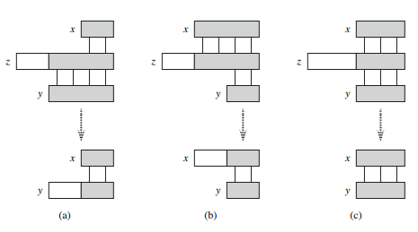

## 字符串匹配

在编辑文本程序的过程中，我们经常需要在文本中找到某个模式的所有出现位置。典型的情况是，一段正在被编辑的文本构成一个文件，而所要搜寻的模式是用户正在输入的特定的关键字。有效地解决这个问题的算法叫做字符串匹配算法，该算法能够极大提高编辑文本程序时的响应效率。在其它很多应用中，字符串匹配算法用于在 DNA 序列中搜寻特定的序列，在网络搜索引擎中也需要这种方法来找到所要查询的网页地址。

字符串匹配问题的形式化定义如下：假定文本是一个长度为 n 的数组 T[1...n]，而模式是一个长度为 m 的数组 P[1...m]，其中 m <= n，进一步假设 P 和 T 的元素都是来自一个有限字母集 ∑ 的字符。例如 ∑ = {0, 1} 或者 ∑ = {a, c, ..., z}。字符数组 P 和 T 通常称为字符串。

如下图所示，如果 0 <= s <= n - m，并且在 T[s+1...s+m] = P[1...m]（即如果 T[s+j] = P[j]，其中 1 <= j <= m），那么称模式 P 在文本 T 中出现，且偏移为 s（或者等价地，模式 P 在文本 T 中出现的位置是以 s + 1 开始的）。如果 P 在 T 中以偏移 s 出现，那么称 s 是有效偏移，否则，称它为无效偏移。字符串匹配问题就是找到所有的有效偏移，使得在该有效偏移下，所给的模式 P 出现在给定的的文本 T 中。


字符串匹配问题的一个例子，在该例子中，我们试图找到模式 P = abaa 在文本 T = abcabaabcabac 中所有出现的位置。模式只在这个文本中出现一次，在偏移 s = 3 处，因此我们称 s 为有效偏移。用竖线连接了每一个模式中的字符与其对应的文本中的字符，所有匹配的字符都被涂上了阴影。

除了朴素算法外，本文中的每个字符串匹配算法都基于模式进行了预处理，然后找到所有有效偏移，我们称第二步为“匹配”。下表给出了每个算法的与处理时间和匹配时间，每个算法的总运行时间是与处理时间和匹配时间的和。Robin 和 Karp 发现了一种有趣的字符串匹配算法，尽管这种算法在最坏情况下的运行时间 Θ((n - m + 1)m) 并不比朴素算法好，但就平均情况和实际情况来说，该算法效果要好得多，这种算法也可以很好地推广，用以解决其它的模式匹配问题。有限自动机算法通过构造一个有限自动机，专门用来搜寻所给的模式 P 在文本中出现的位置，这种算法需要 O(m∣∑∣) 的预处理时间，但是仅仅需要 Θ(n) 的匹配时间。Knuth-Morris-Pratt（或 KMP）算法的匹配时间同样为 Θ(n)，但是它缩短了与处理时间，仅需 Θ(n)。

|      算法     | 预处理时间    | 匹配时间 |
|:----------|:------|:------|
| 朴素算法  |   0 |  O((n - m + 1)m) |
|   Rabin-Karp  |  Θ(m) | O((n - m + 1)m)  |
|   有限自动机算法  | O(m∣∑∣)  | Θ(m)  |
|   Knuth-Morris-Pratt  | Θ(m)  | Θ(n)  |

#### 符号和术语

我们用 ∑<sup>*</sup> 来表示包含所有有限长度的字符串的集合，该字符串是由字母表 ∑ 中的字符组成。我们只考虑有限长度的字符串，长度为零的空字符串用 ε 表示，也属于 ∑<sup>*</sup>。一个字符串 x 的长度用 ∣x∣ 来表示，两个字符串 x 和 y 的连结（concatenation）用 xy 表示，长度为 ∣x∣ + ∣y∣，由 x 的字符后接 y 的字符构成。

如果对某个字符串 y ∈ ∑<sup>*</sup> 有 x = wy，我们称字符串 w 是字符串 x 的前缀，记作 w -> x，注意到如果 w -> x，则 ∣w∣ <= ∣x∣。类似地，如果对某个字符串 y 有 x = yw，则称字符串 w 是字符串 x 的后缀，记作 w <- x，和前缀类似，如果 w <- x，则 ∣w∣ <= ∣x∣。例如，我们有 ab -> abcca 和 cca <- abcca，空字符串 ε 同时是任何一个字符串的前缀和后缀。对于任意字符串 x 和 y 以及任意字符 a，当且仅当 xa <- ya 时，我们有 x <- y。请注意， -> 和 <- 都是传递关系。

后缀重叠引理：假设 x， y 和 z 是满足 x <- z 和 y <- z 的字符串。如果 ∣x∣ <= ∣y∣，那么 x <- y；如果 ∣x∣ >= ∣y∣，那么 y <- x；如果 ∣x∣ = ∣y∣，那么 x = y。

证明如下图所示：



后缀重叠引理的证明。假定 x <- z 和 y <- z。图的三个部分分别说明引理的三种情况。竖线连接字符串的匹配区域（用阴影表示）。(a) 如果 ∣x∣ <= ∣y∣，则 x <- y。(b) 如果 ∣x∣ >= ∣y∣，则 y <- x。(c) 如果 ∣x∣ = ∣y∣，则 x = y。

为了使符号简洁，我们把模式 P[1...m] 的由 k 个字符组成的前缀 P[1...k] 记作 P<sub>k</sub>。因此，P<sub>0</sub> = ε，P<sub>m</sub> = P = P[1...m]。与此类似，我们把文本 T 中由 k 个字符组成的前缀即为 T<sub>k</sub>。采用这种记号，我们能够把字符串匹配问题表述为：找到所有偏移 s (0 <= s <= n-m)，使得 P <- T<sub>s+m</sub>。

### 朴素字符串匹配算法

朴素字符串匹配算法是通过一个循环找到所有有效偏移，该循环对 n - m + 1 个可能的 s 值进行检测，看是否满足条件 P[1...m] = T[s+1...s+m]。

```java

```

下图描绘的是朴素字符串匹配过程可以形象地看成一个包含模式的“模板”沿文本滑动，同时对每个偏移都要检测模板上的字符是否与文本中对应的字符相等。第 3 ~ 5 行的 fot 循环考察每一个可能的偏移。第 4 行的测试代码确定当前的偏移是否有效，该测试隐含一个循环，该循环用于逐个检测对应位置上的字符，直到所有位置都能成功匹配或者有一个位置不能匹配为止。第 5 行用于打印输出每一个有效偏移 s。


朴素字符串匹配对模式 P = aab 和文本 T = acaabc 的操作。可以把 P 想象成一个沿着正文滑动的“模板”。(a) ~ (d) 为 4 个连续地朴素字符串匹配。图中竖线连接相应匹配区域（阴影部分），折线连接先错误匹配的字符，如果是的话，在位移 s = 2 时，找到匹配的模式，见图 (c)。

在最坏情况下，朴素字符串匹配算法运行时间为 O((n - m + 1)m)。例如，在考察文本字符串 a<sup>n</sup>（一串由 n 个 a 组成的字符串）和模式 a<sup>m</sup> 时，对偏移 s 的 n - m + 1 个可能值中的每一个，在第 4 行中比较相应字符的隐式循环必须执行 m 次来确定偏移的有效性。因此，最坏情况下的运行时间是 Θ((n - m + 1)m)，如果 m = floor(n/2)，则运行时间是 Θ(n<sup>2</sup>)。由于不需要预处理，朴素字符串匹配算法的运行时间即为匹配时间。

naiveStringMatcher 并不是解决字符串匹配问题的最好算法，事实上，Knuth-Morris-Pratt 算法在最坏情况下比朴素算法好得多。这种朴素字符串匹配算法效率不高，是因为当其它无效的 s 值存在时，它也只关心一个有效的 s 值，而完全忽略了检测无效 s 值时获得的文本的信息。然而这样的信息可能非常有用，例如，如果 P = aaab 并且我们发现 s = 0 是有效的，由于 T[4] = b，那么偏移 1、2 或 3 都不是有效的。

### Rabin-Karp 算法

在实际应用中，Rabin 和 Karp 所提出的字符串匹配算法能够较好地运行，并且还可以从中归纳出相关问题的其它算法，比如二维模式匹配。Rabin-Karp 算法的预处理时间是 Θ(m)，并且在最坏情况下，它的运行时间为 Θ((n - m + 1)m)。基于一些假设，在平均情况下，它的运行时间还是比较好的。

为了便于说明，假设 ∑ = {0, 1, 2, ..., 9}，这样每个字符都是十进制数字。在通常情况下，可以假定每个字符都是以 d 为基数表示的数字，其中 d = ∣∑∣。我们可以用长度为 k 的十进制数来表示 k 个连续的字符组成的字符串，因此，字符串 31 415 对应着十进制数 31 415.加入输入的字符既可以看作是图形符号，也可以看做是数字，那么我们会发现，运用我们的标准文本字体，把它们表示为数字会更加方便。

给定一个模式 P[1...m]，假设 p 表示其相应的十进制，类似地，给定文本 T[1...n]，假设 t<sub>s</sub> 表示长度为 m 的子字符串 T[s+1...s+m] 所对应的十进制值，其中 s = 0, 1, ..., n-m。当然，只有在 T[s+1...s+m] = P[1...m] 时，t<sub>s</sub> = p。如果能在时间 Θ(m) 内计算 p 的值，并在总时间 Θ(n - m + 1) 内计算出所有的 t<sub>s</sub> 值，那么通过比较 p 和每一个 t<sub>s</sub> 值，就能在 Θ(m) + Θ(n - m + 1) = Θ(n) 内找到所有的有效偏移 s。（目前，暂不考虑 p 和 t<sub>s</sub> 很大的问题）。

我们可以运用霍纳法则在时间 Θ(m) 内计算出 p：

p = P[m] + 10(P[m-1] + 10(P[m-2] + ... + 10((P[2] + 10P[1]...))))

类似地，也可以在 Θ(m) 时间内根据 T[1...m] 计算出 t<sub>0</sub> 的值。

为了在时间 Θ(n - m) 内计算出剩余的值 t<sub>1</sub>, t<sub>2</sub>, ..., t<sub>n-m</sub>，我们需要在常数时间内根据 t<sub>s</sub> 计算出 t<sub>s+1</sub>，因为

t<sub>s+1</sub> = 10(t<sub>s</sub> + 10<sup>m-1</sup>T[s + 1]) + T[s + m + 1]

减去 10<sup>m-1</sup>T[s + 1]) 就从 t<sub>s</sub> 中去掉了高位数字，再把结果乘以 10 就使得数字向左移动一个数位，然后加上 T[s + m + 1]，则加入一个适当的低位数字。例如，如果 m = 5 并且 t<sub>s</sub> = 31415，那么我们希望能够去掉高位数字 T[s + 1] = 3，并且加入新的低位数字（假设是 T[s + 5 + 1） = 2 ，从而获得：

t<sub>s+1</sub> = 10(31415 - 1000.3) + 2 = 14152

如果能够预先计算出常数 10<sup>m-1</sup>，则每次执行式 (32.1) 的计算时，需要执行的算数运算的次数为常数。因此，可以在时间 Θ(m) 计算出 p，在时间 Θ(n - m + 1) 内计算出所有的 t<sub>0</sub>, t<sub>1</sub>, t<sub>2</sub>, ..., t<sub>n-m</sub> 的值。因而可以用 Θ(m) 的预处理时间和 Θ(n - m + 1) 的匹配时间找到所有模式 P[1...m] 在文本 T[1...n] 中出现的位置。

到目前为止，我们有意回避的一个问题是：p 和 t<sub>s</sub> 的取值可能太大，导致不能方便地对其进行操作。如果 P 包含 m 个字符，那么关于在 p（m 数位长）上的每次算数运算需要“常数”时间这一假设就不合理了。幸运的是，我们可以很容易地解决这个问题。如下图所示：选取一个合适的模 p 来计算 p 和 t<sub>s</sub> 的模。我们可以在 Θ(m) 的时间内计算出模 q 的 p 值，并且可以在 Θ(n - m + 1) 时间内计算出模 q 的所有 t<sub>s</sub> 值。如果选模 q 为一个常数，使得 10q 恰好满足一个计算机字长，那么可以用单精度算数运算执行所有必需的运行。在一般情况下，采用 d 进制的字母表 {0, 1, ..., d-1} 时，选取一个 q 值，使得 dq 在一个计算机字长内，然后调整递归式 (32.1)，使其能够对模 q 有效，式子变为：

t<sub>s+1</sub> = (d(t<sub>s</sub> - T[s + 1]h) + T[s + m - 1]) % q

其中 h ≡ d<sup>m-1</sup> % q 是一个具有 m 数位的文本窗口的高位数位上的数字 "1" 的值。

Rabin-Karp 算法。每一个字符都是一个十进制数，并且对模 13 取余。(a) 一个文本字符串。长度为 5 的窗口被标上了阴影，标记阴影数字的数值对模 13 取余的结果为 7。(b) 一个相同的文本字符串，对长度为 5 的窗口的每一个可能位置，计算出它对 13 取余的数值。假定模式 P = 31415，由于 31415 ≡ 7 % 13，所以寻找所有对模 13 取余为 7 的窗口。该算法找到两个与之对应的窗口，在图中用阴影表示出来。第一个是在文本的位置 7 处开始的，最后验证确实为模式的出现。而第二个是在文本的位置 13 处开始的，但最终验证为伪命中。(c) 已知前一个窗口的值，如何在常数时间内计算出某个窗口的值。第一个窗口的值为 31415，去除高位数字 3，往左移（乘以 10），然后加入低位数字 2 得到新的值 14152，因为所有的计算都是模 13 取余，所以第一个窗口的值是 7，从而新窗口的值是 8。

但是基于模 q 得到的结果并不完美：t<sub>s</sub> ≡ p % q 并不能说明 t<sub>s</sub> = p。但是另一方面，如果 t<sub>s</sub> != p % q，那么可以判定 t<sub>s</sub> != p，从而确定偏移 s 是无效的。因此可以把测试 t<sub>s</sub> ≡ p % q 是否成立作为一种快速的启发式测试方法用于检测无效偏移us。任何满足 t<sub>s</sub> ≡ p % q 的偏移 s 都需要被进一步检测，看 s 是真的有效还是仅仅是一个伪命中点。这项额外的测试可以通过检测条件 P[1...m] = T[s+1...s+m] 来完成，如果 q 足够大，那么这个伪命中点可以尽量少出现，从而使额外测试的代价降低。

下面的过程准确描述了上述思想，过程的输入是文本 T，模式 P，使用基数 d（其典型取值为 ∣∑∣）和素数 q。

```java

```  

rabinKarpMatcher 执行过程如下。所有的字符都假设是 d 进制的数字。仅为了说明的清除，给 t 添加了下标，去除所有下标不会影响程序运行。第 3 行初始化 m 位窗口中高位上的值 h。第 4 ~ 8 行计算出 P[1...m] % q 的值 p，计算出 T[1...m] % q 的值 t<sub>0</sub>。第 9 ~ 14 行的 for 循环迭代便利了所有可能的偏移 s，保持如下的不变量：

第 10 行无论如何执行，都有 t<sub>s</sub> = T[s+1...s+m] % q。

如果在第 10 行中有 p = t<sub>s</sub>（一个“命中点”），那么在第 11 行检测是否 P[1...m] = T[s+1...s+m]，用以排除它是伪命中点的可能性。第 12 行打印出所有找到的有效偏移。如果 s < n - m（在第 13 行中检测），则至少在执行一次 for 循环，这时首先执行第 14 行以保证再次执行到第 10 行时循环不变式依然成立。第 14 行直接利用等式 (32.2)，就可以在常数时间内由 t<sub>s</sub> % q 的值计算出 t<sub>s+1</sub> % q 的值。

rabinKarpMatcher 的预处理时间为 Θ(m)，在最坏情况下，它的匹配时间是 Θ((n - m + 1)m)，因为 Rabin-Karp 算法和朴素字符串匹配算法一样，对每个有效偏移进行显式验证。如果 P = a<sup>m</sup> 并且 T = a<sup>n</sup>，由于在 n - m + 1 个可能的偏移中每一个都是有效的，则验证所需的时间为 Θ((n - m + 1)m)。

在许多实际应用中，我们希望有效偏移的个数少一些（如只有常数 c 个）。在这样的应用中，加上处理伪命中点所需时间，算法的期望匹配时间为 O((n - m + 1) + cm) = O(n + m)。减少模 q 的值就如同从 ∑<sup>*</sup> 到 Z<sub>q</sub> 上的一个随机映射，基于这个假设，可以对算法进行启发式分析。然后我们能够预计伪命中的次数为 O(n/q)，因为可以估计出任意的 t<sub>s</sub> 模 q 的余数等价于 p 的概率为 1 / q。因为第 10 行中的测试会在 O(n) 个位置上失败，且每次命中的时间代价是 O(m)，因此，Rabin-Karp 算法的期望运行时间为：

O(n) + O((m(v + n/q)))

其中 v 是有效偏移量。如果 v = O(1) 并且 q >= m，则这个算法的运行时间是 O(n)。也就是说，如果期望的有效偏移量很少（O(1），而选取的素数 q 大于模式的长度，则可以估计 Rabin-Karp 算法的匹配时间为 O(n + m)，由于 m <= n，这个算法的期望匹配时间是 O(n)。

### 利用有限自动机进行字符串匹配


